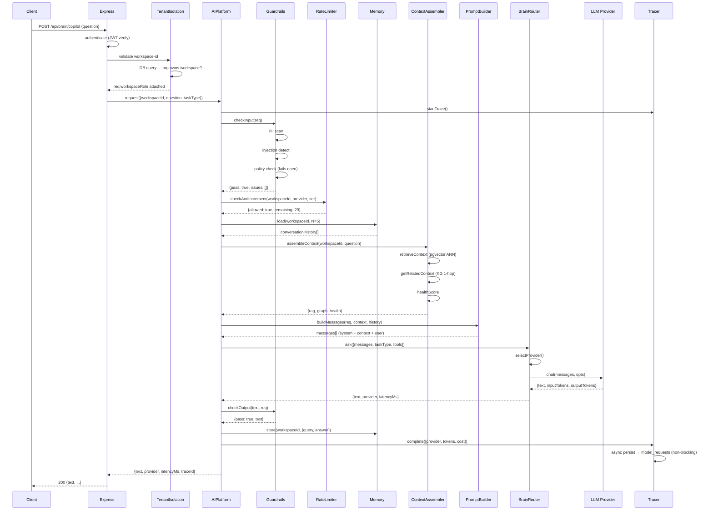
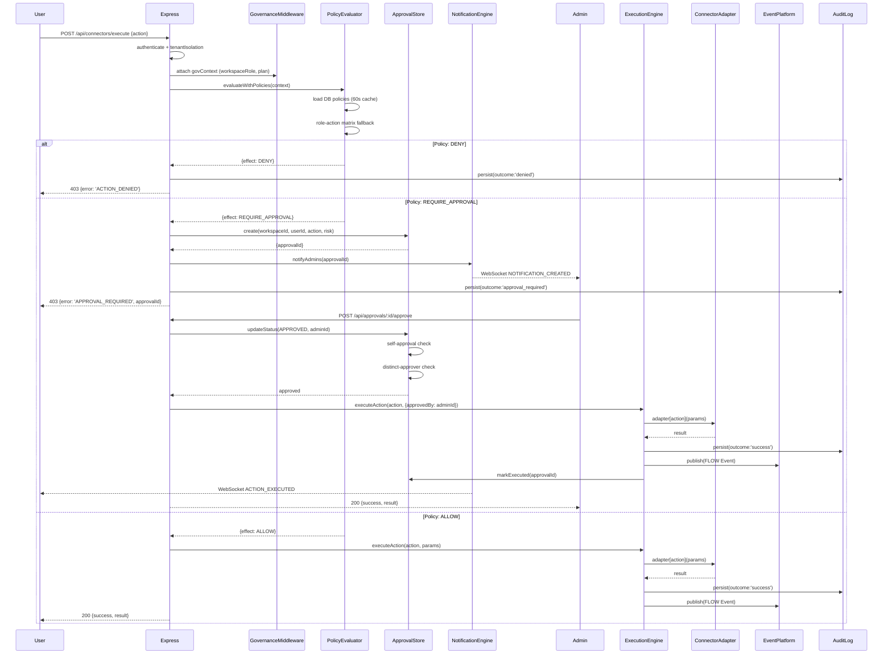
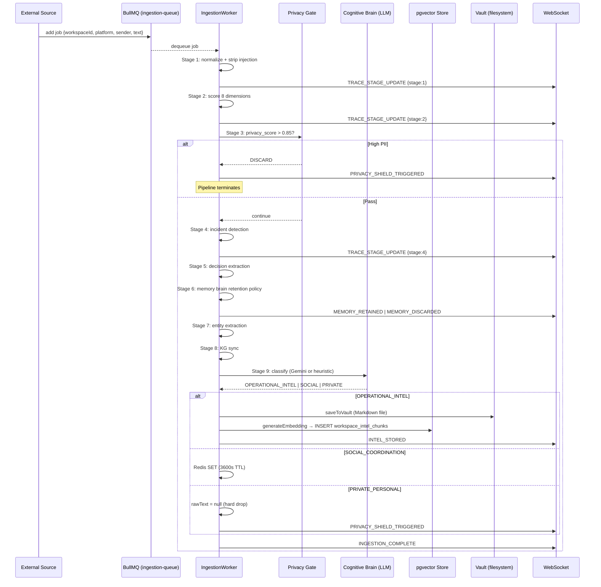
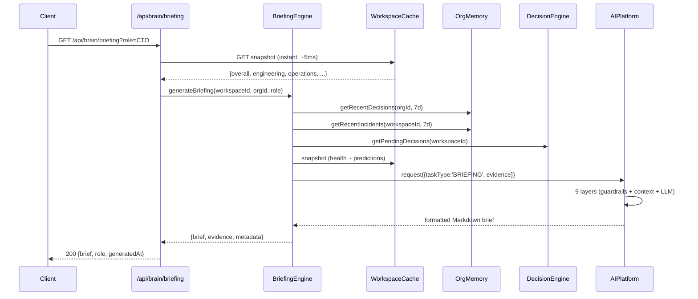
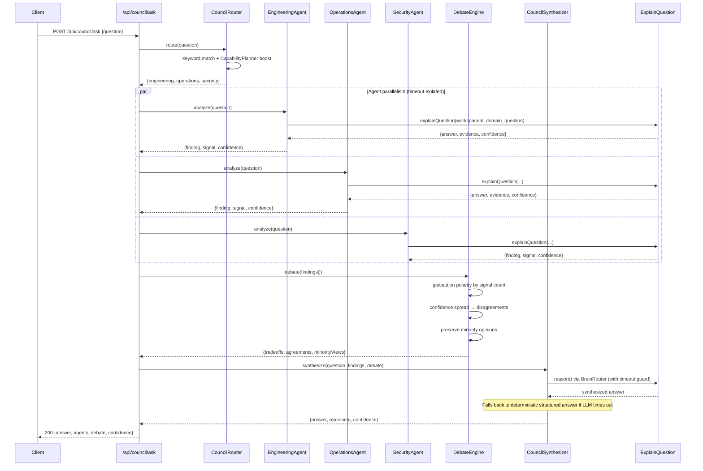
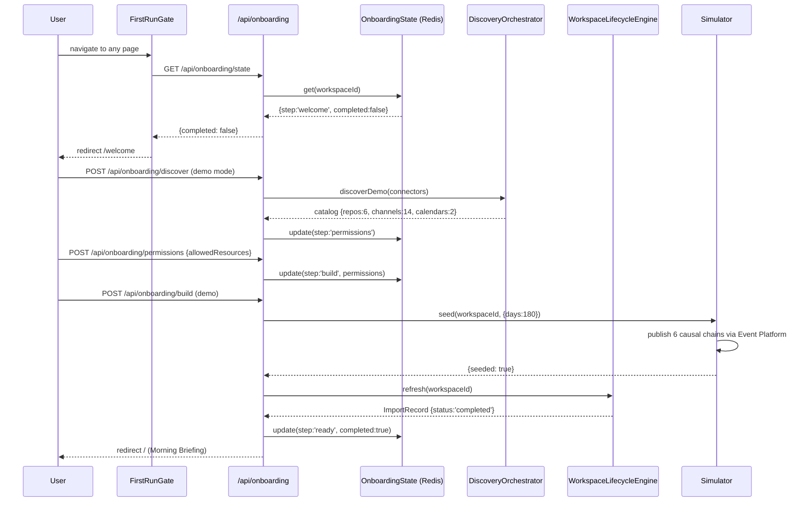
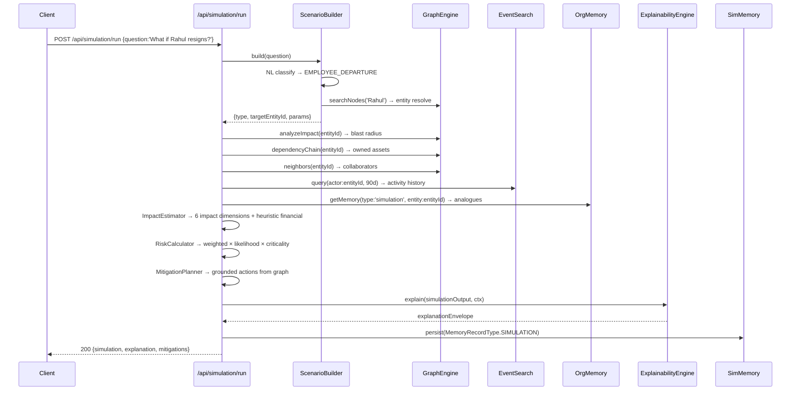
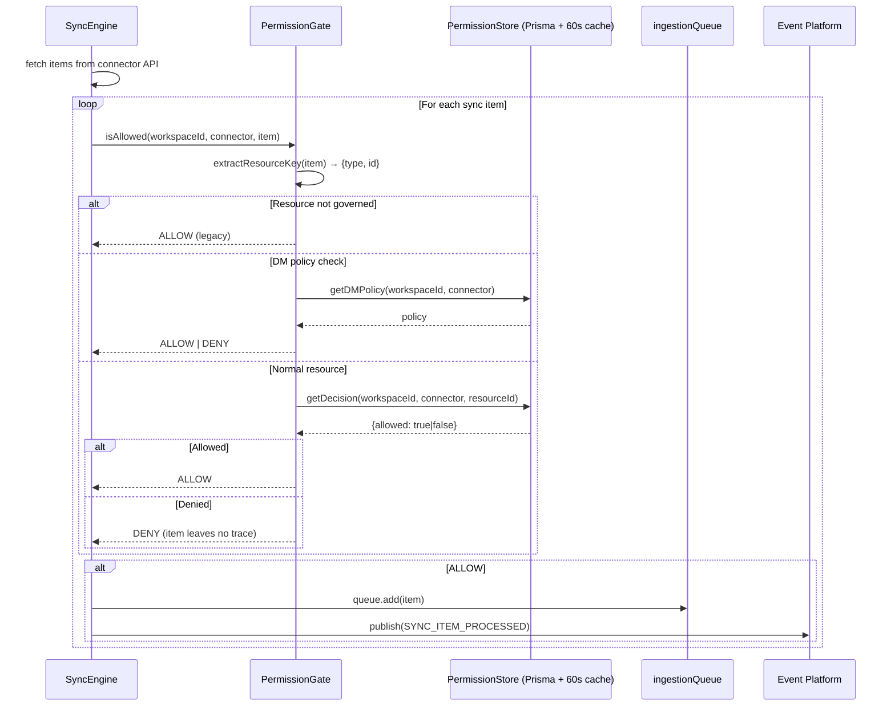

# FLOW OS — Sequence Diagrams
**Architecture Version:** 1.0  
**Status:** FROZEN

All diagrams use Mermaid syntax. Render at https://mermaid.live or any Mermaid-compatible Markdown renderer.

---

## 1. AI Request — Full 9-Layer Pipeline

---

## 2. Connector Action with Approval

---

## 3. Data Ingestion Pipeline

---

## 4. Executive Briefing Flow

---

## 5. Multi-Agent Executive Council

---

## 6. Workspace Onboarding (First Run)

---

## 7. What-If Simulation

---

## 8. Integration Permission Gate (Sync Path)

