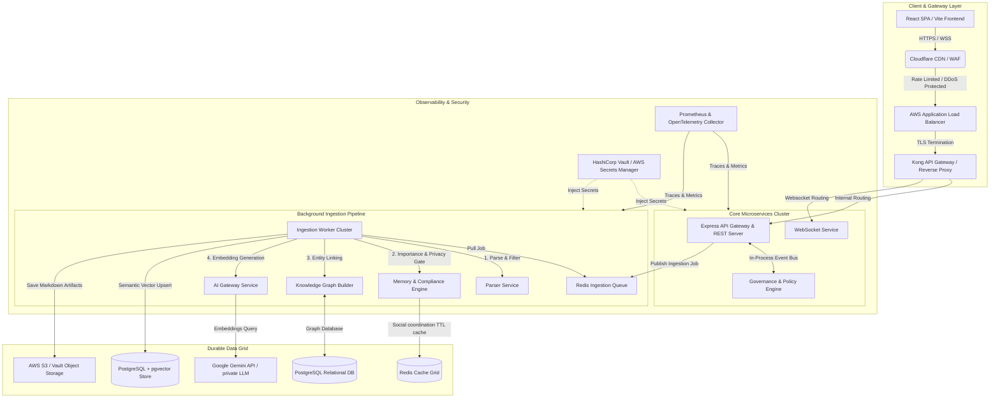

# FLOW OS Deployment & Production Architecture Blueprint
**Version:** 2.0.0  
**Status:** Approved for Implementation  
**Author:** Principal Infrastructure Architect, FLOW OS Core Team  

---

## SECTION 1: SYSTEM OVERVIEW

FLOW OS is a multi-tenant corporate intelligence operating system. The platform continuously ingests communication streams from enterprise communication networks (Slack, Gmail, GitHub, Jira, Calendars), parses and filters data through a strict privacy-compliance gate, registers entity-relation links in an operational knowledge graph, and vectorizes operational intelligence into a PostgreSQL database with the `pgvector` extension. 

Below is the conceptual architecture outlining the ingestion pipeline, query processing, and data flow layers.



### Architectural Subsystems Reference Table

| Subsystem | Components | Primary Responsibilities | Scaling Dimension |
| :--- | :--- | :--- | :--- |
| **Frontend** | React SPA, Vite, Tailwind CSS, Lucide icons | Renders workfeed, recommendation engine, Action Center, timeline, dev dashboard. | Scale via CDN edges (Cloudflare). |
| **API Gateway** | Kong Gateway / Nginx | Routing, rate-limiting, CORS enforcement, JWT verification fallback. | CPU-bound. Horizontal auto-scaling. |
| **Authentication** | Custom Express middleware, JWT, WorkspaceMember RBAC | Multi-tenant isolation, cryptographically secures headers, loads workspace permission matrix. | RAM-bound (session caching in Redis). |
| **AI Gateway** | `@google/genai` Integration layer, local fallbacks | Normalizes calls to Gemini 2.5 Flash, handles backoff, falls back to local heuristic engines if quota hits. | Network I/O-bound. |
| **Connector Services** | Gmail, Calendar, GitHub, Jira, HubSpot, Workday adapters | Bidirectional API syncing, fetches third-party data, normalizes types, maps raw schemas to FLOW-native events. | High network/rate-limiting constraints. |
| **Sync Workers** | BullMQ workers running on Node.js | Syncs external systems on-demand, schedules recurring daily rollovers, controls cron timing. | Disk & memory bound. |
| **Embedding Workers** | BullMQ workers | Formats clean text chunks, fires API calls to Gemini-embedding-2, pushes vectors to database. | Highly parallelized I/O. |
| **Knowledge Graph** | Postgres-backed Node/Edge schema, in-memory traversal | Manages 2-hop traversal context injections, updates entity weights, links entities (users, issues). | RAM & DB Query bound. |
| **Vector Search** | PostgreSQL + `pgvector` (HNSW indexing) | Performs Cosine similarity matching, retrieves local vault fallbacks, executes hybrid RRF merging. | Disk I/O & RAM bound. |
| **Operational Intel** | Cognitive Brain Service, CriticAgent | Anti-hallucination checks, detects contradictions, assigns importance scores, tags metadata as `DEPRECATED`. | CPU & LLM token limits. |
| **Redis Queue** | ioredis grid | Manages job queues (ingestion-queue, summary-queue), locks jobs, persists job states. | Memory (RAM) bound. |
| **Storage** | AWS S3 / local directory fallback (`VAULT_ROOT`) | Holds physical Markdown briefs, raw attachments, meeting recordings, system exports. | Storage capacity & read throughput. |
| **Database** | PostgreSQL 16+ via Prisma ORM | Stores tenant configuration, policies, approvals, users, audit logs, and graph schemas. | Write throughput & index memory. |
| **Monitoring** | Prometheus, OpenTelemetry, Datadog/Grafana | Traces execution pipelines, counts token consumption, measures RAG latencies, reports errors. | Network throughput. |
| **Secrets** | HashiCorp Vault / AWS Secrets Manager | Manages runtime database passwords, API credentials, dynamic OAuth tokens, and encryption keys. | High Availability API. |
| **Backup** | WAL-G, AWS Backup | Point-in-time recovery for Postgres, cross-region replication for S3 data. | Disk I/O. |
| **Enterprise Layer** | Policy and Approval Store | Enforces workspace role isolation, locks workflows pending ADMIN/OWNER approvals, logs audits. | DB transaction latency. |

---

## SECTION 2: DEPLOYMENT PHASES

```
Phase 1 (Local) ──> Phase 2 (Demo) ──> Phase 3 (Pilot) ──> Phase 4 (SaaS) ──> Phase 5 (Enterprise) ──> Phase 6 (On-Prem)
```

### Phase 1: Local Development
*   **Purpose:** Rapid iteration, debugging, and testing of services without cloud resource costs.
*   **Architecture:** Docker Compose running PostgreSQL (with pgvector), Redis, and Node.js backend. React app served locally on port 3000.
*   **Cloud Services:** None. Run entirely on local workstation (Mac/Linux/Windows WSL).
*   **Scaling Limits:** Single developer machine capacity (typically 8-cores, 16GB RAM).
*   **Estimated Monthly Cost:** $0.
*   **Advantages:** Zero cost, fast startup, instant code reloading, simplified networking, raw log access.
*   **Tradeoffs:** In-memory states lost on container restart. Local Mock APIs replace Google/GitHub endpoints if credentials are missing.
*   **Migration Path:** Code committed to `main` branch triggers automated pipeline to build container images for Phase 2.

### Phase 2: Internal Demo
*   **Purpose:** Showcase platform features to stakeholders and validate basic deployment procedures.
*   **Architecture:** Single small virtual machine (e.g., AWS EC2 t3.large) hosting Express backend, frontend static files, local Redis, and PostgreSQL running in Docker containers.
*   **Cloud Services:** AWS EC2 (t3.large), Route 53 (DNS), Cloudflare (Free Tier DNS/SSL).
*   **Scaling Limits:** 5-10 concurrent users. Ingestion queue slows down if bulk processing runs concurrently.
*   **Estimated Monthly Cost:** ~$120/month.
*   **Advantages:** Cheap, simple to configure, accessible over public internet via secure subdomain.
*   **Tradeoffs:** No redundancy. Single point of failure. Low processing speeds for vector embeddings.
*   **Migration Path:** Database schema changes are validated; local SQLite/Postgres schemas are exported via pg_dump to prepare for migration to RDS.

### Phase 3: Pilot Customers
*   **Purpose:** Support early adopting companies (up to 5 organizations) under production-like constraints.
*   **Architecture:** Decoupled application layer from storage. Stateless Express backend run on virtual machines behind a load balancer. Managed PostgreSQL and Redis.
*   **Cloud Services:** AWS ECS (Fargate) for backend, RDS PostgreSQL (db.t4g.medium), ElastiCache Redis (cache.t4g.small), S3 for vault assets, ACM for certificates.
*   **Scaling Limits:** Up to 100 total active users across 5 tenants. Maximum ingestion capacity of 5,000 documents per day.
*   **Estimated Monthly Cost:** ~$750/month.
*   **Advantages:** High database reliability, isolated files in S3, basic auto-scaling, daily automated backups.
*   **Tradeoffs:** Higher operational cost; database scaling is vertical, not horizontal.
*   **Migration Path:** Set up Prisma tenant validation rules to prepare database for high-volume multi-tenancy.

### Phase 4: Production SaaS
*   **Purpose:** Publicly accessible, multi-tenant subscription-based software-as-a-service platform.
*   **Architecture:** Multi-AZ deployment. Traffic enters Cloudflare CDN, routed to an AWS ALB, and distributed to ECS Fargate services. Database uses read replicas. Redis runs in a highly available Cluster mode.
*   **Cloud Services:** AWS ECS Fargate, RDS PostgreSQL Multi-AZ (db.m6g.xlarge) with 1 Read Replica, ElastiCache Redis Cluster, S3 (standard + intelligent tiering), AWS KMS, Datadog.
*   **Scaling Limits:** 10,000 active users, 100,000 ingestion events daily, HNSW index capacity up to 5,000,000 vector records.
*   **Estimated Monthly Cost:** ~$4,800/month (base infrastructure) + LLM consumption costs.
*   **Advantages:** Zero single points of failure, auto-scaling up to 20x average load, zero-downtime rolling updates.
*   **Tradeoffs:** High management complexity, substantial monitoring costs, complex data boundary rules.
*   **Migration Path:** Code configuration modularized to allow deployment of identical stacks into separate regional VPCs for Phase 5.

### Phase 5: Enterprise Scale
*   **Purpose:** Support large global companies requiring regional data residency, dedicated performance, and SLA guarantees.
*   **Architecture:** Global multi-region AWS network topology. Central SaaS control plane with localized regional workspace execution layers (US-East, EU-Central, AP-Southeast).
*   **Cloud Services:** AWS EKS (Kubernetes), Aurora Global Database PostgreSQL (pgvector HNSW indexes), global S3 cross-region replication, HashiCorp Vault Enterprise.
*   **Scaling Limits:** 100,000+ active users, 1,000,000 daily ingestion events, multi-gigabyte knowledge graphs.
*   **Estimated Monthly Cost:** ~$25,000/month (minimum commit across 3 regions).
*   **Advantages:** Localized latency, compliance with EU GDPR data residency requirements, isolated regional failure domains.
*   **Tradeoffs:** Very expensive to run, requires a dedicated cloud operations team, database synchronization lags across regions.
*   **Migration Path:** Abstract configuration manifests to support Helm charts, paving the way for on-premise customer deployments.

### Phase 6: Dedicated Customer Deployments
*   **Purpose:** Deliver single-tenant, completely isolated environments for Fortune 500 companies or regulated industries.
*   **Architecture:** Customer VPC deployment. App runs inside the customer's cloud account (AWS/Azure/GCP) or on-premise Kubernetes cluster. Optional air-gapped configuration with local LLM gateways.
*   **Cloud Services:** Managed Kubernetes (EKS/AKS/GKE), local PostgreSQL, local Redis, MinIO (S3 API alternative), local Triton Inference Server or Ollama for private models.
*   **Scaling Limits:** Bound only by the customer's allocated budget and local node infrastructure.
*   **Estimated Monthly Cost:** Managed by customer + FLOW licensing fee.
*   **Advantages:** Ultimate security, zero data leakage to external networks, custom compliance profiles.
*   **Tradeoffs:** Maintenance and updates must be executed via secure agent packages (e.g., Replicated), debugging is difficult due to restricted access.
*   **Migration Path:** Automated infrastructure updates pushed through sealed Helm charts and GitOps pipelines.

---

## SECTION 3: NETWORK TOPOLOGY

The network layout establishes a multi-tiered security defense-in-depth model. All traffic originates from the public internet, terminates at security edges, and tunnels through progressively restricted subnets.

```
[Public Internet] 
       │ (HTTPS / WSS on Port 443)
       ▼
┌────────────────────────────────────────────────────────┐
│ Cloudflare Edge: WAF, DDoS Protection, CDN, Anycast    │
└────────────────────────────────────────────────────────┘
       │ (Origin Shielded IP Range)
       ▼
┌────────────────────────────────────────────────────────┐
│ AWS Route 53 DNS Resolution                            │
└────────────────────────────────────────────────────────┘
       │
       ▼
┌────────────────────────────────────────────────────────┐
│ Public Subnet: Application Load Balancer (ALB)         │
│ * TLS 1.3 Termination                                  │
└────────────────────────────────────────────────────────┘
       │ (Ports 5001 / 3000 inside Private Security Group)
       ▼
┌────────────────────────────────────────────────────────┐
│ Private App Subnet: ECS Fargate Services                │
│ * Express API Server, WebSocket Service, BullMQ Workers │
└────────────────────────────────────────────────────────┘
       │ (Ports 5432 & 6379, isolated by DB Security Group)
       ▼
┌────────────────────────────────────────────────────────┐
│ Database Subnet: Aurora Postgres (pgvector) & Redis    │
│ * Inbound access ONLY from App Subnet Security Group   │
└────────────────────────────────────────────────────────┘
```

### Security & Traffic Management Configurations

1.  **Firewalls & Web Application Firewall (WAF):** Cloudflare WAF sits at the outermost boundary. It actively drops request packets matching OWASP Top 10 web vulnerabilities, blocks non-API request paths (e.g., `/wp-admin`), and filters access using Geo-IP blocklists.
2.  **Private Networking (VPC):** The AWS VPC contains three distinct subnets:
    *   *Public Subnets (Multi-AZ):* Hosts the Application Load Balancer and NAT Gateways. Direct ingress from `0.0.0.0/0` is permitted on port 443 only.
    *   *Private Application Subnets:* Hosts ECS tasks. These containers have no public IP addresses. Outbound internet connection is routes through NAT Gateways for external API calls (e.g., Google Calendar, GitHub, Gemini API).
    *   *Private Database Subnets:* Hosts RDS Postgres and ElastiCache Redis. Routing tables block all traffic to internet gateways. Access is exclusively restricted to resources inside the VPC.
3.  **Security Group Rules:**
    *   *ALB Security Group:* Allows inbound port 443 from all addresses (`0.0.0.0/0`).
    *   *App Security Group:* Allows inbound port 5001 and port 3000 ONLY from the ALB Security Group.
    *   *Database Security Group:* Allows inbound port 5432 (PostgreSQL) and port 6379 (Redis) ONLY from the App Security Group.
4.  **Rate Limiting & DDoS Protection:** 
    *   *Edge Rate Limiting:* Cloudflare limits API requests to 120 per minute per IP address. Exceeding this triggers an HTTP 429 response.
    *   *DDoS Shield:* Cloudflare Magic Transit and Advanced Shield mitigate volumetric layer 3/4 attacks.
    *   *App Rate Limiter:* Express backend runs a sliding-window rate limiter on the `/api/auth` endpoints to block brute-force attacks.
5.  **TLS Termination:** SSL/TLS handshakes terminate at the Application Load Balancer. Communication between the ALB and internal ECS Fargate containers uses HTTP/1.1 on port 5001 within the isolated private VPC network. Internal TLS 1.3 encryption can be enabled using AWS App Mesh if strict compliance is required.

---

## SECTION 4: SERVICE ARCHITECTURE

FLOW OS is split into decoupled services to guarantee horizontal scaling.

```
                          ┌──> [WebSocket Service] <──> Client Browser
                          │
[React SPA] ──> [API GW] ─┼──> [Backend API Server] <──> [Prisma Postgres]
                          │             │
                          │             ▼
                          │      [BullMQ Queue]
                          │             │
                          │             ▼
                          └──> [Worker Pool (NodeJS)] <──> [AI Gateway / Gemini]
```

### 1. Frontend
*   **Responsibilities:** Renders the React UI, displays dashboard metrics, establishes real-time WebSocket communication, and parses Markdown files directly on the client.
*   **Dependencies:** Runs on Client Web Browser.
*   **Scaling Strategy:** Assets are compiled into static HTML/JS bundles and distributed via CDN edges.
*   **Failure Recovery:** Runs retry loops for API calls and client-side WebSocket connections using exponential backoff.
*   **Health Checks:** Handled automatically by CDN host.

### 2. Backend API
*   **Responsibilities:** Accepts incoming REST calls, executes OAuth handshakes, evaluates governance policies, and writes transaction data to the database.
*   **Dependencies:** PostgreSQL, Redis, Auth Service.
*   **Scaling Strategy:** Horizontally scaled using ECS Fargate. Scaling triggers when average CPU usage exceeds 70% or RAM exceeds 80%.
*   **Failure Recovery:** Stateless architecture. Crashing containers are terminated and replaced by the container orchestrator.
*   **Health Checks:** Express server exposes a `GET /api/health` endpoint returning database and queue connection metrics.

### 3. Authentication Service
*   **Responsibilities:** Verifies JWT integrity, issues user credentials, maps Tenant IDs, and validates workspace ownership rules.
*   **Dependencies:** PostgreSQL, Redis (session verification).
*   **Scaling Strategy:** Scaled as an integrated middleware layer in the Backend API, with JWT public keys cached in RAM.
*   **Failure Recovery:** Leverages stateless asymmetric JWT validation; if Postgres crashes, cached sessions persist.
*   **Health Checks:** Part of the API server's health monitoring endpoint.

### 4. Connector Service
*   **Responsibilities:** Runs platform-specific adapters (Gmail, GitHub, Google Calendar), normalizes incoming schemas, and handles external API rate limits.
*   **Dependencies:** External API Endpoints (Google, GitHub), Redis.
*   **Scaling Strategy:** Decoupled into isolated execution clusters to prevent slow third-party API responses from blocking core platform queries.
*   **Failure Recovery:** Implements retry queues and registers credentials as degraded rather than failing the process when tokens expire.
*   **Health Checks:** Exposes `GET /api/connectors/health` checking rate limit pools and credential validity.

### 5. AI Gateway
*   **Responsibilities:** Coordinates API traffic to Google Gemini (or custom local LLMs), formats prompts, enforces output schemas, and manages rate limits.
*   **Dependencies:** Gemini API endpoints.
*   **Scaling Strategy:** Scales dynamically through network request pooling and asynchronous batching.
*   **Failure Recovery:** Automatically falls back to local heuristic classifiers and templates if the Gemini API is offline or rate limits are reached.
*   **Health Checks:** Measures round-trip API latency and validates model availability.

### 6. Memory Service
*   **Responsibilities:** Computes retention values (PERMANENT, 90_DAYS, 24_HOURS, DISCARD) and manages the sliding-window context storage.
*   **Dependencies:** Backend API, PostgreSQL.
*   **Scaling Strategy:** Scaled horizontally; memory calculations are stateless algorithms processed inside ingestion workers.
*   **Failure Recovery:** Failed evaluations are requeued in BullMQ and re-evaluated.
*   **Health Checks:** Evaluated using automated unit tests run against the scoring logic.

### 7. Knowledge Graph Service
*   **Responsibilities:** Manages the entity-relation mapping system (nodes and edges), processes updates, and conducts 2-hop traversals to expand query context.
*   **Dependencies:** PostgreSQL (GraphNode and GraphEdge models).
*   **Scaling Strategy:** Database indices optimize query speeds; read replicas handle context queries.
*   **Failure Recovery:** The graph is fully reconstructed by parsing stored Postgres transaction records if the in-memory cache is lost.
*   **Health Checks:** Monitored via node/edge consistency counts.

### 8. Operational Intelligence Service
*   **Responsibilities:** Computes business impact, security posture, and timeline delay indicators. Generates daily feeds.
*   **Dependencies:** PostgreSQL, AI Gateway.
*   **Scaling Strategy:** Runs off-peak as background cron jobs using BullMQ.
*   **Failure Recovery:** The system restarts from the last successfully compiled day, storing interim states in Postgres.
*   **Health Checks:** Validates that scoring pipelines run successfully within standard thresholds.

### 9. Worker Cluster
*   **Responsibilities:** Runs the 9-stage ingestion pipeline, processes incoming webhooks, and creates summary files.
*   **Dependencies:** Redis (BullMQ), PostgreSQL, S3, AI Gateway.
*   **Scaling Strategy:** Horizontally autoscaled based on the number of waiting jobs in the BullMQ queue.
*   **Failure Recovery:** Employs BullMQ job locking. If a worker container crashes, the job lock expires and the job is automatically retried by another worker.
*   **Health Checks:** Docker container exposes a health script checking Redis connectivity.

### 10. WebSocket Service
*   **Responsibilities:** Maintains active connections, handles client heartbeats, and broadcasts pipeline telemetry (like `INTEL_STORED` and `RISK_DETECTED`).
*   **Dependencies:** Redis (Pub/Sub).
*   **Scaling Strategy:** Horizontally scaled behind a Load Balancer with sticky sessions enabled. Re-syncs states using Redis Pub/Sub.
*   **Failure Recovery:** Clients automatically reconnect and re-subscribe to their workspace channels using local backoff limits.
*   **Health Checks:** Monitors active socket counts and executes ping/pong checks every 30 seconds.

### 11. Queue Service
*   **Responsibilities:** Manages the task distribution framework for ingestion workflows.
*   **Dependencies:** Redis.
*   **Scaling Strategy:** Scales vertically (CPU/RAM sizing) or horizontally by running a Redis Cluster.
*   **Failure Recovery:** Redis runs with AOF (Append Only File) persistence enabled, writing writes to disk every second.
*   **Health Checks:** Standard Redis ping checks.

### 12. File Storage
*   **Responsibilities:** Hosts generated Markdown summaries, RAG fallback vault directories, and raw attachments.
*   **Dependencies:** AWS S3 API / local directory path.
*   **Scaling Strategy:** Scaled transparently by S3.
*   **Failure Recovery:** S3 offers 11 nines of data durability and replicates files across multiple Availability Zones.
*   **Health Checks:** Validates read/write permissions via standard API probes.

### 13. Database
*   **Responsibilities:** Persists user authentication, policies, approval records, workspace configurations, and transaction logs.
*   **Dependencies:** PostgreSQL 16+.
*   **Scaling Strategy:** Vertical scaling of the master instance, combined with horizontal read replica nodes.
*   **Failure Recovery:** Automated failover via AWS Aurora Multi-AZ setup.
*   **Health Checks:** Executes verification queries (e.g., `SELECT 1`).

### 14. Vector Store
*   **Responsibilities:** Stores text chunk vectors and runs Approximate Nearest Neighbor (ANN) searches.
*   **Dependencies:** PostgreSQL with pgvector.
*   **Scaling Strategy:** Increases RAM to cache HNSW index graphs, uses partitioned tables to isolate data by tenant.
*   **Failure Recovery:** Recovered using the primary database backup strategy.
*   **Health Checks:** Measures index health and verifies query execution times.

---

## SECTION 5: DATABASE ARCHITECTURE

FLOW OS uses a unified relational and vector database strategy using PostgreSQL (v16+) with the `pgvector` extension. 

```
               ┌───────────────────────────────────────┐
               │         Express App (Prisma)          │
               └───────────────────────────────────────┘
                                   │
                   ┌───────────────┴───────────────┐
                   │  PgBouncer Connection Pool    │
                   └───────────────────────────────┘
                                   │
                ┌──────────────────┴──────────────────┐
                │          PostgreSQL Cluster         │
                │  * Port 5432 (pgvector Enabled)     │
                └─────────────────────────────────────┘
                 /                                   \
  ┌─────────────────────────────┐       ┌─────────────────────────────┐
  │      Primary Writer         │       │      Read Replica           │
  │  * Write Path: Ingestion    │======>│  * Read Path: RAG Queries   │
  │  * Updates: Policy/Approvals│ (Sync)│  * UI Dashboard Loading     │
  └─────────────────────────────┘       └─────────────────────────────┘
```

### Database Engines & Indexing
The database relies on Prisma ORM for relational schemas (Users, Policies, Approvals, GraphNodes, GraphEdges) and direct `pg.Pool` parameterized queries for high-speed vector operations on `workspace_intel_chunks`.

To run semantic query matching on embeddings, we define an HNSW (Hierarchical Navigable Small World) index on the vector column:
```sql
CREATE INDEX IF NOT EXISTS workspace_intel_chunks_embedding_hnsw_idx 
ON workspace_intel_chunks 
USING hnsw (embedding vector_cosine_ops)
WITH (m = 16, ef_construction = 64);
```
*   `m = 16`: Defines the max number of bi-directional links created for every new node in the HNSW index graph.
*   `ef_construction = 64`: Controls the tradeoff between index build speed and search recall accuracy.

### Connection Pooling
To manage high concurrency, the system deploys **PgBouncer** as an intermediate pooling layer between application servers and the database cluster.
*   *Prisma:* Connects directly using transaction pooling mode to handle quick relational queries.
*   *Raw pg.Pool:* Configured with a max pool size of 20 connections per server instance using session mode, allowing safe execution of long-running similarity searches.

### Write Path vs. Read Path (RAG)
To prevent write queries from degrading search performance:
*   **The Write Path:** Ingestion workers execute bulk inserts of new vector chunks directly to the PostgreSQL Primary Writer database instance.
*   **The Read Path:** Incoming RAG queries (`POST /api/query`) are routed to a Read Replica instance. Similarity searches and Knowledge Graph traversals execute on this replica, protecting the master database from resource exhaustion.

### Migration & Backup Strategies
*   **Migration Framework:** Prisma migrations manage all structural alterations. The deployment pipeline runs migrations inside a temporary container block before spinning up new backend instances.
*   **Zero-Downtime Rule:** All schema alterations must follow the "Expand and Contract" pattern. Drop columns or delete tables only in subsequent releases.
*   **Backups:** Handled via AWS Aurora automated daily snapshots with point-in-time recovery (PITR) enabled. Transactions are archived to Amazon S3 every 5 minutes.

### Dedicated Vector Database Evolution
While `pgvector` meets requirements for current workloads, scale may justify a dedicated vector engine.

```
       ┌─────────────────────────────────────────────────────────┐
       │             Is Vector Count > 10,000,000?               │
       │                           OR                            │
       │        Average RAG Query Latency > 150ms?               │
       └─────────────────────────────────────────────────────────┘
                                    │
                    ┌───────────────┴───────────────┐
                   YES                              NO
                    ▼                               ▼
       ┌─────────────────────────┐     ┌─────────────────────────┐
       │   Migrate to Qdrant     │     │   Keep pgvector in DB   │
       │   (Managed Cluster)         │     │   (Keep Overhead Low)   │
       └─────────────────────────┘     └─────────────────────────┘
```

*   **When to Introduce a Dedicated Vector Database (e.g., Qdrant, Milvus):**
    1.  *Scale:* The active dataset exceeds 10,000,000 vector records.
    2.  *Performance:* Average similarity query latencies exceed 150ms despite HNSW index tuning.
    3.  *Resource Contention:* High CPU usage from vector indexing degrades standard SQL query performance.
*   **When NOT to Introduce a Dedicated Vector Database:**
    *   *Scale:* Dataset remains below 1,000,000 vectors.
    *   *Operational Simplicity:* The team wants to avoid managing a second database engine and coordinate distributed transactions.

---

## SECTION 6: VECTOR SEARCH STRATEGY

Vector retrieval forms the core of FLOW's RAG pipeline. The strategy balances semantic search quality with strict tenant data protection.

### Vector Ingestion & Processing Pipeline
```
[Raw Text Document] ──> [Parser Service] ──> [Metadata Extractor]
                                │
                                ▼
                       [Text Chunks (500 Char)]
                                │ (Gemini-embedding-2 API Call)
                                ▼
                       [768-Dim Vector Array]
                                │
                                ▼
               [PostgreSQL pgvector Database Store]
```

1.  **Chunking Engine:** Standardizes documents using the `parserService`. Text is split into chunks of 500 characters, with a 100-character overlap to preserve semantic context across chunk boundaries. Code blocks and Markdown headers are preserved within single chunks.
2.  **Embedding Generation:** Vectors are created using `gemini-embedding-2` via the Gemini API, producing a 768-dimensional float array. If the API is unavailable, the ingestion worker falls back to local sentence-transformer models.
3.  **Similarity Search:** Similarity matching runs cosine distance calculations:
    ```sql
    SELECT id, text_content, metadata, (1 - (embedding <=> $1)) AS similarity_score
    FROM workspace_intel_chunks
    WHERE workspace_id = $2
    ORDER BY embedding <=> $1
    LIMIT 20;
    ```

### Hybrid Search & RRF Merging
To improve retrieval accuracy, similarity search outcomes are merged with keyword matches using Reciprocal Rank Fusion (RRF).

```
[User Search Query]
     ├──> [Semantic Search (pgvector)] ──> List A (Ranked Chunks) ──┐
     │                                                              ├─> [RRF Merge] ─> [Top Chunks]
     └──> [Keyword Scan (Vault Files)] ──> List B (Ranked Chunks) ──┘
```

The merging pipeline implements RRF as follows:
$$\text{RRF Score}(d) = \sum_{m \in M} \frac{1}{k + r_m(d)}$$
*   $M$ represents the set of retrieval systems (Semantic Vector Search and Physical Vault File matching).
*   $r_m(d)$ is the rank of document $d$ in system $m$.
*   $k$ is a constant factor set to $60$.
*   Chunks are sorted by their RRF score, and the top 5 highest-ranked elements are selected to build the context prompt.

### Multi-Tenant Isolation & Namespaces
*   **Isolation Guard:** Multi-tenancy is enforced at the database query layer. The query specifies the workspace ID in the `WHERE` clause. Indexes are built on `(workspace_id, id)` to optimize partition pruning.
*   **Caching:** Vector search query results are stored in Redis with a 5-minute TTL. This prevents duplicate searches when a user runs similar queries sequentially.

---

## SECTION 7: BACKGROUND PROCESSING

All long-running tasks, third-party API syncs, and data processing operations run in background worker pools managed by Redis and BullMQ.

```
                  [API Gateway / Express Server]
                                │
                                ▼ (Push Job)
                     [Redis ioredis Cluster]
                     ┌─────────────────────┐
                     │  ingestion-queue    │
                     │  summary-queue      │
                     └─────────────────────┘
                                │
                                ▼ (Poll & Lock Job)
                 [Node.js BullMQ Worker Cluster]
                                │
        ┌───────────────────────┼───────────────────────┐
        ▼                       ▼                       ▼
   [Worker 1]              [Worker 2]              [Worker 3]
  (Ingestion)             (Sync Tasks)            (Daily Cron)
```

### Ingestion Workers
*   **Queue Architecture:** A Redis cluster manages two separate BullMQ queues:
    1.  `ingestion-queue`: Handles pipeline stages (parsing, vectorizing, graph linking, compliance filtering).
    2.  `summary-queue`: Manages low-priority rollup summaries and cron triggers.
*   **Worker Pools:** Stateless Node.js processes scale independently inside Fargate containers. Each worker consumes jobs from designated queues based on its configured resource capacity.
*   **Retry & Failure Policy:**
    *   *Exponential Backoff:* Failed jobs automatically retry with exponential backoff and randomized jitter:
      $$\text{Delay} = \text{Base Delay} \times 2^{\text{Attempt}} + \text{Jitter}$$
    *   *Dead Letter Queue (DLQ):* If a job fails 5 consecutive times, it is moved to a Dead Letter Queue (`failed` job state). This triggers a Slack alert to the operations team for manual inspection.
*   **Job Priority Matrix:**
    *   *Priority 1 (High):* Real-time Slack webhooks, chat responses.
    *   *Priority 2 (Medium):* Scheduled Google Calendar and GitHub sync operations.
    *   *Priority 3 (Low):* Daily rolling summaries, database cleanup tasks.

---

## SECTION 8: STORAGE

The storage architecture handles semi-structured files, Markdown artifacts, and attachments. It provides data isolation and compliance guarantees.

### Storage Hierarchy & Bucket Configuration
```
                          ┌──> [S3 Standard Tier] ──> Active Markdown Vault Files
                          │
[S3 Bucket: flow-vaults] ─┼──> [S3 Glacier Inst.] ──> Archives (>90 Days)
                          │
                          └──> [S3 Glacier Deep]  ──> Deletion/Audit Logs (>1 Year)
```

To manage files at scale, S3 buckets are configured with Object Lifecycle policies:
*   *Active Vault Files:* Saved to standard S3 buckets.
*   *Glacier Transition:* Files older than 90 days are transitioned to Amazon S3 Glacier Instant Retrieval.
*   *Archive & Deletion:* Export logs and temporary files are automatically deleted after 30 days.

### Encryption & Security
*   **Encryption at Rest:** All stored objects are encrypted using Server-Side Encryption with AWS KMS-Managed Keys (SSE-KMS).
*   **Network Transport:** S3 Bucket policies enforce SSL connections, blocking non-HTTPS read/write requests.
*   **Bucket Versioning:** Enabled to recover from accidental file updates or deletions.

---

## SECTION 9: ENVIRONMENTS

The deployment pipeline maintains four environments to isolate testing from production data.

| Component | Local | Staging | Production | Enterprise |
| :--- | :--- | :--- | :--- | :--- |
| **Infrastructure** | Docker Compose on localhost. | AWS ECS Fargate, single RDS DB. | AWS ECS Fargate, Aurora Postgres. | Dedicated AWS VPC, isolated Database. |
| **Env Variables** | `NODE_ENV=development` | `NODE_ENV=staging` | `NODE_ENV=production` | `NODE_ENV=production` |
| **Feature Flags** | All experimental flags enabled. | Selected pre-release flags active. | Only production-verified features enabled. | Custom enterprise configuration. |
| **Secrets** | Plaintext `.env` files. | AWS Secrets Manager. | AWS Secrets Manager (Auto-rotated). | HashiCorp Vault. |
| **Logging** | Console output (Standard). | Structured JSON logs sent to CloudWatch. | JSON logs streamed to Datadog. | Exported to customer-specified SIEM. |
| **Monitoring** | Basic local health endpoints. | Grafana dashboards, basic alerts. | Datadog dashboards, PagerDuty integration. | Isolated Prometheus & Grafana. |
| **Debugging** | Node inspect debugger attached. | Remote logs, source maps enabled. | Source maps disabled, raw console logging blocked. | Controlled access audits. |
| **Deployment Rules** | Local developer execution. | Automated branch deploy. | Managed tag deployment with approval gates. | GitOps pipeline deployment. |

---

## SECTION 10: SECRET MANAGEMENT

Secrets and credentials must never be committed to source control or saved in plaintext configurations.

```
                              [AWS KMS / IAM]
                                     │
                                     ▼
[HashiCorp Vault / Secrets Manager] ───> Decrypts Secrets in Memory
                                     │
         ┌───────────────────────────┼───────────────────────────┐
         ▼                           ▼                           ▼
  [Database Passwords]       [Gemini API Keys]          [OAuth Credentials]
```

### Encryption & Access Policies
*   **Secrets Engine:** HashiCorp Vault or AWS Secrets Manager stores runtime database passwords, API credentials, dynamic OAuth tokens, and encryption keys.
*   **Secret Decryption:** Application containers retrieve decrypted secrets directly into memory at startup. Under no circumstances are secrets written to disk or logged.
*   **Rotation Schedule:** Secrets (like database passwords and internal system tokens) are rotated every 90 days using AWS Lambda rotation scripts.
*   **OAuth Credentials Security:** Workspace-specific OAuth credentials for Slack or Gmail are encrypted before insertion into the database:
    $$\text{Ciphertext} = \text{Encrypt}(\text{Plaintext Token}, \text{Workspace KMS Key})$$
    A unique KMS key is created for each workspace, isolating data encryption keys.

---

## SECTION 11: CI/CD

The pipeline automates testing, validation, and deployment of services to production.

```
[Developer Branch] ──> [PR to Develop] ──> [Lint, Test, Security Check]
                                               │
                                               ▼ (Merge to Develop)
                                     [Staging Build & Deploy]
                                               │
                                               ▼ (Release Tag to Main)
                                    [Production Deploy (Approval Gate)]
```

### CI/CD Workflow
1.  **Branching Pattern:** Employs GitHub Flow. Developers commit to feature branches and merge to `develop` via Pull Requests.
2.  **Continuous Integration:**
    *   *Linters:* ESLint enforces style guidelines, blocking builds with linting errors.
    *   *Unit & Integration Tests:* The test suite executes automated checks:
      ```bash
      npm run test:all
      ```
    *   *Security Analysis:* Snyk scans containers and npm packages for vulnerabilities.
3.  **Continuous Deployment:**
    *   *Staging:* Successful merges to `develop` automatically build Docker containers and deploy to the Staging ECS cluster.
    *   *Production:* Merges to the `main` branch require approvals. After approval, the pipeline triggers a zero-downtime rolling update (canary release) on the Production ECS cluster.
    *   *Rollbacks:* If health probes fail during deployment, the pipeline automatically halts and rolls back to the previous stable container build.

---

## SECTION 12: MONITORING

The observability architecture provides real-time visibility into system health, API latencies, and worker queues.

```
                             [Express API / Workers]
                                        │ (OpenTelemetry)
                                        ▼
                             [Collector Agent]
                                        │
             ┌──────────────────────────┼──────────────────────────┐
             ▼                          ▼                          ▼
      [Datadog Logs]             [Prometheus Metrics]        [Tempo Tracing]
```

*   **System Metrics:** Prometheus metrics track CPU usage, memory utilization, active database connections, and WebSocket client counts.
*   **Log Management:** JSON logs include trace IDs to trace operations across backend services.
*   **Latency Monitoring:** The RAG pipeline monitors latency across subsystems:
    *   *Embedding Latency:* Tracks the round-trip execution times for vector generation APIs.
    *   *Vector Query Latency:* Measures pgvector index execution speeds.
    *   *AI Response Latency:* Tracks executive synthesis generation times.

---

## SECTION 13: BACKUP & DISASTER RECOVERY

The backup strategy ensures data durability and quick system recovery during outages.

### Recovery Thresholds
*   **Recovery Point Objective (RPO):** < 5 minutes. (Maximum allowed data loss during an outage).
*   **Recovery Time Objective (RTO):** < 1 hour. (Maximum allowed time to restore services).

### Backup Execution
*   **PostgreSQL Databases:** AWS Aurora schedules daily snapshot storage. Transaction logs are archived to S3 every 5 minutes to support point-in-time recovery (PITR).
*   **S3 Storage Buckets:** Storage buckets are replicated across AWS availability zones using Cross-Region Replication (CRR).
*   **Disaster Recovery Procedures:**
    1.  *DNS Failover:* If a primary AWS region goes offline, Route 53 routes traffic to a secondary standby region.
    2.  *Database Failover:* The system promotes the secondary read replica to write master.
    3.  *Application Redeployment:* ECS tasks boot in the secondary region, connecting to the newly promoted database master.

---

## SECTION 14: SCALING STRATEGY

As FLOW OS expands its active user base, infrastructure limits will be reached. This scaling plan details step-by-step modifications.

### 1. Scaling for 10 Users
*   **Expected Bottlenecks:** None.
*   **Infrastructure Changes:** Single container hosting backend, frontend, local PostgreSQL, and Redis.
*   **Estimated Monthly Cost:** $120/month.
*   **Database Strategy:** Single node PostgreSQL.
*   **Queue Strategy:** In-memory job execution.
*   **Worker Scaling:** 1 worker thread.
*   **Caching:** In-memory cache.

### 2. Scaling for 100 Users
*   **Expected Bottlenecks:** Database query lock delays, high CPU usage during concurrent ingestion.
*   **Infrastructure Changes:** Decouple application server from database server. Use managed PostgreSQL (RDS) and Redis.
*   **Estimated Monthly Cost:** $750/month.
*   **Database Strategy:** RDS Postgres db.t4g.medium.
*   **Queue Strategy:** Dedicated Redis instance.
*   **Worker Scaling:** 2 worker tasks.
*   **Caching:** Redis cache active.

### 3. Scaling for 1,000 Users
*   **Expected Bottlenecks:** pgvector query delays, third-party API rate-limiting blocks.
*   **Infrastructure Changes:** Run multiple backend tasks behind an Application Load Balancer. Enable horizontal auto-scaling for workers.
*   **Estimated Monthly Cost:** $2,200/month.
*   **Database Strategy:** RDS Postgres db.m6g.large with 1 Read Replica.
*   **Queue Strategy:** Managed ElastiCache Redis.
*   **Worker Scaling:** 4 to 8 workers, scaling based on CPU metrics.
*   **Caching:** Distributed caching enabled.

### 4. Scaling for 10,000 Users
*   **Expected Bottlenecks:** Index search contention on pgvector, database connection exhaustion.
*   **Infrastructure Changes:** Deploy ECS tasks inside auto-scaled container networks. Configure PgBouncer connection pooling.
*   **Estimated Monthly Cost:** $5,100/month.
*   **Database Strategy:** Aurora Postgres Cluster with HNSW index optimization.
*   **Queue Strategy:** Multi-node Redis cluster.
*   **Worker Scaling:** 12 to 24 workers.
*   **Caching:** Persistent query caching active.

### 5. Scaling for 100,000 Users
*   **Expected Bottlenecks:** Global sync lag, search degradation on massive database tables.
*   **Infrastructure Changes:** Transition database clusters to partitioned shards based on Tenant ID. Migrate vector search workloads to Qdrant.
*   **Estimated Monthly Cost:** $28,000/month.
*   **Database Strategy:** Aurora Global database with Citus database sharding.
*   **Queue Strategy:** High-availability Redis Cluster.
*   **Worker Scaling:** 50+ workers.
*   **Caching:** Multi-tier cache validation.

---

## SECTION 15: ENTERPRISE DEPLOYMENT

For enterprise customers with strict regulatory requirements, FLOW offers dedicated single-tenant configurations.

```
       ┌─────────────────────────────────────────────────────────┐
       │             Select Infrastructure Type                  │
       └─────────────────────────────────────────────────────────┘
                      /                               \
                     /                                 \
  ┌─────────────────────────────────┐   ┌─────────────────────────────────┐
  │         Private Cloud           │   │      Air-Gapped On-Premise      │
  │  * Deploy inside Customer VPC   │   │  * Deploy inside Local K8s      │
  │  * AWS / Azure / GCP Stack      │   │  * Local Models (Ollama/vLLM)   │
  └─────────────────────────────────┘   └─────────────────────────────────┘
```

### Dedicated Deployments
*   **Deployment Options:**
    *   *Private Cloud:* System resources are provisioned inside the customer's cloud account (AWS VPC, Azure VNet, or GCP VPC) using Terraform templates.
    *   *On-Premise Kubernetes:* Applications are deployed on local Kubernetes clusters using Helm charts.
*   **Air-Gapped Architecture:**
    *   *AI Processing:* Replaces cloud API calls (Google Gemini) with local inference servers like Ollama or vLLM running on local GPU hardware (Nvidia A100/H100).
    *   *Data Sync:* Replaces cloud OAuth flows with local integrations (like Microsoft Exchange Server or local Git servers).
    *   *Dependencies:* Core services (PostgreSQL, Redis, MinIO storage) run as local container workloads, ensuring no data leaves the physical network.

---

## SECTION 16: SECURITY

FLOW OS enforces strict security measures across all platform layers.

*   **Multi-Tenant Isolation:** The database architecture secures tenant boundaries. Relational queries and vector operations must specify the `workspaceId` partition:
    ```
    (Tenant JWT Claims) ──> Enforces Workspace ID ──> Restricts Database Query
    ```
    Downstream handlers retrieve the validated `req.workspaceId` from auth middleware, preventing cross-tenant access.
*   **Workspace Member RBAC:** User access is controlled by workspace memberships:
    *   *OWNER:* Full administrative privileges, policy editing.
    *   *ADMIN:* Access approval management, metric tracking.
    *   *MEMBER:* Default read/write capabilities for connected integrations.
    *   *VIEWER:* Read-only dashboard access.
*   **Governance Audit Logging:** The system logs audit trails to a read-only database table (`AuditLog`). This records user access, policy modifications, and data exports.
*   **Compliance Readiness:**
    *   *Data Encryption:* Enforces TLS 1.3 in-transit and AES-256 at-rest.
    *   *SOC 2 Type II Validation:* Includes audit logs, secret rotation policies, and network isolation configurations.
    *   *GDPR Compliance:* Features tenant data deletion capabilities, localized hosting options, and workspace isolation boundaries.

---

## SECTION 17: COST MODEL

The costing grid outlines monthly infrastructure expenditures across deployment phases.

| Subsystem | Development | Demo | Pilot | Production | Scale | Enterprise |
| :--- | :--- | :--- | :--- | :--- | :--- | :--- |
| **Frontend CDN** | $0 | $0 | $10 | $150 | $600 | $1,200 |
| **Backend API** | $0 | $40 | $160 | $800 | $3,200 | $6,400 |
| **Database** | $0 | $50 | $220 | $1,200 | $4,800 | $9,600 |
| **Redis Cache** | $0 | $15 | $60 | $350 | $1,200 | $2,400 |
| **S3 Storage** | $0 | $5 | $20 | $150 | $900 | $1,800 |
| **Bandwidth** | $0 | $5 | $30 | $200 | $800 | $1,600 |
| **Monitoring** | $0 | $0 | $50 | $450 | $1,800 | $3,600 |
| **AI Processing** | $0 | $10 | $150 | $1,200 | $4,800 | $9,600 |
| **Vector Embeddings**| $0 | $5 | $30 | $200 | $800 | $1,600 |
| **Backups** | $0 | $5 | $20 | $100 | $500 | $1,000 |
| **Total Cost** | **$0** | **$135** | **$750** | **$4,800** | **$19,400** | **$38,800** |

---

## SECTION 18: DEPLOYMENT CHECKLIST

Use this checklist to verify production readiness.

### 1. Infrastructure
*   [ ] Verify the Application Load Balancer routes traffic to multiple Availability Zones (Multi-AZ).
*   [ ] Validate NAT Gateway routes to ensure private subnet containers can reach external APIs.
*   [ ] Test auto-scaling rules by simulating a CPU load test on ECS containers.

### 2. Security
*   [ ] Confirm all API endpoints require valid JWT headers.
*   [ ] Validate WAF rules to ensure SQL Injection and Cross-Site Scripting payloads are blocked.
*   [ ] Verify that no internal services expose port 80 to the public internet.

### 3. Database
*   [ ] Confirm the HNSW index on the vector column is built and active:
    `SELECT * FROM pg_indexes WHERE indexname = 'workspace_intel_chunks_embedding_hnsw_idx';`
*   [ ] Verify database connection limits on PgBouncer.
*   [ ] Test read replica failover procedures.

### 4. Secrets
*   [ ] Confirm all environment variables are loaded from AWS Secrets Manager.
*   [ ] Verify that no API keys or passwords are saved in repository source code.
*   [ ] Test automated password rotation schedules.

### 5. Monitoring
*   [ ] Validate that health endpoints (`GET /api/health`) report status correctly.
*   [ ] Confirm Datadog collects memory metrics and RAG pipeline latencies.
*   [ ] Verify PagerDuty alerts fire when container availability drops below 99%.

### 6. Workers
*   [ ] Verify BullMQ workers consume jobs from Redis correctly.
*   [ ] Confirm exponential backoff retry rules are working.
*   [ ] Test the Dead Letter Queue routing rules for failed ingestion tasks.

### 7. Backups
*   [ ] Confirm RDS automated backup snapshots are active.
*   [ ] Verify that S3 cross-region replication is working.
*   [ ] Execute a test database restore to verify recovery procedures.

### 8. DNS & SSL
*   [ ] Confirm SSL certificates are valid and expire after 90 days.
*   [ ] Verify DNS records resolve to Cloudflare IP addresses.
*   [ ] Test SSL connections to ensure TLS 1.0/1.1 connections are blocked.

---

## SECTION 19: ROADMAP

This roadmap outlines infrastructure milestones to support system scaling over the next 3 years.

```
       YEAR 1                         YEAR 2                         YEAR 3
┌──────────────────────────┐   ┌──────────────────────────┐   ┌──────────────────────────┐
│ * Aurora Serverless v2   │   │ * Partitioned pgvector   │   │ * Citus DB Sharding      │
│ * HNSW Index Optimization│──>│ * Qdrant Vector Engine   │──>│ * Global Multi-Region    │
│ * ECS Fargate Scaling    │   │ * Redis Cluster Migration│   │ * Air-Gapped Helm Stacks │
└──────────────────────────┘   └──────────────────────────┘   └──────────────────────────┘
```

### Year 1: Foundation & Scale
*   **Infrastructure Upgrades:** Migrate database servers to AWS Aurora Serverless v2. Configure auto-scaling rules for ECS Fargate containers.
*   **Search Optimization:** Tune pgvector HNSW index parameters (`m` and `ef_construction`) to improve search recall under high write loads.
*   **Observability:** Deploy OpenTelemetry tracer agents to log RAG pipeline latencies.

### Year 2: Decoupled Data Grid
*   **Vector Database Migration:** Migrate vector storage from pgvector to a dedicated Qdrant cluster.
*   **Cache Upgrades:** Replace single-node Redis configurations with a highly available Redis Cluster.
*   **Automated Backups:** Implement automated recovery validation testing.

### Year 3: Global SaaS & Air-Gapped Enterprise
*   **Database Sharding:** Deploy Citus DB to shard PostgreSQL tables by Workspace ID, allowing horizontal database scaling.
*   **Multi-Region Routing:** Run active-active application instances in US, EU, and Asia, routing users based on regional latency.
*   **Air-Gapped Packages:** Build Helm charts and local model configs to deploy isolated FLOW OS instances on-premise.
