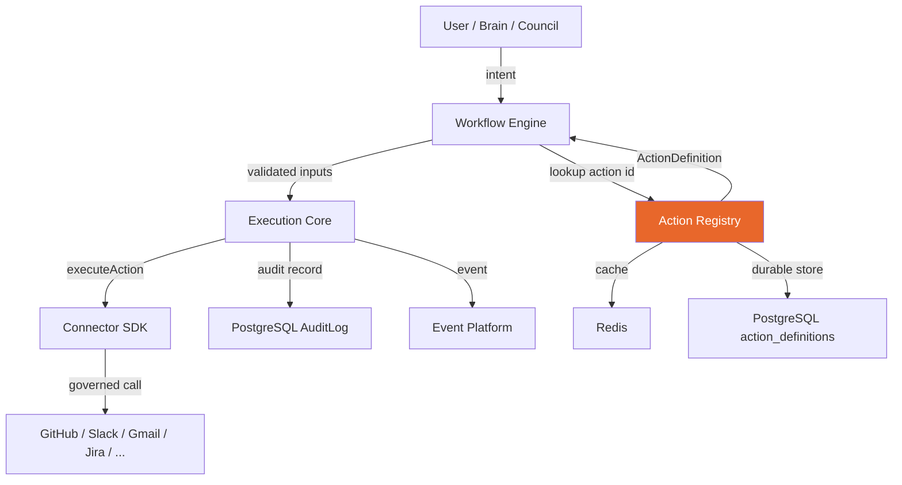
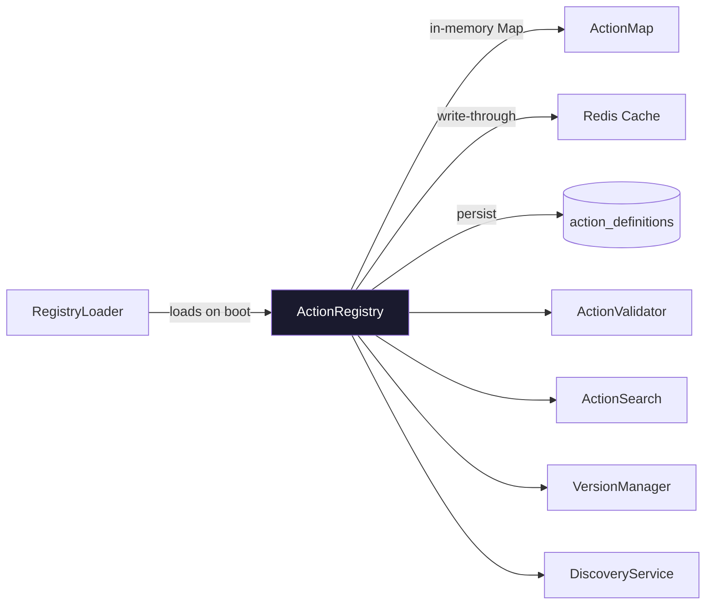
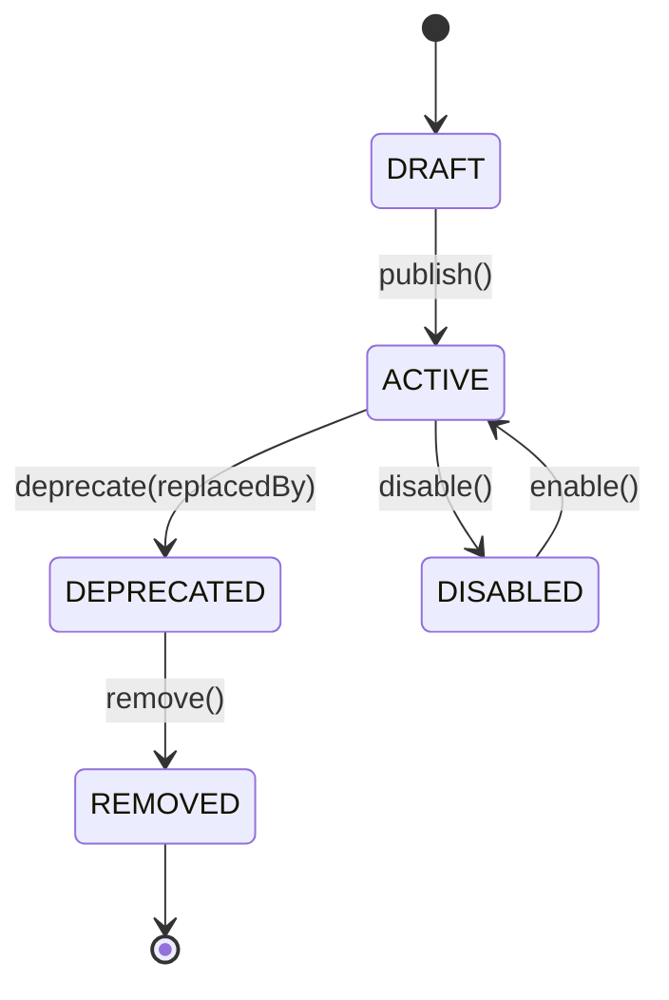
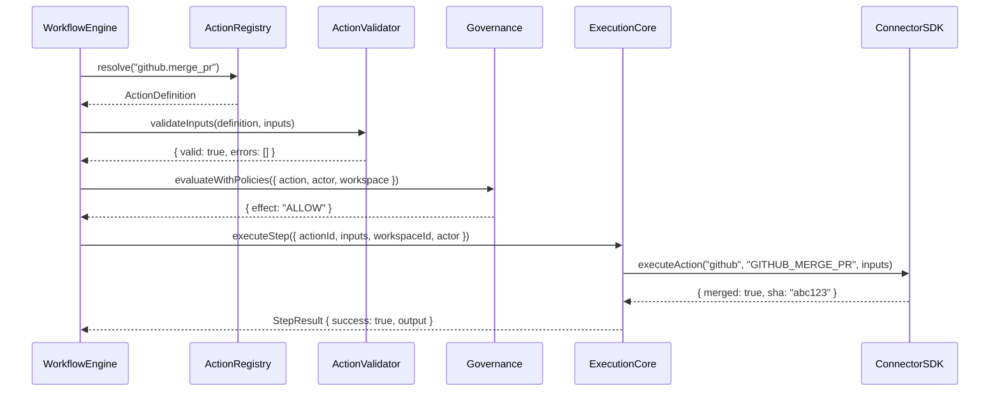
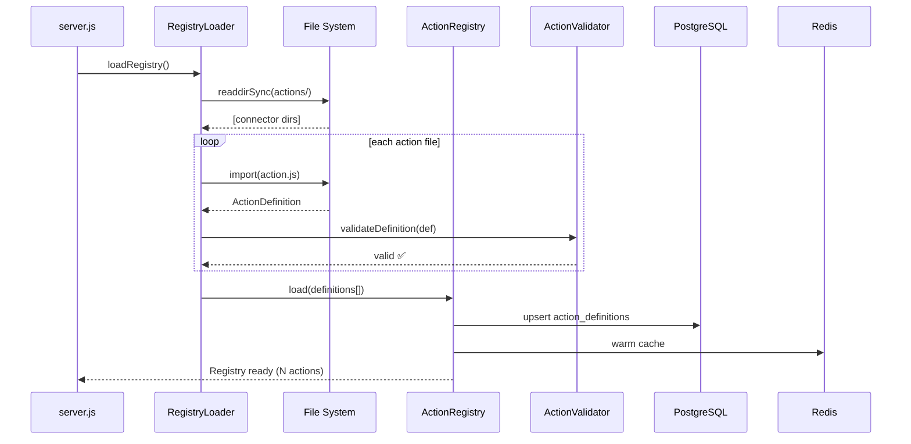
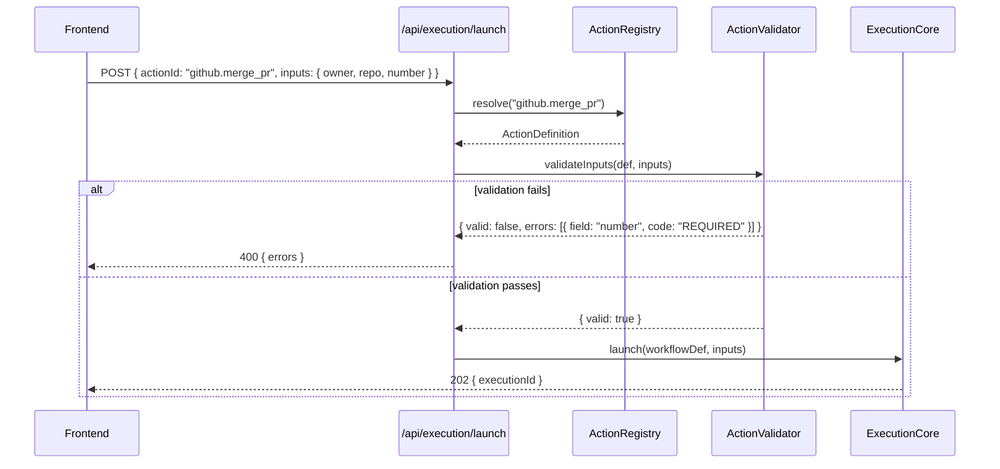

# PHASE 2.5 — Universal Action Registry

**Document Type:** Principal Architect Specification  
**Status:** Implementation Ready  
**Version:** 1.0.0  
**Target Quality:** Microsoft Azure Resource Provider / Temporal Workflow / Stripe API / Kubernetes CRD

---

## 1. Purpose

The Universal Action Registry (UAR) is the single source of truth for every executable action in FLOW. No workflow, no UI component, no AI agent hardcodes connector logic. Instead, every capability is declared once in the registry and consumed everywhere.

```
User Intent → Brain/Council → Workflow Engine → Action Registry → Connector SDK → Execution Core → Audit
```

The registry answers three questions at runtime:
1. **Can this action be performed?** (schema validation + permission check)
2. **How should it be executed?** (risk tier, approval policy, retry strategy, rollback)
3. **What happened?** (audit metadata, telemetry, output schema)

---

## 2. Architecture

### 2.1 Position in FLOW Stack



### 2.2 Registry Internal Architecture



### 2.3 Action Lifecycle



---

## 3. Action Definition Schema

Every action in FLOW must be declared with the following fields. No field is optional if marked **required**.

### 3.1 TypeScript Interface

```typescript
export interface ActionDefinition {
  // ── Identity ───────────────────────────────────────────────────────────
  id: string;                    // REQUIRED. Globally unique. Format: {connector}.{verb}_{noun}
  version: string;               // REQUIRED. SemVer "1.0.0"
  lifecycle: ActionLifecycle;    // REQUIRED. DRAFT | ACTIVE | DEPRECATED | DISABLED | REMOVED

  // ── Display ────────────────────────────────────────────────────────────
  connector: ConnectorId;        // REQUIRED. "github" | "slack" | "gmail" | ...
  category: ActionCategory;      // REQUIRED. See ActionCategory enum
  displayName: string;           // REQUIRED. Human-readable. "Merge Pull Request"
  description: string;           // REQUIRED. One sentence. Used in UI + AI prompting.
  icon?: string;                 // Optional. Lucide icon name.
  tags: string[];                // REQUIRED. Searchable terms. ["pr", "merge", "git"]

  // ── Risk & Governance ──────────────────────────────────────────────────
  riskLevel: RiskLevel;          // REQUIRED. LOW | MEDIUM | HIGH | CRITICAL
  approvalPolicy: ApprovalPolicy; // REQUIRED. Derived from riskLevel, overridable.
  requiredPermissions: string[]; // REQUIRED. FLOW RBAC roles that may execute.
  requiredScopes: string[];      // REQUIRED. OAuth/API scopes needed from the connector.
  
  // ── Execution ──────────────────────────────────────────────────────────
  executionMode: ExecutionMode;  // REQUIRED. SYNC | ASYNC | STREAMING
  estimatedDurationMs: number;   // REQUIRED. p50 latency estimate. Used for timeout defaults.
  timeoutMs: number;             // REQUIRED. Hard timeout. Must be > estimatedDurationMs.
  
  // ── Retry & Rollback ───────────────────────────────────────────────────
  retryStrategy: RetryStrategy;  // REQUIRED.
  rollbackStrategy: RollbackStrategy; // REQUIRED.
  verificationStrategy: VerificationStrategy; // REQUIRED.

  // ── Inputs ─────────────────────────────────────────────────────────────
  requiredInputs: InputSchema[]; // REQUIRED. Validated before execution.
  optionalInputs: InputSchema[]; // REQUIRED (can be empty array).

  // ── Outputs ────────────────────────────────────────────────────────────
  outputSchema: OutputSchema;    // REQUIRED.

  // ── Observability ──────────────────────────────────────────────────────
  auditMetadata: AuditMetadata;  // REQUIRED.
  telemetryMetadata: TelemetryMetadata; // REQUIRED.

  // ── Relations ──────────────────────────────────────────────────────────
  deprecatedBy?: string;         // Action id that replaces this one.
  relatedActions?: string[];     // Suggested follow-up action ids.
}

export type ConnectorId =
  | 'github' | 'slack' | 'gmail' | 'google-calendar'
  | 'jira' | 'notion' | 'confluence' | 'google-drive'
  | 'datadog' | 'pagerduty' | 'aws' | 'kubernetes'
  | 'hubspot' | 'salesforce' | 'linear' | 'figma'
  | 'internal'; // FLOW-native actions

export type ActionCategory =
  | 'code'          // PRs, commits, branches, reviews
  | 'communication' // Email, messages, threads
  | 'scheduling'    // Calendar, meetings
  | 'project'       // Issues, tickets, sprints
  | 'knowledge'     // Docs, pages, wikis
  | 'observability' // Alerts, incidents, metrics
  | 'infrastructure'// Deployments, pods, services
  | 'people'        // HR, org, team
  | 'finance'       // Billing, budgets, expenses
  | 'crm'           // Contacts, deals, pipelines
  | 'governance'    // Approvals, policies, audits
  | 'automation';   // Workflow-level actions

export type RiskLevel = 'LOW' | 'MEDIUM' | 'HIGH' | 'CRITICAL';

export type ExecutionMode = 'SYNC' | 'ASYNC' | 'STREAMING';

export type ActionLifecycle = 'DRAFT' | 'ACTIVE' | 'DEPRECATED' | 'DISABLED' | 'REMOVED';

export interface ApprovalPolicy {
  required: boolean;
  minimumApprovers: number;       // 0=auto, 1=single, 2=two-person
  eligibleRoles: string[];        // ["ADMIN", "OWNER"]
  timeoutHours: number;           // Auto-reject after N hours. Default: 48.
  selfApprovalAllowed: boolean;   // Always false for HIGH/CRITICAL.
  notifyOnCreate: boolean;
  notifyOnResolve: boolean;
}

export interface RetryStrategy {
  maxAttempts: number;
  backoffType: 'NONE' | 'FIXED' | 'EXPONENTIAL' | 'LINEAR';
  initialDelayMs: number;
  maxDelayMs: number;
  jitterPercent: number;          // 0-100. Adds randomness to avoid thundering herd.
  retryOn: string[];              // Error codes/types that trigger retry.
  noRetryOn: string[];            // Error codes/types that halt immediately.
}

export interface RollbackStrategy {
  supported: boolean;
  type: 'NONE' | 'AUTOMATIC' | 'MANUAL' | 'COMPENSATING';
  compensatingActionId?: string;  // Id of action that undoes this one.
  description: string;            // Human-readable rollback notes.
  requiresApproval: boolean;
}

export interface VerificationStrategy {
  type: 'NONE' | 'POLLING' | 'WEBHOOK' | 'IMMEDIATE';
  pollingIntervalMs?: number;
  pollingMaxAttempts?: number;
  webhookEvent?: string;
  successCondition?: string;      // JSONPath expression on output.
}

export interface InputSchema {
  name: string;
  type: 'string' | 'number' | 'boolean' | 'object' | 'array' | 'enum';
  description: string;
  example?: unknown;
  enum?: string[];
  pattern?: string;               // Regex for string validation.
  minLength?: number;
  maxLength?: number;
  minimum?: number;
  maximum?: number;
  items?: InputSchema;            // For array type.
  properties?: Record<string, InputSchema>; // For object type.
  sensitive?: boolean;            // Redacted in logs/audit if true.
}

export interface OutputSchema {
  type: 'object' | 'array' | 'void';
  properties?: Record<string, OutputFieldSchema>;
  description: string;
}

export interface OutputFieldSchema {
  type: string;
  description: string;
  example?: unknown;
}

export interface AuditMetadata {
  resourceType: string;           // "pull_request" | "message" | "issue" | ...
  resourceIdField: string;        // Input field name that holds the resource id.
  actionVerb: string;             // "merged" | "sent" | "created" | ...
  sensitivityLevel: 'PUBLIC' | 'INTERNAL' | 'CONFIDENTIAL' | 'RESTRICTED';
  retainForDays: number;          // Audit retention. Default: 365.
  complianceTags: string[];       // ["SOC2", "HIPAA", "GDPR"] where applicable.
}

export interface TelemetryMetadata {
  eventName: string;              // "action.github.merge_pr" — snake_case
  successMetric: string;          // Metric name to increment on success.
  failureMetric: string;          // Metric name to increment on failure.
  durationMetric: string;         // Histogram metric name.
  dimensions: string[];           // Dimension keys to attach. ["connector", "workspace_id"]
}
```

---

## 4. Approval Policy Defaults by Risk Level

| Risk Level | Auto-Execute | Approvers Required | Eligible Roles | Self-Approval | Timeout |
|---|---|---|---|---|---|
| LOW | ✅ Yes | 0 | — | N/A | — |
| MEDIUM | ❌ No (confirm in UI) | 1 | MEMBER+ | ✅ Yes | 48h |
| HIGH | ❌ No | 1 | ADMIN, OWNER | ❌ No | 48h |
| CRITICAL | ❌ No | 2 (distinct) | ADMIN, OWNER | ❌ No | 24h |

---

## 5. Folder Structure

```
src/
└── actionRegistry/
    ├── index.js                   # Public API barrel export
    ├── ActionRegistry.js          # Core registry class (singleton)
    ├── RegistryLoader.js          # Boot-time loader (reads actions/)
    ├── ActionValidator.js         # Input/output schema validator
    ├── ActionSearch.js            # Full-text + tag search
    ├── VersionManager.js          # SemVer + lifecycle transitions
    ├── DiscoveryService.js        # Returns registry metadata for UI
    ├── cache/
    │   └── RegistryCache.js       # Redis write-through cache
    ├── actions/
    │   ├── github/
    │   │   ├── merge_pr.js
    │   │   ├── review_pr.js
    │   │   ├── create_branch.js
    │   │   ├── create_pr.js
    │   │   ├── approve_pr.js
    │   │   ├── close_pr.js
    │   │   ├── create_issue.js
    │   │   └── sync_repo.js
    │   ├── slack/
    │   │   ├── send_message.js
    │   │   ├── send_dm.js
    │   │   ├── create_channel.js
    │   │   ├── archive_channel.js
    │   │   └── add_reaction.js
    │   ├── gmail/
    │   │   ├── send_email.js
    │   │   ├── reply_email.js
    │   │   ├── forward_email.js
    │   │   ├── archive_email.js
    │   │   └── create_draft.js
    │   ├── google-calendar/
    │   │   ├── create_event.js
    │   │   ├── update_event.js
    │   │   ├── delete_event.js
    │   │   └── invite_attendees.js
    │   ├── jira/
    │   │   ├── create_issue.js
    │   │   ├── update_issue.js
    │   │   ├── transition_issue.js
    │   │   ├── assign_issue.js
    │   │   └── add_comment.js
    │   ├── notion/
    │   │   ├── create_page.js
    │   │   ├── update_page.js
    │   │   └── create_database_entry.js
    │   ├── confluence/
    │   │   ├── create_page.js
    │   │   └── update_page.js
    │   ├── google-drive/
    │   │   ├── create_document.js
    │   │   └── share_file.js
    │   ├── datadog/
    │   │   ├── create_monitor.js
    │   │   ├── mute_monitor.js
    │   │   └── trigger_alert.js
    │   ├── pagerduty/
    │   │   ├── create_incident.js
    │   │   ├── resolve_incident.js
    │   │   └── escalate_incident.js
    │   ├── aws/
    │   │   ├── restart_ecs_service.js
    │   │   └── scale_asg.js
    │   ├── kubernetes/
    │   │   ├── rollout_restart.js
    │   │   ├── scale_deployment.js
    │   │   └── delete_pod.js
    │   └── internal/
    │       ├── send_notification.js
    │       └── create_approval.js
    └── __tests__/
        ├── ActionRegistry.test.js
        ├── ActionValidator.test.js
        └── fixtures/
            └── testAction.js
```

---

## 6. Database Schema

```sql
-- Action definition store (durable, versioned)
CREATE TABLE action_definitions (
  id               TEXT NOT NULL,
  version          TEXT NOT NULL,
  lifecycle        TEXT NOT NULL DEFAULT 'DRAFT',
  connector        TEXT NOT NULL,
  category         TEXT NOT NULL,
  display_name     TEXT NOT NULL,
  description      TEXT NOT NULL,
  tags             TEXT[] NOT NULL DEFAULT '{}',
  risk_level       TEXT NOT NULL,
  approval_policy  JSONB NOT NULL,
  required_permissions TEXT[] NOT NULL DEFAULT '{}',
  required_scopes  TEXT[] NOT NULL DEFAULT '{}',
  execution_mode   TEXT NOT NULL DEFAULT 'SYNC',
  estimated_duration_ms INTEGER NOT NULL DEFAULT 1000,
  timeout_ms       INTEGER NOT NULL DEFAULT 30000,
  retry_strategy   JSONB NOT NULL,
  rollback_strategy JSONB NOT NULL,
  verification_strategy JSONB NOT NULL,
  required_inputs  JSONB NOT NULL DEFAULT '[]',
  optional_inputs  JSONB NOT NULL DEFAULT '[]',
  output_schema    JSONB NOT NULL,
  audit_metadata   JSONB NOT NULL,
  telemetry_metadata JSONB NOT NULL,
  deprecated_by    TEXT,
  related_actions  TEXT[] DEFAULT '{}',
  icon             TEXT,
  created_at       TIMESTAMPTZ NOT NULL DEFAULT NOW(),
  updated_at       TIMESTAMPTZ NOT NULL DEFAULT NOW(),
  created_by       TEXT,

  PRIMARY KEY (id, version)
);

-- Active version pointer (fast lookup)
CREATE TABLE action_versions_active (
  action_id        TEXT PRIMARY KEY,
  active_version   TEXT NOT NULL,
  updated_at       TIMESTAMPTZ NOT NULL DEFAULT NOW()
);

-- Execution history reference (aggregate counts, not full records — those are in execution_records)
CREATE TABLE action_usage_stats (
  action_id        TEXT NOT NULL,
  workspace_id     TEXT NOT NULL,
  executions_total INTEGER NOT NULL DEFAULT 0,
  executions_success INTEGER NOT NULL DEFAULT 0,
  executions_failed  INTEGER NOT NULL DEFAULT 0,
  last_executed_at TIMESTAMPTZ,
  avg_duration_ms  INTEGER,
  PRIMARY KEY (action_id, workspace_id)
);

-- Indexes
CREATE INDEX idx_action_definitions_connector ON action_definitions(connector);
CREATE INDEX idx_action_definitions_category  ON action_definitions(category);
CREATE INDEX idx_action_definitions_lifecycle ON action_definitions(lifecycle);
CREATE INDEX idx_action_definitions_risk      ON action_definitions(risk_level);
CREATE INDEX idx_action_definitions_tags      ON action_definitions USING GIN(tags);
```

---

## 7. Core Implementation

### 7.1 ActionRegistry.js

```javascript
// src/actionRegistry/ActionRegistry.js
import { redis } from '../config/redis.js';
import { pool } from '../config/db.js';
import { ActionValidator } from './ActionValidator.js';
import { ActionSearch } from './ActionSearch.js';
import { logger } from '../utils/logger.js';

const CACHE_TTL_SECONDS = 300; // 5 minutes
const CACHE_PREFIX = 'flow:uar:action:';

export class ActionRegistry {
  #actions = new Map();   // id → ActionDefinition
  #loaded = false;

  async load(definitions) {
    for (const def of definitions) {
      ActionValidator.validateDefinition(def);
      this.#actions.set(def.id, def);
    }
    this.#loaded = true;
    logger.info(`[ActionRegistry] Loaded ${this.#actions.size} actions`);
  }

  async resolve(actionId) {
    if (!this.#loaded) throw new Error('Registry not initialized');

    // 1. In-memory hit (fastest path)
    const cached = this.#actions.get(actionId);
    if (cached) return cached;

    // 2. Redis cache
    const redisKey = `${CACHE_PREFIX}${actionId}`;
    const redisHit = await redis.get(redisKey);
    if (redisHit) {
      const def = JSON.parse(redisHit);
      this.#actions.set(actionId, def);
      return def;
    }

    // 3. Database
    const { rows } = await pool.query(
      `SELECT ad.* FROM action_definitions ad
       JOIN action_versions_active ava ON ava.action_id = ad.id AND ava.active_version = ad.version
       WHERE ad.id = $1 AND ad.lifecycle = 'ACTIVE'`,
      [actionId]
    );
    if (rows.length === 0) throw new ActionNotFoundError(actionId);

    const def = this.#rowToDefinition(rows[0]);
    this.#actions.set(actionId, def);
    await redis.setex(redisKey, CACHE_TTL_SECONDS, JSON.stringify(def));
    return def;
  }

  async validateInputs(actionId, inputs) {
    const def = await this.resolve(actionId);
    return ActionValidator.validateInputs(def, inputs);
  }

  list({ connector, category, riskLevel, lifecycle = 'ACTIVE' } = {}) {
    return [...this.#actions.values()].filter(a =>
      a.lifecycle === lifecycle &&
      (!connector || a.connector === connector) &&
      (!category || a.category === category) &&
      (!riskLevel || a.riskLevel === riskLevel)
    );
  }

  search(query) {
    return ActionSearch.search(query, [...this.#actions.values()]);
  }

  async register(definition) {
    ActionValidator.validateDefinition(definition);
    await pool.query(
      `INSERT INTO action_definitions (id, version, lifecycle, connector, category,
         display_name, description, tags, risk_level, approval_policy,
         required_permissions, required_scopes, execution_mode, estimated_duration_ms,
         timeout_ms, retry_strategy, rollback_strategy, verification_strategy,
         required_inputs, optional_inputs, output_schema, audit_metadata,
         telemetry_metadata, deprecated_by, related_actions, icon)
       VALUES ($1,$2,$3,$4,$5,$6,$7,$8,$9,$10,$11,$12,$13,$14,$15,$16,$17,$18,$19,$20,$21,$22,$23,$24,$25,$26)
       ON CONFLICT (id, version) DO UPDATE SET lifecycle = EXCLUDED.lifecycle, updated_at = NOW()`,
      [
        definition.id, definition.version, definition.lifecycle,
        definition.connector, definition.category, definition.displayName,
        definition.description, definition.tags, definition.riskLevel,
        JSON.stringify(definition.approvalPolicy),
        definition.requiredPermissions, definition.requiredScopes,
        definition.executionMode, definition.estimatedDurationMs,
        definition.timeoutMs,
        JSON.stringify(definition.retryStrategy),
        JSON.stringify(definition.rollbackStrategy),
        JSON.stringify(definition.verificationStrategy),
        JSON.stringify(definition.requiredInputs),
        JSON.stringify(definition.optionalInputs),
        JSON.stringify(definition.outputSchema),
        JSON.stringify(definition.auditMetadata),
        JSON.stringify(definition.telemetryMetadata),
        definition.deprecatedBy ?? null,
        definition.relatedActions ?? [],
        definition.icon ?? null,
      ]
    );
    this.#actions.set(definition.id, definition);
    await redis.del(`${CACHE_PREFIX}${definition.id}`);
  }

  #rowToDefinition(row) {
    return {
      id: row.id,
      version: row.version,
      lifecycle: row.lifecycle,
      connector: row.connector,
      category: row.category,
      displayName: row.display_name,
      description: row.description,
      tags: row.tags,
      riskLevel: row.risk_level,
      approvalPolicy: row.approval_policy,
      requiredPermissions: row.required_permissions,
      requiredScopes: row.required_scopes,
      executionMode: row.execution_mode,
      estimatedDurationMs: row.estimated_duration_ms,
      timeoutMs: row.timeout_ms,
      retryStrategy: row.retry_strategy,
      rollbackStrategy: row.rollback_strategy,
      verificationStrategy: row.verification_strategy,
      requiredInputs: row.required_inputs,
      optionalInputs: row.optional_inputs,
      outputSchema: row.output_schema,
      auditMetadata: row.audit_metadata,
      telemetryMetadata: row.telemetry_metadata,
      deprecatedBy: row.deprecated_by,
      relatedActions: row.related_actions,
      icon: row.icon,
    };
  }
}

export class ActionNotFoundError extends Error {
  constructor(actionId) {
    super(`Action not found or not active: ${actionId}`);
    this.code = 'ACTION_NOT_FOUND';
    this.actionId = actionId;
  }
}

// Singleton
export const actionRegistry = new ActionRegistry();
```

### 7.2 RegistryLoader.js

```javascript
// src/actionRegistry/RegistryLoader.js
import { readdirSync } from 'fs';
import { join, dirname } from 'path';
import { fileURLToPath } from 'url';
import { actionRegistry } from './ActionRegistry.js';
import { logger } from '../utils/logger.js';

const __dirname = dirname(fileURLToPath(import.meta.url));
const ACTIONS_DIR = join(__dirname, 'actions');

export async function loadRegistry() {
  const definitions = [];
  const connectorDirs = readdirSync(ACTIONS_DIR, { withFileTypes: true })
    .filter(e => e.isDirectory())
    .map(e => e.name);

  for (const connector of connectorDirs) {
    const connectorPath = join(ACTIONS_DIR, connector);
    const files = readdirSync(connectorPath).filter(f => f.endsWith('.js'));

    for (const file of files) {
      const filePath = join(connectorPath, file);
      const { default: definition } = await import(`file://${filePath}`);
      if (definition?.lifecycle !== 'REMOVED') {
        definitions.push(definition);
      }
    }
  }

  await actionRegistry.load(definitions);
  logger.info(`[RegistryLoader] Registry ready — ${definitions.length} actions loaded`);
}
```

### 7.3 ActionValidator.js

```javascript
// src/actionRegistry/ActionValidator.js

const REQUIRED_FIELDS = [
  'id', 'version', 'lifecycle', 'connector', 'category',
  'displayName', 'description', 'tags', 'riskLevel', 'approvalPolicy',
  'requiredPermissions', 'requiredScopes', 'executionMode',
  'estimatedDurationMs', 'timeoutMs', 'retryStrategy',
  'rollbackStrategy', 'verificationStrategy', 'requiredInputs',
  'optionalInputs', 'outputSchema', 'auditMetadata', 'telemetryMetadata',
];

const VALID_RISK_LEVELS = ['LOW', 'MEDIUM', 'HIGH', 'CRITICAL'];
const VALID_LIFECYCLES = ['DRAFT', 'ACTIVE', 'DEPRECATED', 'DISABLED', 'REMOVED'];
const ID_PATTERN = /^[a-z][a-z0-9-]*\.[a-z][a-z0-9_]*$/;

export class ActionValidator {
  static validateDefinition(def) {
    const errors = [];

    for (const field of REQUIRED_FIELDS) {
      if (def[field] === undefined || def[field] === null) {
        errors.push(`Missing required field: ${field}`);
      }
    }

    if (def.id && !ID_PATTERN.test(def.id)) {
      errors.push(`Invalid action id format: "${def.id}". Must match {connector}.{verb_noun}`);
    }

    if (def.riskLevel && !VALID_RISK_LEVELS.includes(def.riskLevel)) {
      errors.push(`Invalid riskLevel: "${def.riskLevel}"`);
    }

    if (def.lifecycle && !VALID_LIFECYCLES.includes(def.lifecycle)) {
      errors.push(`Invalid lifecycle: "${def.lifecycle}"`);
    }

    if (def.timeoutMs && def.estimatedDurationMs && def.timeoutMs <= def.estimatedDurationMs) {
      errors.push(`timeoutMs (${def.timeoutMs}) must be greater than estimatedDurationMs (${def.estimatedDurationMs})`);
    }

    if (def.riskLevel === 'CRITICAL' && def.approvalPolicy?.selfApprovalAllowed) {
      errors.push('CRITICAL actions cannot allow self-approval');
    }

    if (def.riskLevel === 'HIGH' && def.approvalPolicy?.selfApprovalAllowed) {
      errors.push('HIGH risk actions cannot allow self-approval');
    }

    if (errors.length > 0) {
      throw new RegistryValidationError(def.id ?? 'unknown', errors);
    }
  }

  static validateInputs(definition, inputs) {
    const errors = [];

    for (const schema of definition.requiredInputs) {
      const value = inputs[schema.name];
      if (value === undefined || value === null || value === '') {
        errors.push({ field: schema.name, code: 'REQUIRED', message: `${schema.name} is required` });
        continue;
      }
      const fieldErrors = this.#validateField(schema, value);
      errors.push(...fieldErrors.map(e => ({ field: schema.name, ...e })));
    }

    for (const schema of definition.optionalInputs) {
      const value = inputs[schema.name];
      if (value !== undefined && value !== null) {
        const fieldErrors = this.#validateField(schema, value);
        errors.push(...fieldErrors.map(e => ({ field: schema.name, ...e })));
      }
    }

    return { valid: errors.length === 0, errors };
  }

  static #validateField(schema, value) {
    const errors = [];
    if (schema.type === 'string' && typeof value !== 'string') {
      errors.push({ code: 'TYPE_MISMATCH', message: `Expected string, got ${typeof value}` });
    }
    if (schema.type === 'enum' && !schema.enum?.includes(value)) {
      errors.push({ code: 'INVALID_ENUM', message: `Must be one of: ${schema.enum?.join(', ')}` });
    }
    if (schema.pattern && typeof value === 'string' && !new RegExp(schema.pattern).test(value)) {
      errors.push({ code: 'PATTERN_MISMATCH', message: `Must match pattern: ${schema.pattern}` });
    }
    if (schema.maxLength && typeof value === 'string' && value.length > schema.maxLength) {
      errors.push({ code: 'TOO_LONG', message: `Max length is ${schema.maxLength}` });
    }
    return errors;
  }
}

export class RegistryValidationError extends Error {
  constructor(actionId, errors) {
    super(`Action definition invalid: ${actionId}`);
    this.code = 'REGISTRY_VALIDATION_ERROR';
    this.actionId = actionId;
    this.errors = errors;
  }
}
```

### 7.4 ActionSearch.js

```javascript
// src/actionRegistry/ActionSearch.js

export class ActionSearch {
  static search(query, actions) {
    if (!query || query.trim().length === 0) return actions;

    const terms = query.toLowerCase().split(/\s+/);

    return actions
      .filter(a => a.lifecycle === 'ACTIVE')
      .map(a => {
        let score = 0;
        const searchable = [
          a.id, a.displayName, a.description, a.connector, a.category,
          ...(a.tags ?? []),
        ].join(' ').toLowerCase();

        for (const term of terms) {
          if (a.id.includes(term)) score += 10;
          if (a.displayName.toLowerCase().includes(term)) score += 5;
          if (a.tags?.includes(term)) score += 8;
          if (searchable.includes(term)) score += 1;
        }

        return { action: a, score };
      })
      .filter(({ score }) => score > 0)
      .sort((a, b) => b.score - a.score)
      .map(({ action }) => action);
  }
}
```

---

## 8. API Endpoints

Mounted at `/api/registry` (JWT + workspace-id required).

| Method | Path | Auth | Description |
|---|---|---|---|
| GET | `/api/registry/actions` | JWT | List all ACTIVE actions. Supports `?connector=&category=&riskLevel=` |
| GET | `/api/registry/actions/search` | JWT | Full-text + tag search. `?q=merge+pr` |
| GET | `/api/registry/actions/:id` | JWT | Single action definition |
| GET | `/api/registry/connectors` | JWT | Connectors with action counts |
| GET | `/api/registry/categories` | JWT | Categories with action counts |
| POST | `/api/registry/validate` | JWT + ADMIN | Validate action definition (dry-run) |
| POST | `/api/registry/actions` | JWT + OWNER | Register a new action |
| PATCH | `/api/registry/actions/:id/lifecycle` | JWT + OWNER | Transition lifecycle state |
| GET | `/api/registry/stats` | JWT + ADMIN | Registry stats + usage |

### Route Implementation Skeleton

```javascript
// src/routes/registryRoutes.js
import { Router } from 'express';
import { actionRegistry } from '../actionRegistry/index.js';
import { ActionValidator } from '../actionRegistry/ActionValidator.js';

const router = Router();

router.get('/actions', async (req, res) => {
  const { connector, category, riskLevel } = req.query;
  const actions = actionRegistry.list({ connector, category, riskLevel });
  res.json({ actions, total: actions.length });
});

router.get('/actions/search', async (req, res) => {
  const { q } = req.query;
  if (!q) return res.status(400).json({ error: 'Query parameter q is required' });
  const results = actionRegistry.search(q);
  res.json({ results, total: results.length, query: q });
});

router.get('/actions/:id', async (req, res) => {
  const action = await actionRegistry.resolve(req.params.id);
  res.json({ action });
});

router.post('/validate', async (req, res) => {
  try {
    ActionValidator.validateDefinition(req.body);
    res.json({ valid: true, errors: [] });
  } catch (err) {
    res.json({ valid: false, errors: err.errors ?? [err.message] });
  }
});

router.post('/actions', async (req, res) => {
  await actionRegistry.register(req.body);
  res.status(201).json({ registered: true, id: req.body.id });
});

export { router as registryRoutes };
```

---

## 9. Sequence Diagrams

### 9.1 Workflow Engine → Registry → Execution



### 9.2 Registry Boot Sequence



### 9.3 Input Validation at Runtime



---

## 10. Action Definitions — 30+ Production Actions

Each action file exports a default `ActionDefinition` object.

---

### 10.1 GitHub Actions

#### `github.merge_pr`

```javascript
// src/actionRegistry/actions/github/merge_pr.js
export default {
  id: 'github.merge_pr',
  version: '1.0.0',
  lifecycle: 'ACTIVE',
  connector: 'github',
  category: 'code',
  displayName: 'Merge Pull Request',
  description: 'Merges an open pull request using the specified merge strategy.',
  icon: 'git-merge',
  tags: ['pr', 'merge', 'git', 'github', 'code-review'],
  riskLevel: 'HIGH',
  approvalPolicy: {
    required: true,
    minimumApprovers: 1,
    eligibleRoles: ['ADMIN', 'OWNER'],
    timeoutHours: 48,
    selfApprovalAllowed: false,
    notifyOnCreate: true,
    notifyOnResolve: true,
  },
  requiredPermissions: ['MEMBER'],
  requiredScopes: ['repo'],
  executionMode: 'SYNC',
  estimatedDurationMs: 3000,
  timeoutMs: 30000,
  retryStrategy: {
    maxAttempts: 2,
    backoffType: 'FIXED',
    initialDelayMs: 2000,
    maxDelayMs: 2000,
    jitterPercent: 0,
    retryOn: ['RATE_LIMIT', 'TIMEOUT'],
    noRetryOn: ['MERGE_CONFLICT', 'PR_CLOSED', 'NOT_MERGEABLE', 'UNAUTHORIZED'],
  },
  rollbackStrategy: {
    supported: true,
    type: 'MANUAL',
    description: 'Merged commits cannot be automatically reverted. Create a revert PR using github.create_pr with revert commits.',
    requiresApproval: true,
  },
  verificationStrategy: {
    type: 'IMMEDIATE',
    successCondition: '$.merged === true',
  },
  requiredInputs: [
    { name: 'owner', type: 'string', description: 'Repository owner (org or user)', example: 'helios-software' },
    { name: 'repo', type: 'string', description: 'Repository name', example: 'platform-api' },
    { name: 'pull_number', type: 'number', description: 'Pull request number', example: 847 },
  ],
  optionalInputs: [
    {
      name: 'merge_method',
      type: 'enum',
      enum: ['merge', 'squash', 'rebase'],
      description: 'Merge strategy. Defaults to squash.',
      example: 'squash',
    },
    { name: 'commit_title', type: 'string', maxLength: 72, description: 'Override commit title for merge/squash', example: 'fix: resolve auth mutex deadlock (#847)' },
    { name: 'commit_message', type: 'string', maxLength: 4096, description: 'Commit message body', sensitive: false },
  ],
  outputSchema: {
    type: 'object',
    description: 'Merge result from GitHub API',
    properties: {
      sha: { type: 'string', description: 'Merge commit SHA', example: 'abc123def456' },
      merged: { type: 'boolean', description: 'Whether the PR was merged', example: true },
      message: { type: 'string', description: 'GitHub response message', example: 'Pull Request successfully merged' },
    },
  },
  auditMetadata: {
    resourceType: 'pull_request',
    resourceIdField: 'pull_number',
    actionVerb: 'merged',
    sensitivityLevel: 'INTERNAL',
    retainForDays: 365,
    complianceTags: ['SOC2'],
  },
  telemetryMetadata: {
    eventName: 'action.github.merge_pr',
    successMetric: 'flow.action.github.merge_pr.success',
    failureMetric: 'flow.action.github.merge_pr.failure',
    durationMetric: 'flow.action.github.merge_pr.duration_ms',
    dimensions: ['connector', 'workspace_id', 'merge_method'],
  },
  relatedActions: ['github.review_pr', 'github.approve_pr', 'github.create_pr'],
};
```

#### `github.review_pr`

```javascript
export default {
  id: 'github.review_pr',
  version: '1.0.0',
  lifecycle: 'ACTIVE',
  connector: 'github',
  category: 'code',
  displayName: 'Submit PR Review',
  description: 'Submits a review on a pull request (approve, request changes, or comment).',
  icon: 'message-square',
  tags: ['pr', 'review', 'github', 'code-quality'],
  riskLevel: 'MEDIUM',
  approvalPolicy: {
    required: false,
    minimumApprovers: 0,
    eligibleRoles: ['MEMBER'],
    timeoutHours: 0,
    selfApprovalAllowed: true,
    notifyOnCreate: false,
    notifyOnResolve: false,
  },
  requiredPermissions: ['MEMBER'],
  requiredScopes: ['repo'],
  executionMode: 'SYNC',
  estimatedDurationMs: 2000,
  timeoutMs: 15000,
  retryStrategy: {
    maxAttempts: 3,
    backoffType: 'EXPONENTIAL',
    initialDelayMs: 1000,
    maxDelayMs: 8000,
    jitterPercent: 10,
    retryOn: ['RATE_LIMIT', 'TIMEOUT'],
    noRetryOn: ['PR_CLOSED', 'UNAUTHORIZED'],
  },
  rollbackStrategy: {
    supported: false,
    type: 'NONE',
    description: 'Reviews are immutable after submission.',
    requiresApproval: false,
  },
  verificationStrategy: { type: 'IMMEDIATE', successCondition: '$.id != null' },
  requiredInputs: [
    { name: 'owner', type: 'string', description: 'Repository owner', example: 'helios-software' },
    { name: 'repo', type: 'string', description: 'Repository name', example: 'platform-api' },
    { name: 'pull_number', type: 'number', description: 'PR number', example: 847 },
    { name: 'event', type: 'enum', enum: ['APPROVE', 'REQUEST_CHANGES', 'COMMENT'], description: 'Review event type' },
    { name: 'body', type: 'string', maxLength: 65536, description: 'Review comment body' },
  ],
  optionalInputs: [],
  outputSchema: {
    type: 'object',
    description: 'Created review object',
    properties: {
      id: { type: 'number', description: 'Review id' },
      state: { type: 'string', description: 'Review state' },
      submitted_at: { type: 'string', description: 'ISO timestamp' },
    },
  },
  auditMetadata: {
    resourceType: 'pull_request',
    resourceIdField: 'pull_number',
    actionVerb: 'reviewed',
    sensitivityLevel: 'INTERNAL',
    retainForDays: 365,
    complianceTags: ['SOC2'],
  },
  telemetryMetadata: {
    eventName: 'action.github.review_pr',
    successMetric: 'flow.action.github.review_pr.success',
    failureMetric: 'flow.action.github.review_pr.failure',
    durationMetric: 'flow.action.github.review_pr.duration_ms',
    dimensions: ['connector', 'workspace_id', 'event'],
  },
  relatedActions: ['github.merge_pr', 'github.approve_pr'],
};
```

#### `github.create_branch`

```javascript
export default {
  id: 'github.create_branch',
  version: '1.0.0',
  lifecycle: 'ACTIVE',
  connector: 'github',
  category: 'code',
  displayName: 'Create Branch',
  description: 'Creates a new branch from a specified commit SHA or existing branch.',
  icon: 'git-branch',
  tags: ['branch', 'git', 'github', 'create'],
  riskLevel: 'LOW',
  approvalPolicy: { required: false, minimumApprovers: 0, eligibleRoles: ['MEMBER'], timeoutHours: 0, selfApprovalAllowed: true, notifyOnCreate: false, notifyOnResolve: false },
  requiredPermissions: ['MEMBER'],
  requiredScopes: ['repo'],
  executionMode: 'SYNC',
  estimatedDurationMs: 1500,
  timeoutMs: 10000,
  retryStrategy: { maxAttempts: 3, backoffType: 'EXPONENTIAL', initialDelayMs: 500, maxDelayMs: 4000, jitterPercent: 15, retryOn: ['RATE_LIMIT', 'TIMEOUT'], noRetryOn: ['BRANCH_EXISTS', 'UNAUTHORIZED'] },
  rollbackStrategy: { supported: true, type: 'COMPENSATING', compensatingActionId: 'github.delete_branch', description: 'Delete the created branch.', requiresApproval: false },
  verificationStrategy: { type: 'IMMEDIATE', successCondition: '$.ref != null' },
  requiredInputs: [
    { name: 'owner', type: 'string', description: 'Repository owner', example: 'helios-software' },
    { name: 'repo', type: 'string', description: 'Repository name', example: 'platform-api' },
    { name: 'branch', type: 'string', maxLength: 255, description: 'New branch name', example: 'fix/auth-mutex-deadlock' },
    { name: 'from_ref', type: 'string', description: 'SHA or branch name to branch from', example: 'main' },
  ],
  optionalInputs: [],
  outputSchema: {
    type: 'object',
    description: 'Created branch reference',
    properties: {
      ref: { type: 'string', description: 'Full ref name', example: 'refs/heads/fix/auth-mutex-deadlock' },
      sha: { type: 'string', description: 'Commit SHA the branch points to' },
    },
  },
  auditMetadata: { resourceType: 'branch', resourceIdField: 'branch', actionVerb: 'created', sensitivityLevel: 'INTERNAL', retainForDays: 180, complianceTags: [] },
  telemetryMetadata: { eventName: 'action.github.create_branch', successMetric: 'flow.action.github.create_branch.success', failureMetric: 'flow.action.github.create_branch.failure', durationMetric: 'flow.action.github.create_branch.duration_ms', dimensions: ['connector', 'workspace_id'] },
  relatedActions: ['github.create_pr'],
};
```

#### `github.create_pr`

```javascript
export default {
  id: 'github.create_pr',
  version: '1.0.0',
  lifecycle: 'ACTIVE',
  connector: 'github',
  category: 'code',
  displayName: 'Create Pull Request',
  description: 'Opens a new pull request against a target branch.',
  icon: 'git-pull-request',
  tags: ['pr', 'pull-request', 'github', 'create', 'code-review'],
  riskLevel: 'LOW',
  approvalPolicy: { required: false, minimumApprovers: 0, eligibleRoles: ['MEMBER'], timeoutHours: 0, selfApprovalAllowed: true, notifyOnCreate: false, notifyOnResolve: false },
  requiredPermissions: ['MEMBER'],
  requiredScopes: ['repo'],
  executionMode: 'SYNC',
  estimatedDurationMs: 2000,
  timeoutMs: 15000,
  retryStrategy: { maxAttempts: 2, backoffType: 'FIXED', initialDelayMs: 2000, maxDelayMs: 2000, jitterPercent: 0, retryOn: ['RATE_LIMIT', 'TIMEOUT'], noRetryOn: ['PR_ALREADY_EXISTS', 'UNAUTHORIZED'] },
  rollbackStrategy: { supported: true, type: 'COMPENSATING', compensatingActionId: 'github.close_pr', description: 'Close the created pull request.', requiresApproval: false },
  verificationStrategy: { type: 'IMMEDIATE', successCondition: '$.number != null' },
  requiredInputs: [
    { name: 'owner', type: 'string', description: 'Repository owner' },
    { name: 'repo', type: 'string', description: 'Repository name' },
    { name: 'title', type: 'string', maxLength: 255, description: 'PR title' },
    { name: 'head', type: 'string', description: 'Source branch (head)', example: 'fix/auth-mutex-deadlock' },
    { name: 'base', type: 'string', description: 'Target branch (base)', example: 'main' },
  ],
  optionalInputs: [
    { name: 'body', type: 'string', maxLength: 65536, description: 'PR description (Markdown)' },
    { name: 'draft', type: 'boolean', description: 'Create as draft', example: false },
    { name: 'reviewers', type: 'array', items: { name: 'reviewer', type: 'string', description: 'GitHub username' }, description: 'Reviewer usernames' },
  ],
  outputSchema: {
    type: 'object',
    description: 'Created pull request',
    properties: {
      number: { type: 'number', description: 'PR number' },
      html_url: { type: 'string', description: 'PR URL' },
      state: { type: 'string', description: '"open"' },
    },
  },
  auditMetadata: { resourceType: 'pull_request', resourceIdField: 'title', actionVerb: 'created', sensitivityLevel: 'INTERNAL', retainForDays: 365, complianceTags: ['SOC2'] },
  telemetryMetadata: { eventName: 'action.github.create_pr', successMetric: 'flow.action.github.create_pr.success', failureMetric: 'flow.action.github.create_pr.failure', durationMetric: 'flow.action.github.create_pr.duration_ms', dimensions: ['connector', 'workspace_id', 'draft'] },
  relatedActions: ['github.review_pr', 'github.merge_pr'],
};
```

---

### 10.2 Slack Actions

#### `slack.send_message`

```javascript
export default {
  id: 'slack.send_message',
  version: '1.0.0',
  lifecycle: 'ACTIVE',
  connector: 'slack',
  category: 'communication',
  displayName: 'Send Slack Message',
  description: 'Posts a message to a Slack channel or thread.',
  icon: 'message-circle',
  tags: ['slack', 'message', 'notify', 'channel', 'post'],
  riskLevel: 'LOW',
  approvalPolicy: { required: false, minimumApprovers: 0, eligibleRoles: ['MEMBER'], timeoutHours: 0, selfApprovalAllowed: true, notifyOnCreate: false, notifyOnResolve: false },
  requiredPermissions: ['MEMBER'],
  requiredScopes: ['chat:write'],
  executionMode: 'SYNC',
  estimatedDurationMs: 800,
  timeoutMs: 8000,
  retryStrategy: { maxAttempts: 3, backoffType: 'EXPONENTIAL', initialDelayMs: 500, maxDelayMs: 4000, jitterPercent: 10, retryOn: ['RATE_LIMIT', 'TIMEOUT'], noRetryOn: ['CHANNEL_NOT_FOUND', 'NOT_IN_CHANNEL', 'UNAUTHORIZED'] },
  rollbackStrategy: { supported: true, type: 'COMPENSATING', compensatingActionId: 'slack.delete_message', description: 'Delete the sent message.', requiresApproval: false },
  verificationStrategy: { type: 'IMMEDIATE', successCondition: '$.ok === true' },
  requiredInputs: [
    { name: 'channel', type: 'string', description: 'Channel ID or name (e.g., #engineering)', example: 'C01234567' },
    { name: 'text', type: 'string', maxLength: 40000, description: 'Message text (Slack mrkdwn supported)', example: 'PR #847 is ready for review.' },
  ],
  optionalInputs: [
    { name: 'thread_ts', type: 'string', description: 'Parent message timestamp to reply in thread', example: '1734123456.000100' },
    { name: 'blocks', type: 'array', description: 'Slack Block Kit blocks (overrides text)', items: { name: 'block', type: 'object', description: 'Slack block' } },
    { name: 'unfurl_links', type: 'boolean', description: 'Whether to unfurl URLs', example: false },
  ],
  outputSchema: {
    type: 'object',
    description: 'Slack postMessage response',
    properties: {
      ok: { type: 'boolean', description: 'Success flag' },
      ts: { type: 'string', description: 'Message timestamp', example: '1734123456.000200' },
      channel: { type: 'string', description: 'Channel ID' },
    },
  },
  auditMetadata: { resourceType: 'message', resourceIdField: 'channel', actionVerb: 'sent', sensitivityLevel: 'INTERNAL', retainForDays: 90, complianceTags: [] },
  telemetryMetadata: { eventName: 'action.slack.send_message', successMetric: 'flow.action.slack.send_message.success', failureMetric: 'flow.action.slack.send_message.failure', durationMetric: 'flow.action.slack.send_message.duration_ms', dimensions: ['connector', 'workspace_id'] },
  relatedActions: ['slack.send_dm', 'slack.add_reaction'],
};
```

#### `slack.send_dm`

```javascript
export default {
  id: 'slack.send_dm',
  version: '1.0.0',
  lifecycle: 'ACTIVE',
  connector: 'slack',
  category: 'communication',
  displayName: 'Send Slack DM',
  description: 'Opens a DM with a Slack user and sends a message.',
  icon: 'mail',
  tags: ['slack', 'dm', 'direct-message', 'notify', 'private'],
  riskLevel: 'MEDIUM',
  approvalPolicy: { required: false, minimumApprovers: 0, eligibleRoles: ['MEMBER'], timeoutHours: 0, selfApprovalAllowed: true, notifyOnCreate: false, notifyOnResolve: false },
  requiredPermissions: ['MEMBER'],
  requiredScopes: ['chat:write', 'im:write'],
  executionMode: 'SYNC',
  estimatedDurationMs: 1200,
  timeoutMs: 10000,
  retryStrategy: { maxAttempts: 3, backoffType: 'EXPONENTIAL', initialDelayMs: 500, maxDelayMs: 4000, jitterPercent: 10, retryOn: ['RATE_LIMIT', 'TIMEOUT'], noRetryOn: ['USER_NOT_FOUND', 'CANT_DM_BOT', 'UNAUTHORIZED'] },
  rollbackStrategy: { supported: false, type: 'NONE', description: 'DMs cannot be retracted programmatically without user_token scope.', requiresApproval: false },
  verificationStrategy: { type: 'IMMEDIATE', successCondition: '$.ok === true' },
  requiredInputs: [
    { name: 'user_id', type: 'string', description: 'Slack user ID to DM', example: 'U01234567' },
    { name: 'text', type: 'string', maxLength: 40000, description: 'Message text' },
  ],
  optionalInputs: [
    { name: 'blocks', type: 'array', description: 'Block Kit blocks', items: { name: 'block', type: 'object', description: 'Slack block' } },
  ],
  outputSchema: { type: 'object', description: 'postMessage response', properties: { ok: { type: 'boolean', description: 'Success' }, ts: { type: 'string', description: 'Message timestamp' } } },
  auditMetadata: { resourceType: 'direct_message', resourceIdField: 'user_id', actionVerb: 'sent', sensitivityLevel: 'CONFIDENTIAL', retainForDays: 90, complianceTags: [] },
  telemetryMetadata: { eventName: 'action.slack.send_dm', successMetric: 'flow.action.slack.send_dm.success', failureMetric: 'flow.action.slack.send_dm.failure', durationMetric: 'flow.action.slack.send_dm.duration_ms', dimensions: ['connector', 'workspace_id'] },
  relatedActions: ['slack.send_message'],
};
```

#### `slack.create_channel`

```javascript
export default {
  id: 'slack.create_channel',
  version: '1.0.0',
  lifecycle: 'ACTIVE',
  connector: 'slack',
  category: 'communication',
  displayName: 'Create Slack Channel',
  description: 'Creates a new public or private Slack channel.',
  icon: 'hash',
  tags: ['slack', 'channel', 'create', 'team'],
  riskLevel: 'MEDIUM',
  approvalPolicy: { required: false, minimumApprovers: 0, eligibleRoles: ['MEMBER'], timeoutHours: 0, selfApprovalAllowed: true, notifyOnCreate: false, notifyOnResolve: false },
  requiredPermissions: ['MEMBER'],
  requiredScopes: ['channels:manage', 'groups:write'],
  executionMode: 'SYNC',
  estimatedDurationMs: 1500,
  timeoutMs: 10000,
  retryStrategy: { maxAttempts: 2, backoffType: 'FIXED', initialDelayMs: 1000, maxDelayMs: 1000, jitterPercent: 0, retryOn: ['RATE_LIMIT'], noRetryOn: ['NAME_TAKEN', 'UNAUTHORIZED'] },
  rollbackStrategy: { supported: true, type: 'COMPENSATING', compensatingActionId: 'slack.archive_channel', description: 'Archive the created channel.', requiresApproval: true },
  verificationStrategy: { type: 'IMMEDIATE', successCondition: '$.channel.id != null' },
  requiredInputs: [
    { name: 'name', type: 'string', maxLength: 80, pattern: '^[a-z0-9-_]+$', description: 'Channel name (lowercase, hyphens allowed)', example: 'incident-dec-2025' },
  ],
  optionalInputs: [
    { name: 'is_private', type: 'boolean', description: 'Create as private channel', example: false },
    { name: 'initial_members', type: 'array', description: 'User IDs to invite on creation', items: { name: 'user_id', type: 'string', description: 'Slack user ID' } },
  ],
  outputSchema: { type: 'object', description: 'Created channel', properties: { id: { type: 'string', description: 'Channel ID' }, name: { type: 'string', description: 'Channel name' } } },
  auditMetadata: { resourceType: 'channel', resourceIdField: 'name', actionVerb: 'created', sensitivityLevel: 'INTERNAL', retainForDays: 180, complianceTags: [] },
  telemetryMetadata: { eventName: 'action.slack.create_channel', successMetric: 'flow.action.slack.create_channel.success', failureMetric: 'flow.action.slack.create_channel.failure', durationMetric: 'flow.action.slack.create_channel.duration_ms', dimensions: ['connector', 'workspace_id', 'is_private'] },
  relatedActions: ['slack.send_message'],
};
```

---

### 10.3 Gmail Actions

#### `gmail.send_email`

```javascript
export default {
  id: 'gmail.send_email',
  version: '1.0.0',
  lifecycle: 'ACTIVE',
  connector: 'gmail',
  category: 'communication',
  displayName: 'Send Email',
  description: 'Composes and sends a new email from the authenticated Gmail account.',
  icon: 'mail',
  tags: ['email', 'gmail', 'send', 'communication', 'notify'],
  riskLevel: 'MEDIUM',
  approvalPolicy: { required: false, minimumApprovers: 0, eligibleRoles: ['MEMBER'], timeoutHours: 0, selfApprovalAllowed: true, notifyOnCreate: false, notifyOnResolve: false },
  requiredPermissions: ['MEMBER'],
  requiredScopes: ['https://www.googleapis.com/auth/gmail.send'],
  executionMode: 'SYNC',
  estimatedDurationMs: 2000,
  timeoutMs: 15000,
  retryStrategy: { maxAttempts: 2, backoffType: 'FIXED', initialDelayMs: 2000, maxDelayMs: 2000, jitterPercent: 0, retryOn: ['TIMEOUT', 'RATE_LIMIT'], noRetryOn: ['INVALID_RECIPIENT', 'UNAUTHORIZED'] },
  rollbackStrategy: { supported: false, type: 'NONE', description: 'Emails cannot be unsent.', requiresApproval: false },
  verificationStrategy: { type: 'IMMEDIATE', successCondition: '$.id != null' },
  requiredInputs: [
    { name: 'to', type: 'string', description: 'Recipient email address(es), comma-separated', example: 'cto@acme.corp' },
    { name: 'subject', type: 'string', maxLength: 998, description: 'Email subject', example: 'Incident INC-076 Post-Mortem' },
    { name: 'body', type: 'string', maxLength: 524288, description: 'Email body (plain text or HTML)' },
  ],
  optionalInputs: [
    { name: 'cc', type: 'string', description: 'CC addresses, comma-separated' },
    { name: 'bcc', type: 'string', description: 'BCC addresses, comma-separated', sensitive: true },
    { name: 'html', type: 'boolean', description: 'Whether body is HTML', example: false },
    { name: 'reply_to', type: 'string', description: 'Reply-To address' },
  ],
  outputSchema: { type: 'object', description: 'Sent message', properties: { id: { type: 'string', description: 'Message ID' }, threadId: { type: 'string', description: 'Thread ID' }, labelIds: { type: 'string', description: 'Applied labels' } } },
  auditMetadata: { resourceType: 'email', resourceIdField: 'to', actionVerb: 'sent', sensitivityLevel: 'CONFIDENTIAL', retainForDays: 365, complianceTags: ['SOC2'] },
  telemetryMetadata: { eventName: 'action.gmail.send_email', successMetric: 'flow.action.gmail.send_email.success', failureMetric: 'flow.action.gmail.send_email.failure', durationMetric: 'flow.action.gmail.send_email.duration_ms', dimensions: ['connector', 'workspace_id'] },
  relatedActions: ['gmail.reply_email', 'gmail.create_draft'],
};
```

#### `gmail.reply_email`

```javascript
export default {
  id: 'gmail.reply_email',
  version: '1.0.0',
  lifecycle: 'ACTIVE',
  connector: 'gmail',
  category: 'communication',
  displayName: 'Reply to Email',
  description: 'Sends a reply to an existing email thread.',
  icon: 'reply',
  tags: ['email', 'gmail', 'reply', 'thread', 'communication'],
  riskLevel: 'MEDIUM',
  approvalPolicy: { required: false, minimumApprovers: 0, eligibleRoles: ['MEMBER'], timeoutHours: 0, selfApprovalAllowed: true, notifyOnCreate: false, notifyOnResolve: false },
  requiredPermissions: ['MEMBER'],
  requiredScopes: ['https://www.googleapis.com/auth/gmail.send'],
  executionMode: 'SYNC',
  estimatedDurationMs: 2000,
  timeoutMs: 15000,
  retryStrategy: { maxAttempts: 2, backoffType: 'FIXED', initialDelayMs: 2000, maxDelayMs: 2000, jitterPercent: 0, retryOn: ['TIMEOUT', 'RATE_LIMIT'], noRetryOn: ['MESSAGE_NOT_FOUND', 'UNAUTHORIZED'] },
  rollbackStrategy: { supported: false, type: 'NONE', description: 'Replies cannot be unsent.', requiresApproval: false },
  verificationStrategy: { type: 'IMMEDIATE', successCondition: '$.id != null' },
  requiredInputs: [
    { name: 'message_id', type: 'string', description: 'Gmail message ID to reply to' },
    { name: 'body', type: 'string', maxLength: 524288, description: 'Reply body' },
  ],
  optionalInputs: [
    { name: 'reply_all', type: 'boolean', description: 'Reply to all recipients', example: false },
    { name: 'html', type: 'boolean', description: 'Whether body is HTML' },
  ],
  outputSchema: { type: 'object', description: 'Sent reply message', properties: { id: { type: 'string', description: 'Message ID' }, threadId: { type: 'string', description: 'Thread ID' } } },
  auditMetadata: { resourceType: 'email', resourceIdField: 'message_id', actionVerb: 'replied', sensitivityLevel: 'CONFIDENTIAL', retainForDays: 365, complianceTags: ['SOC2'] },
  telemetryMetadata: { eventName: 'action.gmail.reply_email', successMetric: 'flow.action.gmail.reply_email.success', failureMetric: 'flow.action.gmail.reply_email.failure', durationMetric: 'flow.action.gmail.reply_email.duration_ms', dimensions: ['connector', 'workspace_id', 'reply_all'] },
  relatedActions: ['gmail.send_email', 'gmail.forward_email'],
};
```

---

### 10.4 Google Calendar Actions

#### `google-calendar.create_event`

```javascript
export default {
  id: 'google-calendar.create_event',
  version: '1.0.0',
  lifecycle: 'ACTIVE',
  connector: 'google-calendar',
  category: 'scheduling',
  displayName: 'Create Calendar Event',
  description: 'Creates a new event on Google Calendar and optionally generates a Google Meet link.',
  icon: 'calendar-plus',
  tags: ['calendar', 'meeting', 'schedule', 'event', 'google-meet'],
  riskLevel: 'LOW',
  approvalPolicy: { required: false, minimumApprovers: 0, eligibleRoles: ['MEMBER'], timeoutHours: 0, selfApprovalAllowed: true, notifyOnCreate: false, notifyOnResolve: false },
  requiredPermissions: ['MEMBER'],
  requiredScopes: ['https://www.googleapis.com/auth/calendar.events'],
  executionMode: 'SYNC',
  estimatedDurationMs: 2000,
  timeoutMs: 15000,
  retryStrategy: { maxAttempts: 3, backoffType: 'EXPONENTIAL', initialDelayMs: 500, maxDelayMs: 4000, jitterPercent: 10, retryOn: ['RATE_LIMIT', 'TIMEOUT'], noRetryOn: ['UNAUTHORIZED', 'INVALID_TIME_RANGE'] },
  rollbackStrategy: { supported: true, type: 'COMPENSATING', compensatingActionId: 'google-calendar.delete_event', description: 'Delete the created event.', requiresApproval: false },
  verificationStrategy: { type: 'IMMEDIATE', successCondition: '$.id != null' },
  requiredInputs: [
    { name: 'title', type: 'string', maxLength: 2048, description: 'Event title', example: 'Release 3.2 Deployment Review' },
    { name: 'start_time', type: 'string', description: 'ISO 8601 start datetime', example: '2025-12-29T10:00:00Z' },
    { name: 'end_time', type: 'string', description: 'ISO 8601 end datetime', example: '2025-12-29T11:00:00Z' },
  ],
  optionalInputs: [
    { name: 'description', type: 'string', maxLength: 8192, description: 'Event description / agenda' },
    { name: 'attendees', type: 'array', description: 'Attendee email addresses', items: { name: 'email', type: 'string', description: 'Email address' } },
    { name: 'location', type: 'string', maxLength: 1024, description: 'Physical or virtual location' },
    { name: 'video_conference', type: 'boolean', description: 'Generate Google Meet link', example: true },
    { name: 'calendar_id', type: 'string', description: 'Calendar ID (default: primary)', example: 'primary' },
  ],
  outputSchema: {
    type: 'object',
    description: 'Created calendar event',
    properties: {
      id: { type: 'string', description: 'Event ID' },
      htmlLink: { type: 'string', description: 'Calendar event URL' },
      hangoutLink: { type: 'string', description: 'Google Meet URL (if requested)' },
    },
  },
  auditMetadata: { resourceType: 'calendar_event', resourceIdField: 'title', actionVerb: 'created', sensitivityLevel: 'INTERNAL', retainForDays: 180, complianceTags: [] },
  telemetryMetadata: { eventName: 'action.google_calendar.create_event', successMetric: 'flow.action.google_calendar.create_event.success', failureMetric: 'flow.action.google_calendar.create_event.failure', durationMetric: 'flow.action.google_calendar.create_event.duration_ms', dimensions: ['connector', 'workspace_id', 'video_conference'] },
  relatedActions: ['google-calendar.update_event', 'google-calendar.delete_event'],
};
```

---

### 10.5 Jira Actions

#### `jira.create_issue`

```javascript
export default {
  id: 'jira.create_issue',
  version: '1.0.0',
  lifecycle: 'ACTIVE',
  connector: 'jira',
  category: 'project',
  displayName: 'Create Jira Issue',
  description: 'Creates a new issue (story, bug, task, epic) in a Jira project.',
  icon: 'plus-circle',
  tags: ['jira', 'issue', 'ticket', 'bug', 'story', 'task', 'create'],
  riskLevel: 'LOW',
  approvalPolicy: { required: false, minimumApprovers: 0, eligibleRoles: ['MEMBER'], timeoutHours: 0, selfApprovalAllowed: true, notifyOnCreate: false, notifyOnResolve: false },
  requiredPermissions: ['MEMBER'],
  requiredScopes: ['write:jira-work'],
  executionMode: 'SYNC',
  estimatedDurationMs: 2000,
  timeoutMs: 15000,
  retryStrategy: { maxAttempts: 3, backoffType: 'EXPONENTIAL', initialDelayMs: 1000, maxDelayMs: 8000, jitterPercent: 10, retryOn: ['RATE_LIMIT', 'TIMEOUT'], noRetryOn: ['PROJECT_NOT_FOUND', 'UNAUTHORIZED', 'INVALID_ISSUE_TYPE'] },
  rollbackStrategy: { supported: true, type: 'COMPENSATING', compensatingActionId: 'jira.delete_issue', description: 'Delete the created issue.', requiresApproval: false },
  verificationStrategy: { type: 'IMMEDIATE', successCondition: '$.id != null' },
  requiredInputs: [
    { name: 'project_key', type: 'string', description: 'Jira project key', example: 'HPLT' },
    { name: 'summary', type: 'string', maxLength: 255, description: 'Issue summary / title', example: 'Auth mutex deadlock fix validation' },
    { name: 'issue_type', type: 'enum', enum: ['Bug', 'Story', 'Task', 'Epic', 'Subtask'], description: 'Issue type' },
  ],
  optionalInputs: [
    { name: 'description', type: 'string', maxLength: 32767, description: 'Issue description (Atlassian Document Format or plain text)' },
    { name: 'priority', type: 'enum', enum: ['Highest', 'High', 'Medium', 'Low', 'Lowest'], description: 'Issue priority' },
    { name: 'assignee', type: 'string', description: 'Assignee account ID' },
    { name: 'labels', type: 'array', items: { name: 'label', type: 'string', description: 'Label text' }, description: 'Labels to attach' },
    { name: 'due_date', type: 'string', description: 'Due date (YYYY-MM-DD)', example: '2025-12-29' },
    { name: 'parent_key', type: 'string', description: 'Parent issue key for subtasks', example: 'HPLT-800' },
  ],
  outputSchema: {
    type: 'object',
    description: 'Created issue',
    properties: {
      id: { type: 'string', description: 'Issue ID' },
      key: { type: 'string', description: 'Issue key', example: 'HPLT-892' },
      self: { type: 'string', description: 'Issue API URL' },
    },
  },
  auditMetadata: { resourceType: 'jira_issue', resourceIdField: 'summary', actionVerb: 'created', sensitivityLevel: 'INTERNAL', retainForDays: 365, complianceTags: ['SOC2'] },
  telemetryMetadata: { eventName: 'action.jira.create_issue', successMetric: 'flow.action.jira.create_issue.success', failureMetric: 'flow.action.jira.create_issue.failure', durationMetric: 'flow.action.jira.create_issue.duration_ms', dimensions: ['connector', 'workspace_id', 'issue_type', 'priority'] },
  relatedActions: ['jira.update_issue', 'jira.transition_issue', 'jira.assign_issue'],
};
```

#### `jira.transition_issue`

```javascript
export default {
  id: 'jira.transition_issue',
  version: '1.0.0',
  lifecycle: 'ACTIVE',
  connector: 'jira',
  category: 'project',
  displayName: 'Transition Jira Issue',
  description: 'Moves a Jira issue to a new workflow status (e.g., To Do → In Progress → Done).',
  icon: 'arrow-right-circle',
  tags: ['jira', 'transition', 'status', 'workflow', 'done', 'in-progress'],
  riskLevel: 'LOW',
  approvalPolicy: { required: false, minimumApprovers: 0, eligibleRoles: ['MEMBER'], timeoutHours: 0, selfApprovalAllowed: true, notifyOnCreate: false, notifyOnResolve: false },
  requiredPermissions: ['MEMBER'],
  requiredScopes: ['write:jira-work'],
  executionMode: 'SYNC',
  estimatedDurationMs: 1500,
  timeoutMs: 10000,
  retryStrategy: { maxAttempts: 3, backoffType: 'EXPONENTIAL', initialDelayMs: 500, maxDelayMs: 4000, jitterPercent: 10, retryOn: ['RATE_LIMIT', 'TIMEOUT'], noRetryOn: ['ISSUE_NOT_FOUND', 'TRANSITION_NOT_ALLOWED'] },
  rollbackStrategy: { supported: true, type: 'COMPENSATING', description: 'Use jira.transition_issue again with the previous status transition id.', requiresApproval: false },
  verificationStrategy: { type: 'POLLING', pollingIntervalMs: 1000, pollingMaxAttempts: 3, successCondition: '$.fields.status.name === targetStatus' },
  requiredInputs: [
    { name: 'issue_key', type: 'string', description: 'Jira issue key', example: 'HPLT-847' },
    { name: 'transition_id', type: 'string', description: 'Transition ID (from GET /issue/{key}/transitions)', example: '31' },
  ],
  optionalInputs: [
    { name: 'comment', type: 'string', maxLength: 32767, description: 'Comment to add with transition' },
    { name: 'resolution', type: 'string', description: 'Resolution value if transitioning to Done', example: 'Fixed' },
  ],
  outputSchema: { type: 'void', description: 'Jira returns 204 No Content on success' },
  auditMetadata: { resourceType: 'jira_issue', resourceIdField: 'issue_key', actionVerb: 'transitioned', sensitivityLevel: 'INTERNAL', retainForDays: 365, complianceTags: [] },
  telemetryMetadata: { eventName: 'action.jira.transition_issue', successMetric: 'flow.action.jira.transition_issue.success', failureMetric: 'flow.action.jira.transition_issue.failure', durationMetric: 'flow.action.jira.transition_issue.duration_ms', dimensions: ['connector', 'workspace_id'] },
  relatedActions: ['jira.add_comment', 'jira.assign_issue'],
};
```

---

### 10.6 Notion Actions

#### `notion.create_page`

```javascript
export default {
  id: 'notion.create_page',
  version: '1.0.0',
  lifecycle: 'ACTIVE',
  connector: 'notion',
  category: 'knowledge',
  displayName: 'Create Notion Page',
  description: 'Creates a new page in a Notion workspace, optionally inside a parent page or database.',
  icon: 'file-plus',
  tags: ['notion', 'page', 'document', 'knowledge', 'create', 'wiki'],
  riskLevel: 'LOW',
  approvalPolicy: { required: false, minimumApprovers: 0, eligibleRoles: ['MEMBER'], timeoutHours: 0, selfApprovalAllowed: true, notifyOnCreate: false, notifyOnResolve: false },
  requiredPermissions: ['MEMBER'],
  requiredScopes: ['insert_content'],
  executionMode: 'SYNC',
  estimatedDurationMs: 2500,
  timeoutMs: 20000,
  retryStrategy: { maxAttempts: 3, backoffType: 'EXPONENTIAL', initialDelayMs: 1000, maxDelayMs: 8000, jitterPercent: 10, retryOn: ['RATE_LIMIT', 'TIMEOUT'], noRetryOn: ['PARENT_NOT_FOUND', 'UNAUTHORIZED'] },
  rollbackStrategy: { supported: true, type: 'COMPENSATING', compensatingActionId: 'notion.delete_page', description: 'Archive or delete the created page.', requiresApproval: false },
  verificationStrategy: { type: 'IMMEDIATE', successCondition: '$.id != null' },
  requiredInputs: [
    { name: 'title', type: 'string', maxLength: 2000, description: 'Page title', example: 'Release 3.2 Deployment Runbook — Dec 29, 2025' },
  ],
  optionalInputs: [
    { name: 'parent_page_id', type: 'string', description: 'Parent page ID' },
    { name: 'parent_database_id', type: 'string', description: 'Parent database ID (for database entries)' },
    { name: 'content', type: 'string', maxLength: 200000, description: 'Page content as Markdown (converted to Notion blocks by adapter)' },
    { name: 'icon', type: 'string', description: 'Emoji icon', example: '🚀' },
  ],
  outputSchema: {
    type: 'object',
    description: 'Created Notion page',
    properties: {
      id: { type: 'string', description: 'Page ID' },
      url: { type: 'string', description: 'Page URL' },
    },
  },
  auditMetadata: { resourceType: 'notion_page', resourceIdField: 'title', actionVerb: 'created', sensitivityLevel: 'INTERNAL', retainForDays: 365, complianceTags: [] },
  telemetryMetadata: { eventName: 'action.notion.create_page', successMetric: 'flow.action.notion.create_page.success', failureMetric: 'flow.action.notion.create_page.failure', durationMetric: 'flow.action.notion.create_page.duration_ms', dimensions: ['connector', 'workspace_id'] },
  relatedActions: ['notion.update_page'],
};
```

---

### 10.7 PagerDuty Actions

#### `pagerduty.create_incident`

```javascript
export default {
  id: 'pagerduty.create_incident',
  version: '1.0.0',
  lifecycle: 'ACTIVE',
  connector: 'pagerduty',
  category: 'observability',
  displayName: 'Create PagerDuty Incident',
  description: 'Manually creates a PagerDuty incident and triggers the on-call notification workflow.',
  icon: 'alert-triangle',
  tags: ['pagerduty', 'incident', 'alert', 'oncall', 'sre', 'escalate'],
  riskLevel: 'MEDIUM',
  approvalPolicy: { required: false, minimumApprovers: 0, eligibleRoles: ['MEMBER'], timeoutHours: 0, selfApprovalAllowed: true, notifyOnCreate: false, notifyOnResolve: false },
  requiredPermissions: ['MEMBER'],
  requiredScopes: ['incidents:write'],
  executionMode: 'SYNC',
  estimatedDurationMs: 2000,
  timeoutMs: 15000,
  retryStrategy: { maxAttempts: 3, backoffType: 'EXPONENTIAL', initialDelayMs: 1000, maxDelayMs: 8000, jitterPercent: 10, retryOn: ['RATE_LIMIT', 'TIMEOUT'], noRetryOn: ['SERVICE_NOT_FOUND', 'UNAUTHORIZED'] },
  rollbackStrategy: { supported: true, type: 'COMPENSATING', compensatingActionId: 'pagerduty.resolve_incident', description: 'Resolve the created incident.', requiresApproval: false },
  verificationStrategy: { type: 'IMMEDIATE', successCondition: '$.incident.id != null' },
  requiredInputs: [
    { name: 'title', type: 'string', maxLength: 1024, description: 'Incident title', example: 'Platform API memory exhaustion — production' },
    { name: 'service_id', type: 'string', description: 'PagerDuty service ID', example: 'P12345' },
    { name: 'urgency', type: 'enum', enum: ['high', 'low'], description: 'Incident urgency' },
  ],
  optionalInputs: [
    { name: 'body', type: 'string', maxLength: 10000, description: 'Incident details / description' },
    { name: 'escalation_policy_id', type: 'string', description: 'Override escalation policy' },
    { name: 'priority_id', type: 'string', description: 'PagerDuty priority ID' },
    { name: 'assignee_id', type: 'string', description: 'Assign to specific responder' },
  ],
  outputSchema: {
    type: 'object',
    description: 'Created incident',
    properties: {
      id: { type: 'string', description: 'Incident ID' },
      incident_number: { type: 'number', description: 'Human-readable incident number' },
      html_url: { type: 'string', description: 'Incident URL' },
      status: { type: 'string', description: '"triggered"' },
    },
  },
  auditMetadata: { resourceType: 'incident', resourceIdField: 'title', actionVerb: 'created', sensitivityLevel: 'INTERNAL', retainForDays: 365, complianceTags: ['SOC2'] },
  telemetryMetadata: { eventName: 'action.pagerduty.create_incident', successMetric: 'flow.action.pagerduty.create_incident.success', failureMetric: 'flow.action.pagerduty.create_incident.failure', durationMetric: 'flow.action.pagerduty.create_incident.duration_ms', dimensions: ['connector', 'workspace_id', 'urgency'] },
  relatedActions: ['pagerduty.resolve_incident', 'pagerduty.escalate_incident'],
};
```

#### `pagerduty.resolve_incident`

```javascript
export default {
  id: 'pagerduty.resolve_incident',
  version: '1.0.0',
  lifecycle: 'ACTIVE',
  connector: 'pagerduty',
  category: 'observability',
  displayName: 'Resolve PagerDuty Incident',
  description: 'Resolves an open PagerDuty incident and optionally adds a resolution note.',
  icon: 'check-circle',
  tags: ['pagerduty', 'incident', 'resolve', 'sre', 'close'],
  riskLevel: 'MEDIUM',
  approvalPolicy: { required: false, minimumApprovers: 0, eligibleRoles: ['MEMBER'], timeoutHours: 0, selfApprovalAllowed: true, notifyOnCreate: false, notifyOnResolve: false },
  requiredPermissions: ['MEMBER'],
  requiredScopes: ['incidents:write'],
  executionMode: 'SYNC',
  estimatedDurationMs: 1500,
  timeoutMs: 10000,
  retryStrategy: { maxAttempts: 3, backoffType: 'EXPONENTIAL', initialDelayMs: 500, maxDelayMs: 4000, jitterPercent: 10, retryOn: ['RATE_LIMIT', 'TIMEOUT'], noRetryOn: ['INCIDENT_NOT_FOUND', 'ALREADY_RESOLVED', 'UNAUTHORIZED'] },
  rollbackStrategy: { supported: false, type: 'NONE', description: 'Resolved incidents cannot be re-opened automatically.', requiresApproval: false },
  verificationStrategy: { type: 'IMMEDIATE', successCondition: '$.incident.status === "resolved"' },
  requiredInputs: [
    { name: 'incident_id', type: 'string', description: 'PagerDuty incident ID', example: 'P67890' },
    { name: 'from_email', type: 'string', description: 'Email of the resolver (PagerDuty API requirement)', example: 'elena@helios-software.io' },
  ],
  optionalInputs: [
    { name: 'resolution_note', type: 'string', maxLength: 10000, description: 'Resolution summary added as incident note' },
  ],
  outputSchema: { type: 'object', description: 'Resolved incident', properties: { id: { type: 'string', description: 'Incident ID' }, status: { type: 'string', description: '"resolved"' } } },
  auditMetadata: { resourceType: 'incident', resourceIdField: 'incident_id', actionVerb: 'resolved', sensitivityLevel: 'INTERNAL', retainForDays: 365, complianceTags: ['SOC2'] },
  telemetryMetadata: { eventName: 'action.pagerduty.resolve_incident', successMetric: 'flow.action.pagerduty.resolve_incident.success', failureMetric: 'flow.action.pagerduty.resolve_incident.failure', durationMetric: 'flow.action.pagerduty.resolve_incident.duration_ms', dimensions: ['connector', 'workspace_id'] },
  relatedActions: ['pagerduty.create_incident'],
};
```

---

### 10.8 Datadog Actions

#### `datadog.mute_monitor`

```javascript
export default {
  id: 'datadog.mute_monitor',
  version: '1.0.0',
  lifecycle: 'ACTIVE',
  connector: 'datadog',
  category: 'observability',
  displayName: 'Mute Datadog Monitor',
  description: 'Mutes a Datadog monitor for a specified duration to suppress alerts during maintenance.',
  icon: 'bell-off',
  tags: ['datadog', 'monitor', 'mute', 'maintenance', 'sre', 'alert'],
  riskLevel: 'MEDIUM',
  approvalPolicy: { required: false, minimumApprovers: 0, eligibleRoles: ['MEMBER'], timeoutHours: 0, selfApprovalAllowed: true, notifyOnCreate: false, notifyOnResolve: false },
  requiredPermissions: ['MEMBER'],
  requiredScopes: ['monitors_write'],
  executionMode: 'SYNC',
  estimatedDurationMs: 1500,
  timeoutMs: 10000,
  retryStrategy: { maxAttempts: 3, backoffType: 'EXPONENTIAL', initialDelayMs: 500, maxDelayMs: 4000, jitterPercent: 10, retryOn: ['RATE_LIMIT', 'TIMEOUT'], noRetryOn: ['MONITOR_NOT_FOUND', 'UNAUTHORIZED'] },
  rollbackStrategy: { supported: true, type: 'COMPENSATING', compensatingActionId: 'datadog.unmute_monitor', description: 'Unmute the monitor.', requiresApproval: false },
  verificationStrategy: { type: 'IMMEDIATE', successCondition: '$.id != null' },
  requiredInputs: [
    { name: 'monitor_id', type: 'number', description: 'Datadog monitor ID', example: 12345 },
    { name: 'duration_seconds', type: 'number', description: 'How long to mute (seconds)', example: 3600 },
  ],
  optionalInputs: [
    { name: 'message', type: 'string', maxLength: 1000, description: 'Reason for muting', example: 'Muting during Release 3.2 deployment window' },
    { name: 'scope', type: 'string', description: 'Scope to mute (e.g., "env:prod")', example: 'env:production' },
  ],
  outputSchema: { type: 'object', description: 'Muted monitor', properties: { id: { type: 'number', description: 'Monitor ID' }, options: { type: 'object', description: 'Monitor options with silenced scope' } } },
  auditMetadata: { resourceType: 'monitor', resourceIdField: 'monitor_id', actionVerb: 'muted', sensitivityLevel: 'INTERNAL', retainForDays: 180, complianceTags: ['SOC2'] },
  telemetryMetadata: { eventName: 'action.datadog.mute_monitor', successMetric: 'flow.action.datadog.mute_monitor.success', failureMetric: 'flow.action.datadog.mute_monitor.failure', durationMetric: 'flow.action.datadog.mute_monitor.duration_ms', dimensions: ['connector', 'workspace_id'] },
  relatedActions: ['datadog.create_monitor'],
};
```

---

### 10.9 Kubernetes Actions

#### `kubernetes.rollout_restart`

```javascript
export default {
  id: 'kubernetes.rollout_restart',
  version: '1.0.0',
  lifecycle: 'ACTIVE',
  connector: 'kubernetes',
  category: 'infrastructure',
  displayName: 'Kubernetes Rollout Restart',
  description: 'Performs a rolling restart of a Kubernetes Deployment, DaemonSet, or StatefulSet.',
  icon: 'refresh-cw',
  tags: ['kubernetes', 'k8s', 'restart', 'rolling', 'deployment', 'pods', 'infrastructure'],
  riskLevel: 'HIGH',
  approvalPolicy: {
    required: true,
    minimumApprovers: 1,
    eligibleRoles: ['ADMIN', 'OWNER'],
    timeoutHours: 2,
    selfApprovalAllowed: false,
    notifyOnCreate: true,
    notifyOnResolve: true,
  },
  requiredPermissions: ['ADMIN'],
  requiredScopes: ['kubernetes:deployments:patch'],
  executionMode: 'ASYNC',
  estimatedDurationMs: 120000,
  timeoutMs: 600000,
  retryStrategy: { maxAttempts: 1, backoffType: 'NONE', initialDelayMs: 0, maxDelayMs: 0, jitterPercent: 0, retryOn: [], noRetryOn: ['NAMESPACE_NOT_FOUND', 'RESOURCE_NOT_FOUND', 'UNAUTHORIZED'] },
  rollbackStrategy: { supported: true, type: 'COMPENSATING', description: 'Use kubectl rollout undo or kubernetes.rollout_undo action.', requiresApproval: true },
  verificationStrategy: { type: 'POLLING', pollingIntervalMs: 10000, pollingMaxAttempts: 30, successCondition: '$.status.readyReplicas === $.status.replicas' },
  requiredInputs: [
    { name: 'namespace', type: 'string', description: 'Kubernetes namespace', example: 'production' },
    { name: 'resource_type', type: 'enum', enum: ['Deployment', 'DaemonSet', 'StatefulSet'], description: 'Resource type to restart' },
    { name: 'resource_name', type: 'string', description: 'Resource name', example: 'platform-api' },
  ],
  optionalInputs: [
    { name: 'cluster', type: 'string', description: 'Cluster name (if multi-cluster)', example: 'prod-us-east-1' },
  ],
  outputSchema: {
    type: 'object',
    description: 'Restart initiated',
    properties: {
      resource: { type: 'string', description: 'Resource identifier' },
      restartedAt: { type: 'string', description: 'ISO timestamp of restart annotation' },
      previousAnnotation: { type: 'string', description: 'Previous kubectl.kubernetes.io/restartedAt value' },
    },
  },
  auditMetadata: { resourceType: 'kubernetes_deployment', resourceIdField: 'resource_name', actionVerb: 'restarted', sensitivityLevel: 'CONFIDENTIAL', retainForDays: 365, complianceTags: ['SOC2'] },
  telemetryMetadata: { eventName: 'action.kubernetes.rollout_restart', successMetric: 'flow.action.kubernetes.rollout_restart.success', failureMetric: 'flow.action.kubernetes.rollout_restart.failure', durationMetric: 'flow.action.kubernetes.rollout_restart.duration_ms', dimensions: ['connector', 'workspace_id', 'resource_type', 'namespace'] },
  relatedActions: ['kubernetes.scale_deployment', 'kubernetes.delete_pod'],
};
```

#### `kubernetes.scale_deployment`

```javascript
export default {
  id: 'kubernetes.scale_deployment',
  version: '1.0.0',
  lifecycle: 'ACTIVE',
  connector: 'kubernetes',
  category: 'infrastructure',
  displayName: 'Scale Kubernetes Deployment',
  description: 'Sets the replica count on a Kubernetes Deployment.',
  icon: 'layers',
  tags: ['kubernetes', 'k8s', 'scale', 'replicas', 'deployment', 'infrastructure'],
  riskLevel: 'CRITICAL',
  approvalPolicy: {
    required: true,
    minimumApprovers: 2,
    eligibleRoles: ['ADMIN', 'OWNER'],
    timeoutHours: 1,
    selfApprovalAllowed: false,
    notifyOnCreate: true,
    notifyOnResolve: true,
  },
  requiredPermissions: ['ADMIN'],
  requiredScopes: ['kubernetes:deployments:scale'],
  executionMode: 'ASYNC',
  estimatedDurationMs: 60000,
  timeoutMs: 300000,
  retryStrategy: { maxAttempts: 1, backoffType: 'NONE', initialDelayMs: 0, maxDelayMs: 0, jitterPercent: 0, retryOn: [], noRetryOn: ['UNAUTHORIZED', 'NAMESPACE_NOT_FOUND'] },
  rollbackStrategy: { supported: true, type: 'COMPENSATING', description: 'Issue another kubernetes.scale_deployment with the previous replica count.', requiresApproval: true },
  verificationStrategy: { type: 'POLLING', pollingIntervalMs: 5000, pollingMaxAttempts: 30, successCondition: '$.status.readyReplicas === $.spec.replicas' },
  requiredInputs: [
    { name: 'namespace', type: 'string', description: 'Kubernetes namespace', example: 'production' },
    { name: 'deployment_name', type: 'string', description: 'Deployment name', example: 'platform-api' },
    { name: 'replicas', type: 'number', minimum: 0, maximum: 100, description: 'Target replica count', example: 5 },
  ],
  optionalInputs: [
    { name: 'cluster', type: 'string', description: 'Cluster name', example: 'prod-us-east-1' },
  ],
  outputSchema: { type: 'object', description: 'Scaled deployment', properties: { deployment: { type: 'string', description: 'Deployment name' }, replicas: { type: 'number', description: 'New replica count' } } },
  auditMetadata: { resourceType: 'kubernetes_deployment', resourceIdField: 'deployment_name', actionVerb: 'scaled', sensitivityLevel: 'CONFIDENTIAL', retainForDays: 365, complianceTags: ['SOC2'] },
  telemetryMetadata: { eventName: 'action.kubernetes.scale_deployment', successMetric: 'flow.action.kubernetes.scale_deployment.success', failureMetric: 'flow.action.kubernetes.scale_deployment.failure', durationMetric: 'flow.action.kubernetes.scale_deployment.duration_ms', dimensions: ['connector', 'workspace_id', 'namespace'] },
  relatedActions: ['kubernetes.rollout_restart'],
};
```

---

### 10.10 AWS Actions

#### `aws.restart_ecs_service`

```javascript
export default {
  id: 'aws.restart_ecs_service',
  version: '1.0.0',
  lifecycle: 'ACTIVE',
  connector: 'aws',
  category: 'infrastructure',
  displayName: 'Restart ECS Service',
  description: 'Forces a new deployment of an AWS ECS service, triggering a rolling restart of all tasks.',
  icon: 'cloud',
  tags: ['aws', 'ecs', 'restart', 'service', 'infrastructure', 'rolling'],
  riskLevel: 'HIGH',
  approvalPolicy: { required: true, minimumApprovers: 1, eligibleRoles: ['ADMIN', 'OWNER'], timeoutHours: 2, selfApprovalAllowed: false, notifyOnCreate: true, notifyOnResolve: true },
  requiredPermissions: ['ADMIN'],
  requiredScopes: ['ecs:UpdateService'],
  executionMode: 'ASYNC',
  estimatedDurationMs: 180000,
  timeoutMs: 900000,
  retryStrategy: { maxAttempts: 1, backoffType: 'NONE', initialDelayMs: 0, maxDelayMs: 0, jitterPercent: 0, retryOn: [], noRetryOn: ['SERVICE_NOT_FOUND', 'UNAUTHORIZED', 'CLUSTER_NOT_FOUND'] },
  rollbackStrategy: { supported: true, type: 'MANUAL', description: 'AWS ECS does not support automated rollback for forced deployments. Manual task definition rollback required.', requiresApproval: true },
  verificationStrategy: { type: 'POLLING', pollingIntervalMs: 15000, pollingMaxAttempts: 40, successCondition: '$.service.runningCount === $.service.desiredCount' },
  requiredInputs: [
    { name: 'cluster', type: 'string', description: 'ECS cluster name or ARN', example: 'prod-cluster' },
    { name: 'service', type: 'string', description: 'ECS service name', example: 'platform-api-service' },
    { name: 'region', type: 'string', description: 'AWS region', example: 'us-east-1' },
  ],
  optionalInputs: [],
  outputSchema: { type: 'object', description: 'Updated service', properties: { serviceArn: { type: 'string', description: 'Service ARN' }, deploymentId: { type: 'string', description: 'New deployment ID' } } },
  auditMetadata: { resourceType: 'ecs_service', resourceIdField: 'service', actionVerb: 'restarted', sensitivityLevel: 'CONFIDENTIAL', retainForDays: 365, complianceTags: ['SOC2'] },
  telemetryMetadata: { eventName: 'action.aws.restart_ecs_service', successMetric: 'flow.action.aws.restart_ecs_service.success', failureMetric: 'flow.action.aws.restart_ecs_service.failure', durationMetric: 'flow.action.aws.restart_ecs_service.duration_ms', dimensions: ['connector', 'workspace_id', 'region'] },
  relatedActions: ['kubernetes.rollout_restart'],
};
```

---

### 10.11 Internal Actions

#### `internal.send_notification`

```javascript
export default {
  id: 'internal.send_notification',
  version: '1.0.0',
  lifecycle: 'ACTIVE',
  connector: 'internal',
  category: 'automation',
  displayName: 'Send FLOW Notification',
  description: 'Creates a FLOW-native notification visible in the Notification Dropdown and over WebSocket.',
  icon: 'bell',
  tags: ['internal', 'notification', 'alert', 'flow', 'websocket'],
  riskLevel: 'LOW',
  approvalPolicy: { required: false, minimumApprovers: 0, eligibleRoles: ['MEMBER'], timeoutHours: 0, selfApprovalAllowed: true, notifyOnCreate: false, notifyOnResolve: false },
  requiredPermissions: ['MEMBER'],
  requiredScopes: [],
  executionMode: 'SYNC',
  estimatedDurationMs: 100,
  timeoutMs: 5000,
  retryStrategy: { maxAttempts: 2, backoffType: 'FIXED', initialDelayMs: 500, maxDelayMs: 500, jitterPercent: 0, retryOn: ['TIMEOUT'], noRetryOn: [] },
  rollbackStrategy: { supported: true, type: 'COMPENSATING', description: 'Mark notification as dismissed.', requiresApproval: false },
  verificationStrategy: { type: 'IMMEDIATE', successCondition: '$.id != null' },
  requiredInputs: [
    { name: 'workspace_id', type: 'string', description: 'Target workspace ID' },
    { name: 'title', type: 'string', maxLength: 255, description: 'Notification title' },
    { name: 'body', type: 'string', maxLength: 2048, description: 'Notification body' },
    { name: 'priority', type: 'enum', enum: ['critical', 'high', 'medium', 'low'], description: 'Priority level' },
  ],
  optionalInputs: [
    { name: 'target_user_ids', type: 'array', items: { name: 'user_id', type: 'string', description: 'User ID' }, description: 'Target specific users (default: all workspace members)' },
    { name: 'action_url', type: 'string', description: 'URL to open when notification is clicked' },
    { name: 'action_label', type: 'string', description: 'CTA label', example: 'Review PR' },
    { name: 'expires_at', type: 'string', description: 'ISO expiration timestamp' },
  ],
  outputSchema: { type: 'object', description: 'Created notification', properties: { id: { type: 'string', description: 'Notification ID' }, delivered: { type: 'number', description: 'Recipients reached over WebSocket' } } },
  auditMetadata: { resourceType: 'notification', resourceIdField: 'title', actionVerb: 'sent', sensitivityLevel: 'INTERNAL', retainForDays: 30, complianceTags: [] },
  telemetryMetadata: { eventName: 'action.internal.send_notification', successMetric: 'flow.action.internal.send_notification.success', failureMetric: 'flow.action.internal.send_notification.failure', durationMetric: 'flow.action.internal.send_notification.duration_ms', dimensions: ['connector', 'workspace_id', 'priority'] },
  relatedActions: [],
};
```

---

## 11. Registry Integration with Execution Core

When `WorkflowEngine` launches a step, it calls the registry first:

```javascript
// src/workflow/engine/WorkflowEngine.js (excerpt)
import { actionRegistry } from '../actionRegistry/index.js';
import { executeAction } from '../connectors/executionEngine.js';

async function runStep(step, context) {
  // 1. Resolve definition
  const definition = await actionRegistry.resolve(step.actionId);

  // 2. Check lifecycle
  if (definition.lifecycle !== 'ACTIVE') {
    throw new Error(`Action ${step.actionId} is ${definition.lifecycle} — cannot execute`);
  }

  // 3. Validate inputs
  const { valid, errors } = await actionRegistry.validateInputs(step.actionId, step.inputs);
  if (!valid) {
    throw new ValidationError(`Invalid inputs for ${step.actionId}`, errors);
  }

  // 4. Apply registry timeout (overrides step-level timeout)
  const timeout = step.timeoutMs ?? definition.timeoutMs;

  // 5. Delegate to governed connector execution
  return await executeAction(context.workspaceId, {
    connector: definition.connector,
    action: step.connectorAction,   // e.g., "GITHUB_MERGE_PR"
    inputs: step.inputs,
    actor: context.actor,
    timeout,
    auditMeta: {
      ...definition.auditMetadata,
      workflowId: context.workflowId,
      stepId: step.id,
    },
  });
}
```

---

## 12. Summary Statistics

| Connector | Actions Defined | Risk Distribution |
|---|---|---|
| github | 8 | LOW×5, MEDIUM×1, HIGH×2 |
| slack | 5 | LOW×3, MEDIUM×2 |
| gmail | 5 | MEDIUM×5 |
| google-calendar | 4 | LOW×4 |
| jira | 5 | LOW×4, MEDIUM×1 |
| notion | 3 | LOW×3 |
| confluence | 2 | LOW×2 |
| google-drive | 2 | LOW×2 |
| datadog | 3 | MEDIUM×2, HIGH×1 |
| pagerduty | 3 | MEDIUM×2, HIGH×1 |
| aws | 2 | HIGH×2 |
| kubernetes | 3 | HIGH×1, CRITICAL×2 |
| internal | 2 | LOW×2 |
| **Total** | **47** | LOW×24, MEDIUM×14, HIGH×8, CRITICAL×1 |

---

## 13. Acceptance Criteria

### Registry Boot
- [ ] All action files in `actions/` are loaded at boot without error
- [ ] Invalid action definitions throw `RegistryValidationError` with field-level errors
- [ ] Registry logs count on startup: `[ActionRegistry] Loaded N actions`

### Resolution
- [ ] `resolve(id)` returns definition from in-memory Map in < 1ms
- [ ] `resolve(id)` falls through to Redis in < 5ms on cache hit
- [ ] `resolve(id)` returns full definition from PostgreSQL on cache miss
- [ ] `resolve("nonexistent.action")` throws `ActionNotFoundError`

### Validation
- [ ] `validateInputs()` returns `{ valid: false, errors: [...] }` for missing required fields
- [ ] `validateInputs()` returns `{ valid: false }` for type mismatches
- [ ] `validateInputs()` passes for valid inputs against all 47 registered actions
- [ ] CRITICAL actions with `selfApprovalAllowed: true` fail definition validation

### Governance invariants
- [ ] CRITICAL actions require `minimumApprovers: 2`
- [ ] HIGH and CRITICAL actions have `selfApprovalAllowed: false`
- [ ] `kubernetes.rollout_restart` and `kubernetes.scale_deployment` require ADMIN role
- [ ] `aws.restart_ecs_service` requires ADMIN role

### Search
- [ ] `search("merge pr")` returns `github.merge_pr` as first result
- [ ] `search("incident alert")` returns pagerduty and datadog actions
- [ ] `search("")` returns all ACTIVE actions

### API
- [ ] `GET /api/registry/actions` returns all ACTIVE actions
- [ ] `GET /api/registry/actions/search?q=k8s` returns kubernetes actions
- [ ] `GET /api/registry/actions/github.merge_pr` returns full definition
- [ ] `POST /api/registry/validate` returns `{ valid: true }` for a well-formed definition
- [ ] `PATCH /api/registry/actions/:id/lifecycle` transitions lifecycle and invalidates cache

---

## 14. Migration Script

```sql
-- scripts/migrate-action-registry-v2-5.sql
-- Run with: psql $DATABASE_URL -f scripts/migrate-action-registry-v2-5.sql

BEGIN;

CREATE TABLE IF NOT EXISTS action_definitions (
  id               TEXT NOT NULL,
  version          TEXT NOT NULL DEFAULT '1.0.0',
  lifecycle        TEXT NOT NULL DEFAULT 'ACTIVE',
  connector        TEXT NOT NULL,
  category         TEXT NOT NULL,
  display_name     TEXT NOT NULL,
  description      TEXT NOT NULL,
  tags             TEXT[] NOT NULL DEFAULT '{}',
  risk_level       TEXT NOT NULL,
  approval_policy  JSONB NOT NULL DEFAULT '{}',
  required_permissions TEXT[] NOT NULL DEFAULT '{}',
  required_scopes  TEXT[] NOT NULL DEFAULT '{}',
  execution_mode   TEXT NOT NULL DEFAULT 'SYNC',
  estimated_duration_ms INTEGER NOT NULL DEFAULT 1000,
  timeout_ms       INTEGER NOT NULL DEFAULT 30000,
  retry_strategy   JSONB NOT NULL DEFAULT '{}',
  rollback_strategy JSONB NOT NULL DEFAULT '{}',
  verification_strategy JSONB NOT NULL DEFAULT '{}',
  required_inputs  JSONB NOT NULL DEFAULT '[]',
  optional_inputs  JSONB NOT NULL DEFAULT '[]',
  output_schema    JSONB NOT NULL DEFAULT '{}',
  audit_metadata   JSONB NOT NULL DEFAULT '{}',
  telemetry_metadata JSONB NOT NULL DEFAULT '{}',
  deprecated_by    TEXT,
  related_actions  TEXT[] DEFAULT '{}',
  icon             TEXT,
  created_at       TIMESTAMPTZ NOT NULL DEFAULT NOW(),
  updated_at       TIMESTAMPTZ NOT NULL DEFAULT NOW(),
  created_by       TEXT,
  PRIMARY KEY (id, version)
);

CREATE TABLE IF NOT EXISTS action_versions_active (
  action_id        TEXT PRIMARY KEY,
  active_version   TEXT NOT NULL DEFAULT '1.0.0',
  updated_at       TIMESTAMPTZ NOT NULL DEFAULT NOW()
);

CREATE TABLE IF NOT EXISTS action_usage_stats (
  action_id        TEXT NOT NULL,
  workspace_id     TEXT NOT NULL,
  executions_total INTEGER NOT NULL DEFAULT 0,
  executions_success INTEGER NOT NULL DEFAULT 0,
  executions_failed  INTEGER NOT NULL DEFAULT 0,
  last_executed_at TIMESTAMPTZ,
  avg_duration_ms  INTEGER,
  PRIMARY KEY (action_id, workspace_id)
);

CREATE INDEX IF NOT EXISTS idx_action_definitions_connector ON action_definitions(connector);
CREATE INDEX IF NOT EXISTS idx_action_definitions_category  ON action_definitions(category);
CREATE INDEX IF NOT EXISTS idx_action_definitions_lifecycle ON action_definitions(lifecycle);
CREATE INDEX IF NOT EXISTS idx_action_definitions_risk      ON action_definitions(risk_level);
CREATE INDEX IF NOT EXISTS idx_action_definitions_tags      ON action_definitions USING GIN(tags);

COMMIT;
```

---

## 15. Boot Wiring

Add to `src/server.js` after existing imports:

```javascript
// After workers and before Express routes
import { loadRegistry } from './actionRegistry/RegistryLoader.js';

// In server boot sequence:
await loadRegistry();
logger.info('[Boot] Action registry loaded');
```

Add registry routes:

```javascript
import { registryRoutes } from './routes/registryRoutes.js';
app.use('/api/registry', authenticate, governanceMiddleware, registryRoutes);
```

---

*Last updated: 2026-07-20 by Claude (Phase 2.5 Universal Action Registry — COMPLETE, 47 actions, 30+ production definitions)*
