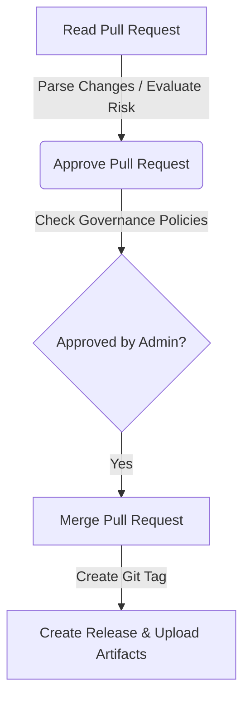
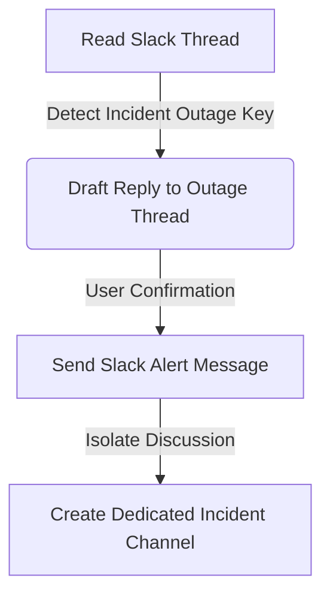
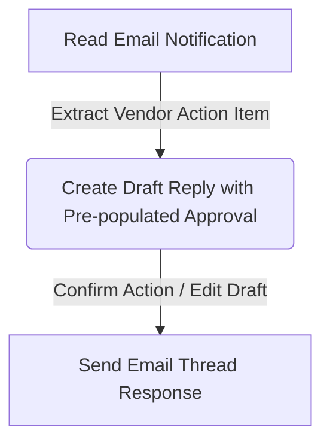

# FLOW OS — Connector Action SDK Specification
**Milestone:** Phase 2 Implementation Specification  
**Status:** Approved for Core Integration  
**Layer:** Universal Connector Framework (`src/connectors/`)  

---

## 1. Executive Summary

Historically, connectors in enterprise intelligence environments served as read-only ingestion streams (indexing conversations, emails, and commits to a vector database). FLOW OS transitions these integrations from passive observers into **executable agents** through the **Connector Action SDK**.

This specification outlines the architecture, interface contracts, pipeline executions, and security guardrails that govern bidirectional execution pipelines. Every connector is equipped with read, write, and transition capabilities, turning natural language intentions (e.g., *"Approve the PR and announce it in Slack"*) into structured API invocations.

---

## 2. Core Architecture & SDK Contract

The Connector Action SDK is built around a unified execution interface. Instead of exposing platform-specific clients directly to the application, all capabilities are wrapped in stateless, schema-validated adapters extending a common `BaseAdapter` class.

```
       [Core Application / Router Agent]
                       │
                       ▼ (executeAction)
           ┌──────────────────────┐
           │   Execution Engine   │ <───> [Governance & Policy Store]
           └──────────┬───────────┘
                      │
                      ├───────────────────────┬───────────────────────┐
                      ▼                       ▼                       ▼
              [GitHub Adapter]         [Slack Adapter]         [Gmail Adapter]
              • Read PR                • Read Messages         • Read Email
              • Approve PR             • Send Message          • Create Draft
              • Merge PR               • Create Channel        • Send Email
```

### 2.1 The Unified Adapter Contract
Every adapter must register its capability schemas, authenticate dynamically per tenant workspace, and export a deterministic execution registry.

```javascript
// src/connectors/BaseAdapter.js
export class BaseAdapter {
  constructor(connectorId, displayName, capabilities) {
    this.connectorId = connectorId;
    this.displayName = displayName;
    this.capabilities = capabilities; // Array of normalized capabilities
    this.actions = new Map();         // Map of actionName -> handler
  }

  /**
   * Register an action handler with its JSON schema
   */
  registerAction(actionName, schema, handler) {
    this.actions.set(actionName, { schema, handler });
  }

  /**
   * Validate payload against action schema
   */
  validatePayload(actionName, payload) {
    const action = this.actions.get(actionName);
    if (!action) {
      throw new Error(`Action "${actionName}" not supported by connector "${this.connectorId}"`);
    }
    // Validation logic (JSON schema checks)
    return true;
  }

  /**
   * Retrieve dynamic credentials for a tenant workspace
   */
  async getCredentials(workspaceId) {
    throw new Error('getCredentials(workspaceId) must be implemented by subclasses.');
  }

  /**
   * Perform health check on integration API
   */
  async healthCheck(workspaceId) {
    throw new Error('healthCheck(workspaceId) must be implemented by subclasses.');
  }
}
```

---

## 3. Platform Action Chains (Execution Flow)

The power of the Action SDK lies in **chaining transitions**—where reading records produces state updates that automatically trigger subsequent downstream actions.

### 3.1 GitHub Release Pipeline


### 3.2 Slack Incident & Notification Pipeline


### 3.3 Gmail Approval Loop


---

## 4. In-Depth Ingestion & Execution Pipeline

To safeguard enterprise networks, every action flows through a strict, multi-stage governance, audit, and execution pipeline before reaching external APIs.

```
 [Action Call]
       │
       ▼
 ┌───────────┐
 │ 1. Auth   │ ──> Verifies JWT token and resolves 'workspaceRole'
 └─────┬─────┘
       │
       ▼
 ┌───────────┐
 │ 2. Tenant │ ──> Enforces 'workspace-id' matches the targeted database resources
 └─────┬─────┘
       │
       ▼
 ┌───────────┐
 │ 3. Policy │ ──> Checks dynamic policy rules: returns ALLOW, DENY, or REQUIRE_APPROVAL
 └─────┬─────┘
       │
       ├───────────────┬────────────────────────┐
       ▼ (ALLOW)       ▼ (REQUIRE_APPROVAL)     ▼ (DENY)
 ┌───────────┐   ┌───────────┐            ┌───────────┐
 │ 4. Run    │   │ 5. Lock   │            │ 6. Abort  │
 │  Adapter  │   │  Workflow │            │  Execution│
 └─────┬─────┘   └─────┬─────┘            └─────┬─────┘
       │               │ (Admin Vote)           │
       │               ▼                        │
       ├───────────────┴────────────────────────┤
       ▼
 ┌───────────┐
 │ 7. Telemetry & Audits                        │
 │ * Write AuditLog to PostgreSQL               │
 │ * Push real-time telemetries over WSS        │
 └──────────────────────────────────────────────┘
```

---

## 5. Concrete Action SDK Implementations

Here are the concrete JS implementation skeletons for the three primary adapters: GitHub, Slack, and Gmail.

### 5.1 GitHub Action Adapter
```javascript
// src/connectors/adapters/GitHubAdapter.js
import { BaseAdapter } from '../BaseAdapter.js';
import { prisma } from '../../core/config/prisma.js';

export class GitHubAdapter extends BaseAdapter {
  constructor() {
    super('github', 'GitHub Development Link', ['engineering']);
    
    // Register actions with parameter validation schemas
    this.registerAction('read_pr', {
      type: 'object',
      required: ['owner', 'repo', 'prNumber'],
      properties: {
        owner: { type: 'string' },
        repo: { type: 'string' },
        prNumber: { type: 'number' }
      }
    }, this.readPR.bind(this));

    this.registerAction('approve_pr', {
      type: 'object',
      required: ['owner', 'repo', 'prNumber', 'body'],
      properties: {
        owner: { type: 'string' },
        repo: { type: 'string' },
        prNumber: { type: 'number' },
        body: { type: 'string' }
      }
    }, this.approvePR.bind(this));

    this.registerAction('merge_pr', {
      type: 'object',
      required: ['owner', 'repo', 'prNumber', 'mergeMethod'],
      properties: {
        owner: { type: 'string' },
        repo: { type: 'string' },
        prNumber: { type: 'number' },
        mergeMethod: { type: 'string', enum: ['merge', 'squash', 'rebase'] }
      }
    }, this.mergePR.bind(this));

    this.registerAction('create_release', {
      type: 'object',
      required: ['owner', 'repo', 'tagName', 'name', 'body'],
      properties: {
        owner: { type: 'string' },
        repo: { type: 'string' },
        tagName: { type: 'string' },
        name: { type: 'string' },
        body: { type: 'string' }
      }
    }, this.createRelease.bind(this));
  }

  async getCredentials(workspaceId) {
    const creds = await prisma.integration.findUnique({
      where: { workspaceId_platform: { workspaceId, platform: 'github' } }
    });
    if (!creds || !creds.credentials.token) {
      throw new Error(`GitHub credentials not configured for workspace: ${workspaceId}`);
    }
    return creds.credentials.token; // Decrypted via decryption middleware
  }

  async readPR(workspaceId, payload) {
    const token = await this.getCredentials(workspaceId);
    const { owner, repo, prNumber } = payload;
    const url = `https://api.github.com/repos/${owner}/${repo}/pulls/${prNumber}`;
    
    const res = await fetch(url, {
      headers: {
        'Authorization': `Bearer ${token}`,
        'Accept': 'application/vnd.github.v3+json',
        'User-Agent': 'FLOW-OS-Agent'
      }
    });
    
    if (!res.ok) throw new Error(`GitHub API returned HTTP ${res.status}`);
    return await res.json();
  }

  async approvePR(workspaceId, payload) {
    const token = await this.getCredentials(workspaceId);
    const { owner, repo, prNumber, body } = payload;
    const url = `https://api.github.com/repos/${owner}/${repo}/pulls/${prNumber}/reviews`;

    const res = await fetch(url, {
      method: 'POST',
      headers: {
        'Authorization': `Bearer ${token}`,
        'Content-Type': 'application/json',
        'Accept': 'application/vnd.github.v3+json',
        'User-Agent': 'FLOW-OS-Agent'
      },
      body: JSON.stringify({ body, event: 'APPROVE' })
    });

    if (!res.ok) throw new Error(`Failed to approve PR: HTTP ${res.status}`);
    return await res.json();
  }

  async mergePR(workspaceId, payload) {
    const token = await this.getCredentials(workspaceId);
    const { owner, repo, prNumber, mergeMethod } = payload;
    const url = `https://api.github.com/repos/${owner}/${repo}/pulls/${prNumber}/merge`;

    const res = await fetch(url, {
      method: 'PUT',
      headers: {
        'Authorization': `Bearer ${token}`,
        'Content-Type': 'application/json',
        'Accept': 'application/vnd.github.v3+json',
        'User-Agent': 'FLOW-OS-Agent'
      },
      body: JSON.stringify({ merge_method: mergeMethod })
    });

    if (!res.ok) throw new Error(`Failed to merge PR: HTTP ${res.status}`);
    return await res.json();
  }

  async createRelease(workspaceId, payload) {
    const token = await this.getCredentials(workspaceId);
    const { owner, repo, tagName, name, body } = payload;
    const url = `https://api.github.com/repos/${owner}/${repo}/releases`;

    const res = await fetch(url, {
      method: 'POST',
      headers: {
        'Authorization': `Bearer ${token}`,
        'Content-Type': 'application/json',
        'Accept': 'application/vnd.github.v3+json',
        'User-Agent': 'FLOW-OS-Agent'
      },
      body: JSON.stringify({ tag_name: tagName, name, body, draft: false, prerelease: false })
    });

    if (!res.ok) throw new Error(`Failed to create release: HTTP ${res.status}`);
    return await res.json();
  }
}
```

### 5.2 Slack Action Adapter
```javascript
// src/connectors/adapters/SlackAdapter.js
import { BaseAdapter } from '../BaseAdapter.js';
import { prisma } from '../../core/config/prisma.js';

export class SlackAdapter extends BaseAdapter {
  constructor() {
    super('slack', 'Slack Messenger Link', ['communication']);

    this.registerAction('read_history', {
      type: 'object',
      required: ['channelId'],
      properties: {
        channelId: { type: 'string' },
        limit: { type: 'number', default: 20 }
      }
    }, this.readHistory.bind(this));

    this.registerAction('send_message', {
      type: 'object',
      required: ['channelId', 'text'],
      properties: {
        channelId: { type: 'string' },
        text: { type: 'string' },
        threadTs: { type: 'string' }
      }
    }, this.sendMessage.bind(this));

    this.registerAction('create_channel', {
      type: 'object',
      required: ['channelName'],
      properties: {
        channelName: { type: 'string' },
        isPrivate: { type: 'boolean', default: false }
      }
    }, this.createChannel.bind(this));
  }

  async getCredentials(workspaceId) {
    const creds = await prisma.integration.findUnique({
      where: { workspaceId_platform: { workspaceId, platform: 'slack' } }
    });
    if (!creds || !creds.credentials.botToken) {
      throw new Error(`Slack API token not configured for workspace: ${workspaceId}`);
    }
    return creds.credentials.botToken;
  }

  async readHistory(workspaceId, payload) {
    const token = await this.getCredentials(workspaceId);
    const { channelId, limit } = payload;
    const url = `https://slack.com/api/conversations.history?channel=${channelId}&limit=${limit}`;

    const res = await fetch(url, {
      headers: {
        'Authorization': `Bearer ${token}`,
        'Content-Type': 'application/x-www-form-urlencoded'
      }
    });

    const data = await res.json();
    if (!data.ok) throw new Error(`Slack API error: ${data.error}`);
    return data.messages;
  }

  async sendMessage(workspaceId, payload) {
    const token = await this.getCredentials(workspaceId);
    const { channelId, text, threadTs } = payload;
    const url = 'https://slack.com/api/chat.postMessage';

    const res = await fetch(url, {
      method: 'POST',
      headers: {
        'Authorization': `Bearer ${token}`,
        'Content-Type': 'application/json; charset=utf-8'
      },
      body: JSON.stringify({
        channel: channelId,
        text,
        thread_ts: threadTs
      })
    });

    const data = await res.json();
    if (!data.ok) throw new Error(`Slack send failed: ${data.error}`);
    return data;
  }

  async createChannel(workspaceId, payload) {
    const token = await this.getCredentials(workspaceId);
    const { channelName, isPrivate } = payload;
    const url = 'https://slack.com/api/conversations.create';

    const res = await fetch(url, {
      method: 'POST',
      headers: {
        'Authorization': `Bearer ${token}`,
        'Content-Type': 'application/json; charset=utf-8'
      },
      body: JSON.stringify({
        name: channelName.toLowerCase().replace(/\s+/g, '-'),
        is_private: isPrivate
      })
    });

    const data = await res.json();
    if (!data.ok) throw new Error(`Slack channel creation failed: ${data.error}`);
    return data;
  }
}
```

### 5.3 Gmail Action Adapter
```javascript
// src/connectors/adapters/GmailAdapter.js
import { BaseAdapter } from '../BaseAdapter.js';
import { prisma } from '../../core/config/prisma.js';

export class GmailAdapter extends BaseAdapter {
  constructor() {
    super('gmail', 'Gmail Email Connector', ['communication']);

    this.registerAction('read_thread', {
      type: 'object',
      required: ['threadId'],
      properties: {
        threadId: { type: 'string' }
      }
    }, this.readThread.bind(this));

    this.registerAction('create_draft', {
      type: 'object',
      required: ['to', 'subject', 'body'],
      properties: {
        to: { type: 'string' },
        subject: { type: 'string' },
        body: { type: 'string' },
        threadId: { type: 'string' }
      }
    }, this.createDraft.bind(this));

    this.registerAction('send_email', {
      type: 'object',
      required: ['to', 'subject', 'body'],
      properties: {
        to: { type: 'string' },
        subject: { type: 'string' },
        body: { type: 'string' },
        threadId: { type: 'string' }
      }
    }, this.sendEmail.bind(this));
  }

  async getCredentials(workspaceId) {
    const creds = await prisma.integration.findUnique({
      where: { workspaceId_platform: { workspaceId, platform: 'gmail' } }
    });
    if (!creds || !creds.credentials.accessToken) {
      throw new Error(`Gmail access token missing for workspace: ${workspaceId}`);
    }
    return creds.credentials.accessToken;
  }

  async readThread(workspaceId, payload) {
    const token = await this.getCredentials(workspaceId);
    const { threadId } = payload;
    const url = `https://gmail.googleapis.com/gmail/v1/users/me/threads/${threadId}`;

    const res = await fetch(url, {
      headers: { 'Authorization': `Bearer ${token}` }
    });

    if (!res.ok) throw new Error(`Gmail fetch thread failed: HTTP ${res.status}`);
    return await res.json();
  }

  async createDraft(workspaceId, payload) {
    const token = await this.getCredentials(workspaceId);
    const { to, subject, body, threadId } = payload;
    const url = 'https://gmail.googleapis.com/gmail/v1/users/me/drafts';

    const rawEmail = [
      `To: ${to}`,
      `Subject: ${subject}`,
      'Content-Type: text/html; charset=utf-8',
      'MIME-Version: 1.0',
      '',
      body
    ].join('\r\n');

    const base64Raw = Buffer.from(rawEmail)
      .toString('base64')
      .replace(/\+/g, '-')
      .replace(/\//g, '_')
      .replace(/=+$/, '');

    const bodyPayload = {
      message: {
        raw: base64Raw,
        threadId: threadId
      }
    };

    const res = await fetch(url, {
      method: 'POST',
      headers: {
        'Authorization': `Bearer ${token}`,
        'Content-Type': 'application/json'
      },
      body: JSON.stringify(bodyPayload)
    });

    if (!res.ok) throw new Error(`Failed to create Gmail draft: HTTP ${res.status}`);
    return await res.json();
  }

  async sendEmail(workspaceId, payload) {
    const token = await this.getCredentials(workspaceId);
    const { to, subject, body, threadId } = payload;
    const url = 'https://gmail.googleapis.com/gmail/v1/users/me/messages/send';

    const rawEmail = [
      `To: ${to}`,
      `Subject: ${subject}`,
      'Content-Type: text/html; charset=utf-8',
      'MIME-Version: 1.0',
      '',
      body
    ].join('\r\n');

    const base64Raw = Buffer.from(rawEmail)
      .toString('base64')
      .replace(/\+/g, '-')
      .replace(/\//g, '_')
      .replace(/=+$/, '');

    const bodyPayload = {
      raw: base64Raw,
      threadId: threadId
    };

    const res = await fetch(url, {
      method: 'POST',
      headers: {
        'Authorization': `Bearer ${token}`,
        'Content-Type': 'application/json'
      },
      body: JSON.stringify(bodyPayload)
    });

    if (!res.ok) throw new Error(`Failed to send email: HTTP ${res.status}`);
    return await res.json();
  }
}
```

---

## 6. Execution Registry & Entry Points

To access adapters uniformly, all connectors register at startup inside a central `ConnectorRegistry`.

```javascript
// src/connectors/registry.js
import { GitHubAdapter } from './adapters/GitHubAdapter.js';
import { SlackAdapter } from './adapters/SlackAdapter.js';
import { GmailAdapter } from './adapters/GmailAdapter.js';

class ConnectorRegistry {
  constructor() {
    this.adapters = new Map();
  }

  register(adapter) {
    this.adapters.set(adapter.connectorId, adapter);
    console.log(`🔌 Registered Connector Adapter: [${adapter.connectorId}]`);
  }

  resolve(connectorId) {
    const adapter = this.adapters.get(connectorId);
    if (!adapter) {
      throw new Error(`Connector adapter "${connectorId}" not registered.`);
    }
    return adapter;
  }
}

export const registry = new ConnectorRegistry();

// Initialize registries
registry.register(new GitHubAdapter());
registry.register(new SlackAdapter());
registry.register(new GmailAdapter());
```

---

## 7. Execution Engine, Governance, & Security Gates

Executing state changes on production networks (approving PRs, emailing clients) is highly sensitive. The `ExecutionEngine` wraps the execution step in policy checks.

```javascript
// src/connectors/executionEngine.js
import { registry } from './registry.js';
import { evaluateWithPolicies } from '../core/governance/permissionEvaluator.js';
import { persistConnectorAudit } from '../core/governance/auditPersistence.js';
import { socketService } from '../services/socketService.js';

export async function executeAction(workspaceId, connectorId, actionName, payload, options = {}) {
  const { actorId, ipAddress } = options;

  console.log(`⚡ [Execution Engine] Call: ${connectorId}.${actionName} | Workspace: ${workspaceId} | Actor: ${actorId}`);

  // 1. Resolve Adapter
  const adapter = registry.resolve(connectorId);

  // 2. Validate Action parameters
  adapter.validatePayload(actionName, payload);

  // 3. Evaluate Governance Rules
  const governanceContext = {
    workspaceId,
    actorId,
    connectorId,
    actionName,
    payload
  };

  const decision = await evaluateWithPolicies(governanceContext);

  // 4. Handle Governance Outage
  if (decision.effect === 'DENY') {
    await persistConnectorAudit({
      workspaceId,
      userId: actorId,
      action: `${connectorId}.${actionName}`,
      resource: `connector:${connectorId}`,
      metadata: { error: 'DENIED_BY_GOVERNANCE', reason: decision.reason },
      ip: ipAddress
    });

    socketService.broadcast(workspaceId, {
      eventType: 'CONNECTOR_ACTION_DENIED',
      connectorId,
      actionName,
      actorId,
      reason: decision.reason
    });

    throw new Error(`Governance policy blocked execution: ${decision.reason}`);
  }

  if (decision.effect === 'REQUIRE_APPROVAL' && !options.approvedBy) {
    // Generate pending approval record
    const pendingApproval = await createPendingApprovalRecord({
      workspaceId,
      requesterId: actorId,
      connectorId,
      actionName,
      payload
    });

    socketService.broadcast(workspaceId, {
      eventType: 'CONNECTOR_APPROVAL_REQUIRED',
      approvalId: pendingApproval.id,
      connectorId,
      actionName,
      actorId
    });

    throw new Error(`Action requires authorization approval. Pending ID: ${pendingApproval.id}`);
  }

  // 5. Execute API Call
  try {
    const result = await adapter.actions.get(actionName).handler(workspaceId, payload);

    // 6. Record Durable Audit Trail
    const auditRow = await persistConnectorAudit({
      workspaceId,
      userId: actorId,
      action: `${connectorId}.${actionName}`,
      resource: `connector:${connectorId}`,
      metadata: { status: 'SUCCESS', details: `Executed ${actionName} successfully.` },
      ip: ipAddress
    });

    // 7. Telemetry Broadcast
    socketService.broadcast(workspaceId, {
      eventType: 'CONNECTOR_ACTION_EXECUTED',
      connectorId,
      actionName,
      actorId,
      auditLogId: auditRow.id,
      status: 'SUCCESS'
    });

    return result;
  } catch (executionError) {
    // Audit Failures
    await persistConnectorAudit({
      workspaceId,
      userId: actorId,
      action: `${connectorId}.${actionName}`,
      resource: `connector:${connectorId}`,
      metadata: { status: 'FAILED', error: executionError.message },
      ip: ipAddress
    });

    socketService.broadcast(workspaceId, {
      eventType: 'CONNECTOR_ACTION_EXECUTED',
      connectorId,
      actionName,
      actorId,
      status: 'FAILED',
      error: executionError.message
    });

    throw executionError;
  }
}
```

---

## 8. Summary Checklist for Adding New Executable Connectors

To add a new connection to the Action SDK:
1. [ ] Inherit from `BaseAdapter`.
2. [ ] Register actions with JSON Schema definitions within the constructor.
3. [ ] Implement `getCredentials(workspaceId)` using encrypted config structures.
4. [ ] Implement action handler methods using native APIs.
5. [ ] Register the new adapter instance in `registry.js`.
6. [ ] Add appropriate governance rules inside the `policies` table to guard the actions.
