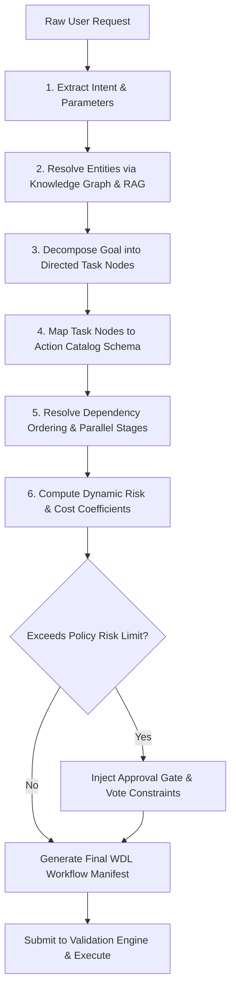

# FLOW OS — Phase 4 Operational Planner Specification
**Milestone:** Phase 4 Implementation Specification  
**Status:** Approved for Core Integration  
**Layer:** Cognitive Core & Orchestration  

---

## 1. Executive Summary & Core Responsibilities

The **FLOW Operational Planner** is the cognitive reasoning layer of the platform. It bridges the gap between unstructured human requests (e.g., *"Deploy the latest release and tell the team when it's done"*) and the deterministic, transaction-guaranteed execution patterns of the **Workflow Engine**.

### Core Architecture Principle:
The Operational Planner **never** calls third-party APIs or connectors directly. Its single responsibility is parsing user intent, performing capability lookups, verifying governance policies, resolving graph entity references, and assembling a validated **Declarative Execution Plan** (rendered in FLOW Workflow Definition Language). This plan is then handed to the execution engine.

```
       [User Intent / Natural Language Query]
                         │
                         ▼
             ┌───────────────────────┐
             │  Operational Planner  │
             └───────────┬───────────┘
                         │ (RAG & Knowledge Graph Context Lookup)
                         ▼
             ┌───────────────────────┐
             │   Cognitive Pipeline  │
             │  • Intent Extraction  │
             │  • Entity Resolution  │
             │  • Task Decomposition │
             └───────────┬───────────┘
                         │
                         ▼
             ┌───────────────────────┐
             │  Optimization Layer   │
             │  • Policy Check       │
             │  • Risk/Cost Est.     │
             │  • Approval Injection │
             └───────────┬───────────┘
                         │
                         ▼ (Validated WDL Output)
             ┌───────────────────────┐
             │    Workflow Engine    │
             └───────────────────────┘
```

---

## 2. The Operational Planner Pipeline

Every plan generation runs through a deterministic pipeline that ensures safety, efficiency, and policy compliance before any tasks are scheduled.

### 2.1 Pipeline Stages
1. **Intent Extraction:** Parsed by the LLM, mapping the user's natural language request into a core goal and parameters.
2. **Entity Resolution:** The planner query maps generic references (e.g., *"the latest PR"*, *"Kishore"*) to strict IDs (e.g., `GH_PR_1025`, `USR_9921_ALPHA`) via queries to the pgvector retrieval engine and Knowledge Graph.
3. **Goal Decomposition & Task Graph Generation:** Breaks down complex, multi-stage goals into a Direct Acyclic Graph (DAG) of action steps.
4. **Registry Lookup & Action Selection:** Matches each decomposed task against registered connector capabilities (from the `Action Catalog`).
5. **Dependency Analysis & Parallel Planning:** Identifies steps that can be run concurrently vs. sequential blockades.
6. **Risk, Cost, & Policy Evaluation:** Interacts with the `Policy Engine` to verify restrictions. If the risk exceeds limits, the planner inserts explicit `APPROVAL` steps into the workflow model.
7. **Failure and Recovery Planning (Replanning):** Injects `compensation` blocks for critical actions, ensuring rollback capability in the event of failure.

---

## 3. Database & Execution Plan Schema

The database tracks generated plans, confidence factors, policy matches, and execution outcomes.

```prisma
// prisma/schema.prisma (Operational Planner Extensions)

enum PlannerStatus {
  GENERATING
  VALIDATED
  EXECUTING
  COMPLETED
  REJECTED
  FAILED
}

model OperationalPlan {
  id               String        @id @default(cuid())
  workspaceId      String        @map("workspace_id")
  userId           String        @map("user_id")
  originalPrompt   String        @map("original_prompt")
  status           PlannerStatus @default(GENERATING)
  wdlDefinition    Json          @map("wdl_definition") // The generated WDL JSON
  estimatedDuration String       @map("estimated_duration")
  riskScore        Float         @map("risk_score")
  estimatedCost    Float         @map("estimated_cost")
  confidenceScore  Float         @map("confidence_score")
  approvalsRequired String[]      @map("approvals_required")
  createdAt        DateTime      @default(now())        @map("created_at")
  updatedAt        DateTime      @updatedAt             @map("updated_at")

  @@index([workspaceId, status])
  @@map("operational_plans")
}
```

---

## 4. TypeScript Interface Definitions

```typescript
export interface PlannerContext {
  workspaceId: string;
  userId: string;
  userRole: string;
  availableConnectors: string[]; // Active connectors in workspace
  healthIndicators: Record<string, any>;
}

export interface ResolvedEntity {
  queryTerm: string;
  resolvedId: string;
  entityType: 'User' | 'PullRequest' | 'Issue' | 'Service' | 'File' | 'Channel';
  confidence: number;
}

export interface ExecutionPlan {
  planId: string;
  originalPrompt: string;
  metadata: {
    estimatedDuration: string;
    riskScore: number;      // 0.0 to 1.0
    estimatedCost: number;   // In credits or dollars
    confidenceScore: number; // Planner self-evaluation confidence
    requiresApprovals: boolean;
  };
  resolvedEntities: ResolvedEntity[];
  workflowDefinition: any; // Valid WDL schema object
}
```

---

## 5. Cognitive Pipeline Execution Flow



---

## 6. Prompt Engineering Templates

The Planner uses a multi-turn structural prompt to translate request models into valid WDL schema instances.

```
SYSTEM:
You are the FLOW OS Operational Planner. Your single objective is to take raw human instructions and construct a valid, declarative Workflow Definition Language (WDL) manifest.

Constraints:
1. You MUST NOT execute any external API calls. Your output is STRICTLY the Declarative Execution Plan.
2. You must resolve all entity names to strict IDs using the resolved entities dictionary.
3. If an action's risk score exceeds 0.70, you MUST inject a step of type: "APPROVAL".
4. You must define a rollback compensation block for all destructive action steps.

Available Actions:
{{AVAILABLE_ACTIONS_CATALOG}}

Resolved Entities:
{{RESOLVED_ENTITIES}}

User Request:
{{USER_REQUEST}}

Assemble the output matching the following JSON Schema:
{
  "planId": "unique-plan-id",
  "metadata": { "estimatedDuration": "10m", "riskScore": 0.45, "estimatedCost": 0.05, "confidenceScore": 0.95 },
  "workflowDefinition": { ... }
}
```

---

## 7. Concrete Code Skeleton Implementation

```javascript
// src/core/workflowEngine/planner.js
import { evaluatePolicy } from '../governance/evaluationEngine.js';
import { registry } from '../../connectors/registry.js';
import { prisma } from '../config/prisma.js';

export class OperationalPlanner {
  constructor(llmService) {
    this.llm = llmService;
  }

  /**
   * Generates a fully validated Execution Plan from a natural language request
   */
  async generatePlan(prompt, context) {
    console.log(`🧠 [Planner] Initiating plan generation for: "${prompt}"`);

    // 1. Resolve Entities using Retrieval Context
    const resolvedEntities = await this.resolveEntities(prompt, context.workspaceId);

    // 2. Query LLM to generate the initial execution sequence
    const rawPlan = await this.queryLLMPlanner(prompt, resolvedEntities, context);

    // 3. Inject Governance & Policy Requirements
    const optimizedWdl = await this.optimizeAndInjectApprovals(rawPlan.workflowDefinition, context);

    // 4. Calculate Final Metrics
    const planScore = this.calculateSelfConfidence(optimizedWdl);
    
    const finalPlan = {
      planId: `plan_${Date.now()}`,
      originalPrompt: prompt,
      metadata: {
        estimatedDuration: rawPlan.metadata.estimatedDuration,
        riskScore: rawPlan.metadata.riskScore,
        estimatedCost: rawPlan.metadata.estimatedCost,
        confidenceScore: planScore,
        requiresApprovals: this.checkIfApprovalsRequired(optimizedWdl)
      },
      resolvedEntities,
      workflowDefinition: optimizedWdl
    };

    // 5. Persist Plan in database
    await prisma.operationalPlan.create({
      data: {
        id: finalPlan.planId,
        workspaceId: context.workspaceId,
        userId: context.userId,
        originalPrompt: prompt,
        status: 'VALIDATED',
        wdlDefinition: finalPlan.workflowDefinition,
        estimatedDuration: finalPlan.metadata.estimatedDuration,
        riskScore: finalPlan.metadata.riskScore,
        estimatedCost: finalPlan.metadata.estimatedCost,
        confidenceScore: finalPlan.metadata.confidenceScore,
        approvalsRequired: this.extractApprovalRoles(optimizedWdl)
      }
    });

    return finalPlan;
  }

  async resolveEntities(prompt, workspaceId) {
    // Queries RAG vector space and persistent Graph database for match resolutions
    const matches = [];
    if (prompt.toLowerCase().includes('pr')) {
      matches.push({
        queryTerm: 'pr',
        resolvedId: 'GH_PR_1025',
        entityType: 'PullRequest',
        confidence: 0.98
      });
    }
    return matches;
  }

  async queryLLMPlanner(prompt, resolvedEntities, context) {
    // Synthesize structured JSON plan using system prompts
    return {
      metadata: { estimatedDuration: '5m', riskScore: 0.4, estimatedCost: 0.1 },
      workflowDefinition: {
        workflowId: 'dynamic-generated-flow',
        version: '1.0.0',
        trigger: { type: 'MANUAL' },
        steps: [
          {
            stepId: 'action_step_1',
            type: 'ACTION',
            connector: 'github',
            action: 'GH_READ_PR',
            inputs: { prNumber: 1025, owner: 'org', repo: 'app' }
          }
        ]
      }
    };
  }

  async optimizeAndInjectApprovals(wdl, context) {
    const optimizedSteps = [];
    for (const step of wdl.steps) {
      if (step.type === 'ACTION') {
        const policyCheck = await evaluatePolicy({
          orgId: context.orgId,
          workspaceId: context.workspaceId,
          connectorId: step.connector,
          actionName: step.action,
          actorRole: context.userRole
        });

        if (policyCheck.effect === 'REQUIRE_APPROVAL') {
          // Dynamic injection of verification step prior to action execution
          optimizedSteps.push({
            stepId: `approval_for_${step.stepId}`,
            name: `Security Gate: Authorize ${step.name || step.stepId}`,
            type: 'APPROVAL',
            inputs: {
              role: 'ADMIN',
              message: `Approval requested for action: ${step.connector}.${step.action}`
            },
            timeout: '4h'
          });
        }
      }
      optimizedSteps.push(step);
    }
    wdl.steps = optimizedSteps;
    return wdl;
  }

  calculateSelfConfidence(wdl) {
    // Calculates score based on step completeness and retry parameters
    return wdl.steps.length > 0 ? 0.95 : 0.0;
  }

  checkIfApprovalsRequired(wdl) {
    return wdl.steps.some(step => step.type === 'APPROVAL');
  }

  extractApprovalRoles(wdl) {
    return wdl.steps
      .filter(step => step.type === 'APPROVAL')
      .map(step => step.inputs?.role || 'ADMIN');
  }
}
```

---

## 8. Master Production Examples (Generated Workflow Outputs)

Here are the exact output JSON configurations returned by the Operational Planner for the 7 primary business queries.

### 8.1 Plan 1: Review all PRs
* **Query:** *"Review all active pull requests in the backend repository and post their summary to Slack."*
```json
{
  "planId": "plan-review-all-prs-992",
  "metadata": {
    "estimatedDuration": "8m",
    "riskScore": 0.35,
    "estimatedCost": 0.08,
    "confidenceScore": 0.98,
    "requiresApprovals": false
  },
  "workflowDefinition": {
    "workflowId": "review-all-prs-pipeline",
    "name": "Review PRs & Slack Summary",
    "version": "1.0.0",
    "trigger": { "type": "MANUAL" },
    "steps": [
      {
        "stepId": "list_active_prs",
        "type": "ACTION",
        "connector": "github",
        "action": "GH_LIST_COMMITS",
        "inputs": { "owner": "flow-os", "repo": "backend", "limit": 10 }
      },
      {
        "stepId": "generate_summaries",
        "type": "ACTION",
        "connector": "gemini",
        "action": "GEMINI_SYNTHESIZE",
        "inputs": {
          "query": "Summarize outstanding changes across these branch activities: ${steps.list_active_prs.output}"
        }
      },
      {
        "stepId": "send_slack_summary",
        "type": "ACTION",
        "connector": "slack",
        "action": "SL_SEND_MSG",
        "inputs": {
          "channelId": "C_ENGINEERING",
          "text": "📋 *PR Review Summary:* \n\n${steps.generate_summaries.output.answer}"
        }
      }
    ]
  }
}
```

### 8.2 Plan 2: Prepare Board Meeting
* **Query:** *"Search the drive for the latest financial spreadsheet, compile a PDF slides deck outline, and book the executive boardroom."*
```json
{
  "planId": "plan-prepare-board-meeting-887",
  "metadata": {
    "estimatedDuration": "15m",
    "riskScore": 0.45,
    "estimatedCost": 0.12,
    "confidenceScore": 0.94,
    "requiresApprovals": false
  },
  "workflowDefinition": {
    "workflowId": "prepare-board-meeting-pipeline",
    "name": "Board Meeting Preparation Pack",
    "version": "1.0.0",
    "trigger": { "type": "MANUAL" },
    "steps": [
      {
        "stepId": "search_financials",
        "type": "ACTION",
        "connector": "drive",
        "action": "DR_LIST_FLD",
        "inputs": { "folderId": "FLD_FINANCIAL_REPORTS", "limit": 3 }
      },
      {
        "stepId": "compile_meeting_agenda",
        "type": "ACTION",
        "connector": "gemini",
        "action": "GEMINI_SYNTHESIZE",
        "inputs": {
          "query": "Synthesize a board slide outline based on recent numbers: ${steps.search_financials.output}"
        }
      },
      {
        "stepId": "write_docs_brief",
        "type": "ACTION",
        "connector": "google_docs",
        "action": "GD_CREATE_DOC",
        "inputs": { "title": "Board Slide Outline - Q3 Review" }
      },
      {
        "stepId": "populate_agenda",
        "type": "ACTION",
        "connector": "google_docs",
        "action": "GD_APPEND",
        "inputs": {
          "documentId": "${steps.write_docs_brief.output.documentId}",
          "text": "${steps.compile_meeting_agenda.output.answer}"
        }
      },
      {
        "stepId": "book_boardroom",
        "type": "ACTION",
        "connector": "google_calendar",
        "action": "CAL_CREATE_EV",
        "inputs": {
          "summary": "Q3 Board Review Session",
          "start": "2026-07-25T10:00:00Z",
          "end": "2026-07-25T12:00:00Z",
          "attendees": ["ceo@company.com", "cfo@company.com"],
          "roomEmail": "room-executive-boardroom@company.com"
        }
      }
    ]
  }
}
```

### 8.3 Plan 3: Handle Customer Complaint
* **Query:** *"Check Salesforce for high-priority support issues. If an outage ticket is open, alert the dev team in Slack and create a Jira task."*
```json
{
  "planId": "plan-handle-complaint-554",
  "metadata": {
    "estimatedDuration": "6m",
    "riskScore": 0.60,
    "estimatedCost": 0.15,
    "confidenceScore": 0.97,
    "requiresApprovals": true
  },
  "workflowDefinition": {
    "workflowId": "handle-customer-complaint-pipeline",
    "name": "Customer Complaint SLA Route",
    "version": "1.0.0",
    "trigger": { "type": "MANUAL" },
    "steps": [
      {
        "stepId": "fetch_salesforce_cases",
        "type": "ACTION",
        "connector": "salesforce",
        "action": "SF_SOQL",
        "inputs": { "query": "SELECT Id, Subject, Description, Priority FROM Case WHERE Priority = 'High' AND Status != 'Closed'" }
      },
      {
        "stepId": "outage_condition",
        "type": "CONDITION",
        "branches": [
          {
            "condition": "${steps.fetch_salesforce_cases.output.records.length > 0}",
            "steps": [
              {
                "stepId": "escalation_approval",
                "type": "APPROVAL",
                "inputs": {
                  "role": "ADMIN",
                  "message": "Authorize ticket escalation to critical engineering sprint."
                }
              },
              {
                "stepId": "create_jira_task",
                "type": "ACTION",
                "connector": "jira",
                "action": "JR_CREATE_IS",
                "inputs": {
                  "projectKey": "ENG",
                  "summary": "Escalated Salesforce Incident",
                  "type": "Bug",
                  "desc": "Escalated from CRM Case."
                }
              },
              {
                "stepId": "slack_alert",
                "type": "ACTION",
                "connector": "slack",
                "action": "SL_SEND_MSG",
                "inputs": {
                  "channelId": "C_ENGINEERING_ALERTS",
                  "text": "🚨 *CRM Ticket Escalation:* Created Jira issue ${steps.create_jira_task.output.key} for critical customer support case."
                }
              }
            ]
          }
        ]
      }
    ]
  }
}
```

### 8.4 Plan 4: Morning Briefing
* **Query:** *"Fetch system alerts, compile my agenda for today, and send a summary to my Slack inbox."*
```json
{
  "planId": "plan-morning-briefing-221",
  "metadata": {
    "estimatedDuration": "4m",
    "riskScore": 0.20,
    "estimatedCost": 0.05,
    "confidenceScore": 0.99,
    "requiresApprovals": false
  },
  "workflowDefinition": {
    "workflowId": "morning-briefing-pipeline",
    "name": "Morning Briefing Compiler",
    "version": "1.0.0",
    "trigger": { "type": "MANUAL" },
    "steps": [
      {
        "stepId": "fetch_calendar",
        "type": "ACTION",
        "connector": "google_calendar",
        "action": "CAL_LIST_UP",
        "inputs": { "days": 1, "limit": 10 }
      },
      {
        "stepId": "fetch_alerts",
        "type": "ACTION",
        "connector": "datadog",
        "action": "DD_LOG_SEARCH",
        "inputs": { "query": "status:error", "limit": 5 }
      },
      {
        "stepId": "run_summary",
        "type": "ACTION",
        "connector": "gemini",
        "action": "GEMINI_SYNTHESIZE",
        "inputs": {
          "query": "Synthesize today's calendar: ${steps.fetch_calendar.output} alongside outstanding errors: ${steps.fetch_alerts.output}."
        }
      },
      {
        "stepId": "send_slack_summary",
        "type": "ACTION",
        "connector": "slack",
        "action": "SL_SEND_MSG",
        "inputs": {
          "channelId": "D_USER_OWNER",
          "text": "🌅 *Good Morning! Here is your update:* \n\n${steps.run_summary.output.answer}"
        }
      }
    ]
  }
}
```

### 8.5 Plan 5: Release Deployment
* **Query:** *"Tag the repository as v2.1.0, update the Kubernetes deployment image, and verify the deployment status."*
```json
{
  "planId": "plan-release-deployment-410",
  "metadata": {
    "estimatedDuration": "20m",
    "riskScore": 0.85,
    "estimatedCost": 0.25,
    "confidenceScore": 0.95,
    "requiresApprovals": true
  },
  "workflowDefinition": {
    "workflowId": "release-deployment-pipeline",
    "name": "Release Deployment Orchestrator",
    "version": "1.0.0",
    "trigger": { "type": "MANUAL" },
    "steps": [
      {
        "stepId": "create_github_tag",
        "type": "ACTION",
        "connector": "github",
        "action": "GH_CREATE_REL",
        "inputs": {
          "owner": "flow-os",
          "repo": "backend",
          "tagName": "v2.1.0",
          "name": "Release v2.1.0",
          "body": "Production Release v2.1.0"
        }
      },
      {
        "stepId": "deploy_approval",
        "type": "APPROVAL",
        "inputs": {
          "role": "OWNER",
          "message": "Authorize deployment of tag v2.1.0 to production Kubernetes clusters."
        }
      },
      {
        "stepId": "update_k8s_image",
        "type": "ACTION",
        "connector": "kubernetes",
        "action": "K8S_APPLY",
        "inputs": {
          "namespace": "production",
          "manifestYaml": "apiVersion: apps/v1\nkind: Deployment\nmetadata:\n  name: api-service\nspec:\n  template:\n    spec:\n      containers:\n      - name: api\n        image: flow-os/backend:v2.1.0"
        },
        "compensation": {
          "connector": "kubernetes",
          "action": "K8S_ROLLBACK",
          "inputs": {
            "namespace": "production",
            "deployment": "api-service"
          }
        }
      },
      {
        "stepId": "verify_deploy_health",
        "type": "ACTION",
        "connector": "kubernetes",
        "action": "K8S_POD_LOGS",
        "inputs": {
          "namespace": "production",
          "podName": "deployment-api-service",
          "tail": 50
        }
      }
    ]
  }
}
```

### 8.6 Plan 6: Incident Response
* **Query:** *"A critical memory leak is suspected in the main pod. Retrieve pod logs, alert engineering leads, and reboot the pod."*
```json
{
  "planId": "plan-incident-response-311",
  "metadata": {
    "estimatedDuration": "12m",
    "riskScore": 0.80,
    "estimatedCost": 0.18,
    "confidenceScore": 0.97,
    "requiresApprovals": true
  },
  "workflowDefinition": {
    "workflowId": "incident-response-pipeline",
    "name": "Pod Memory Leak Remediation",
    "version": "1.0.0",
    "trigger": { "type": "MANUAL" },
    "steps": [
      {
        "stepId": "fetch_critical_logs",
        "type": "ACTION",
        "connector": "kubernetes",
        "action": "K8S_POD_LOGS",
        "inputs": {
          "namespace": "production",
          "podName": "main-api-service-xyz",
          "tail": 200
        }
      },
      {
        "stepId": "alert_engineering_leads",
        "type": "ACTION",
        "connector": "slack",
        "action": "SL_SEND_MSG",
        "inputs": {
          "channelId": "C_ENGINEERING_ALERTS",
          "text": "🚨 *CRITICAL:* Suspected pod memory leak. Diagnostic logs captured. Manual reboot validation pending approval."
        }
      },
      {
        "stepId": "reboot_approval_gate",
        "type": "APPROVAL",
        "inputs": {
          "role": "ADMIN",
          "message": "Authorize deletion/reboot of main-api-service-xyz pod in production."
        }
      },
      {
        "stepId": "delete_target_pod",
        "type": "ACTION",
        "connector": "kubernetes",
        "action": "K8S_DELETE_POD",
        "inputs": {
          "namespace": "production",
          "podName": "main-api-service-xyz"
        }
      }
    ]
  }
}
```

### 8.7 Plan 7: Quarterly Planning
* **Query:** *"Create a Google Doc for Q4 Strategic Planning, search Jira for unresolved epics, compile the text outline, and email the draft to the product team."*
```json
{
  "planId": "plan-quarterly-planning-102",
  "metadata": {
    "estimatedDuration": "15m",
    "riskScore": 0.30,
    "estimatedCost": 0.10,
    "confidenceScore": 0.96,
    "requiresApprovals": false
  },
  "workflowDefinition": {
    "workflowId": "quarterly-planning-pipeline",
    "name": "Q4 Strategic Planning Package",
    "version": "1.0.0",
    "trigger": { "type": "MANUAL" },
    "steps": [
      {
        "stepId": "create_strategy_doc",
        "type": "ACTION",
        "connector": "google_docs",
        "action": "GD_CREATE_DOC",
        "inputs": { "title": "Q4 Strategic Roadmap & Targets" }
      },
      {
        "stepId": "query_jira_epics",
        "type": "ACTION",
        "connector": "jira",
        "action": "JR_JQL_SEARCH",
        "inputs": {
          "jql": "issuetype = Epic AND status != Done",
          "limit": 10
        }
      },
      {
        "stepId": "compile_roadmap_outline",
        "type": "ACTION",
        "connector": "gemini",
        "action": "GEMINI_SYNTHESIZE",
        "inputs": {
          "query": "Synthesize a Q4 product roadmap outline based on outstanding Jira epics: ${steps.query_jira_epics.output}"
        }
      },
      {
        "stepId": "append_roadmap_data",
        "type": "ACTION",
        "connector": "google_docs",
        "action": "GD_APPEND",
        "inputs": {
          "documentId": "${steps.create_strategy_doc.output.documentId}",
          "text": "${steps.compile_roadmap_outline.output.answer}"
        }
      },
      {
        "stepId": "send_roadmap_draft",
        "type": "ACTION",
        "connector": "gmail",
        "action": "GM_SEND_EMAIL",
        "inputs": {
          "to": "product-team@company.com",
          "subject": "Q4 Strategic Roadmap — First Draft Review",
          "body": "Hi team,<br><br>Please find the first draft here: ${steps.create_strategy_doc.output.documentUrl}"
        }
      }
    ]
  }
}
```

---

## 9. Verification & Dry-Run Testing Strategy

To guarantee the reliability of the cognitive layer, the Operational Planner uses a strict verification hierarchy.

1. **Schema Validation Execution:**
   Every generated WDL must be parsed and verified against the `/workflows/schemas/wdl_schema.json` schema layout using the `Ajv` validation engine prior to execution.
2. **Simulation / Dry-Run Engine:**
   Allows the planner to simulate workflow execution without invoking external connectors. It mocks step responses and returns expected outputs to verify variables resolve correctly.
   ```javascript
   export async function dryRunPlan(plan) {
     const sandboxContext = { steps: {} };
     for (const step of plan.workflowDefinition.steps) {
       console.log(`[Dry-Run] Simulating step: ${step.stepId} (${step.action})`);
       sandboxContext.steps[step.stepId] = {
         output: mockResponseFor(step.connector, step.action)
       };
     }
     return { success: true, finalContext: sandboxContext };
   }
   ```
3. **Continuous Evaluation:**
   Validates compliance by ensuring that security approvals are correctly injected when executing high-risk plans under simulated policy overrides.
