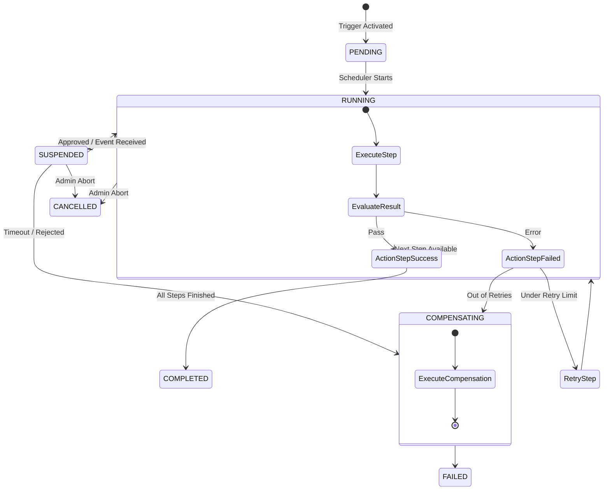

# FLOW OS — Workflow Definition Language (WDL) Specification
**Milestone:** Phase 2 Implementation Specification  
**Status:** Approved for Core Integration  
**Layer:** Core Engine Workflow Automation  

---

## 1. Executive Summary & Design Philosophy

FLOW OS is an automation engine where workflows are declarative, versioned, and event-driven. Hardcoded operational pipelines are prohibited. All workspace automation (from developer PR merges to executive briefings and production incident remediations) is defined using **FLOW Workflow Definition Language (WDL)**, a YAML-based Domain-Specific Language (DSL).

### Core Design Principles:
1. **Zero Code Changes:** Introducing or modifying business logic requires changing WDL files, not compilation or code changes.
2. **Transactional & Reversible:** Steps support compensation routines (rollback actions) to handle partial failures.
3. **State Persistence:** Workflows are stateful. The engine can suspend execution pending human approvals or asynchronous webhooks and resume execution from the exact point of suspension.
4. **Context Isolation:** Execution context is sandboxed per tenant workspace and tracks data flow safely between steps.

---

## 2. DSL Specification & Schema

FLOW WDL documents are parsed and validated against a strict JSON Schema before registration.

### 2.1 WDL JSON Schema
```json
{
  "$schema": "http://json-schema.org/draft-07/schema#",
  "title": "FLOW_WDL_Schema",
  "type": "object",
  "required": ["workflowId", "name", "version", "trigger", "steps"],
  "properties": {
    "workflowId": { "type": "string", "pattern": "^[a-z0-9_-]+$" },
    "name": { "type": "string" },
    "description": { "type": "string" },
    "version": { "type": "string", "pattern": "^\\d+\\.\\d+\\.\\d+$" },
    "trigger": {
      "type": "object",
      "required": ["type"],
      "properties": {
        "type": { "type": "string", "enum": ["EVENT", "CRON", "MANUAL"] },
        "event": { "type": "string" },
        "cronExpression": { "type": "string" },
        "conditions": { "type": "array", "items": { "type": "string" } }
      }
    },
    "variables": {
      "type": "object",
      "additionalProperties": { "type": "string" }
    },
    "steps": {
      "type": "array",
      "minItems": 1,
      "items": { "$ref": "#/definitions/step" }
    }
  },
  "definitions": {
    "step": {
      "type": "object",
      "required": ["stepId", "type"],
      "properties": {
        "stepId": { "type": "string", "pattern": "^[a-zA-Z0-9_-]+$" },
        "name": { "type": "string" },
        "type": { "type": "string", "enum": ["ACTION", "APPROVAL", "CONDITION", "PARALLEL", "LOOP", "WAIT"] },
        "connector": { "type": "string" },
        "action": { "type": "string" },
        "inputs": { "type": "object" },
        "timeout": { "type": "string", "pattern": "^\\d+[ms|s|m|h]$" },
        "retry": {
          "type": "object",
          "required": ["maxAttempts"],
          "properties": {
            "maxAttempts": { "type": "integer", "minimum": 1 },
            "backoffFactor": { "type": "number", "minimum": 1.0 },
            "initialDelay": { "type": "string", "pattern": "^\\d+[ms|s|m|h]$" }
          }
        },
        "compensation": {
          "type": "object",
          "required": ["connector", "action", "inputs"],
          "properties": {
            "connector": { "type": "string" },
            "action": { "type": "string" },
            "inputs": { "type": "object" }
          }
        },
        "branches": {
          "type": "array",
          "items": {
            "type": "object",
            "required": ["condition", "steps"],
            "properties": {
              "condition": { "type": "string" },
              "steps": { "type": "array", "items": { "$ref": "#/definitions/step" } }
            }
          }
        },
        "default": {
          "type": "array",
          "items": { "$ref": "#/definitions/step" }
        },
        "parallelSteps": {
          "type": "array",
          "items": {
            "type": "array",
            "items": { "$ref": "#/definitions/step" }
          }
        },
        "loop": {
          "type": "object",
          "required": ["forEach", "steps"],
          "properties": {
            "forEach": { "type": "string" },
            "steps": { "type": "array", "items": { "$ref": "#/definitions/step" } }
          }
        },
        "wait": {
          "type": "object",
          "properties": {
            "duration": { "type": "string" },
            "event": { "type": "string" },
            "condition": { "type": "string" }
          }
        }
      }
    }
  }
}
```

### 2.2 TypeScript Interfaces
```typescript
export interface WorkflowDefinition {
  workflowId: string;
  name: string;
  description?: string;
  version: string;
  trigger: WorkflowTrigger;
  variables?: Record<string, string>;
  steps: WorkflowStep[];
}

export type TriggerType = 'EVENT' | 'CRON' | 'MANUAL';

export interface WorkflowTrigger {
  type: TriggerType;
  event?: string;
  cronExpression?: string;
  conditions?: string[];
}

export type StepType = 'ACTION' | 'APPROVAL' | 'CONDITION' | 'PARALLEL' | 'LOOP' | 'WAIT';

export interface WorkflowStep {
  stepId: string;
  name?: string;
  type: StepType;
  connector?: string;
  action?: string;
  inputs?: Record<string, any>;
  timeout?: string;
  retry?: RetryPolicy;
  compensation?: CompensationAction;
  branches?: ConditionalBranch[];
  default?: WorkflowStep[];
  parallelSteps?: WorkflowStep[][];
  loop?: LoopPolicy;
  wait?: WaitPolicy;
}

export interface RetryPolicy {
  maxAttempts: number;
  backoffFactor: number;
  initialDelay: string;
}

export interface CompensationAction {
  connector: string;
  action: string;
  inputs: Record<string, any>;
}

export interface ConditionalBranch {
  condition: string;
  steps: WorkflowStep[];
}

export interface LoopPolicy {
  forEach: string; // Expression resolving to array
  steps: WorkflowStep[];
}

export interface WaitPolicy {
  duration?: string; // Timeout duration e.g., '10m'
  event?: string;    // Event identifier on event bus
  condition?: string; // Condition evaluated on event payload
}
```

---

## 3. Runtime Execution & State Model

The execution engine runs as an event-driven state machine. When a trigger is pulled, a stateful `WorkflowRun` is created in the database.

### 3.1 State Transitions


---

## 4. Large Production Examples (10 Core Workflows)

Here are the 10 core enterprise workflows written in FLOW WDL format.

### 1. GitHub Pull Request Review & Release Workflow
* **ID:** `github-pr-review-release`
* **Trigger:** GitHub pull request review submitted or opened.
* **Goal:** Auto-approve, merge, create release tags, and announce to Slack.
```yaml
workflowId: github-pr-review-release
name: GitHub Pull Request Review & Release Pipeline
description: Validates, approves, merges, and releases code commits automatically upon passing governance.
version: 1.0.0
trigger:
  type: EVENT
  event: GITHUB_PR_OPENED
  conditions:
    - "${event.payload.pullRequest.draft == false}"

steps:
  - stepId: get_pr_details
    name: Fetch Pull Request Metadata
    type: ACTION
    connector: github
    action: GH_READ_PR
    inputs:
      owner: "${event.payload.repository.owner}"
      repo: "${event.payload.repository.name}"
      prNumber: "${event.payload.pullRequest.number}"

  - stepId: check_security_governance
    name: Validate Security Policies
    type: CONDITION
    branches:
      - condition: "${steps.get_pr_details.output.mergeable == true && steps.get_pr_details.output.changedFiles < 50}"
        steps:
          - stepId: auto_approve
            name: Submit Auto Approval
            type: ACTION
            connector: github
            action: GH_APPROVE_PR
            inputs:
              owner: "${event.payload.repository.owner}"
              repo: "${event.payload.repository.name}"
              prNumber: "${event.payload.pullRequest.number}"
              body: "FLOW OS Auto-approval: PR matches security and limits profiles."

          - stepId: require_merge_approval
            name: Admin Merge Authorization Gate
            type: APPROVAL
            inputs:
              role: "ADMIN"
              message: "PR #${event.payload.pullRequest.number} is ready for merge. Approve execution."
            timeout: "1h"

          - stepId: execute_merge
            name: Merge Pull Request
            type: ACTION
            connector: github
            action: GH_MERGE_PR
            inputs:
              owner: "${event.payload.repository.owner}"
              repo: "${event.payload.repository.name}"
              prNumber: "${event.payload.pullRequest.number}"
              method: "squash"
            retry:
              maxAttempts: 3
              backoffFactor: 2.0
              initialDelay: "10s"

          - stepId: generate_release
            name: Generate Version Tag Release
            type: ACTION
            connector: github
            action: GH_CREATE_REL
            inputs:
              owner: "${event.payload.repository.owner}"
              repo: "${event.payload.repository.name}"
              tagName: "v1.0.${steps.get_pr_details.output.number}"
              name: "Release v1.0.${steps.get_pr_details.output.number}"
              body: "Auto-generated release from merged PR #${event.payload.pullRequest.number}."

          - stepId: slack_announcement
            name: Notify Team on Slack
            type: ACTION
            connector: slack
            action: SL_SEND_MSG
            inputs:
              channelId: "C_ENGINEERING_RELEASES"
              text: "🚀 Release v1.0.${steps.get_pr_details.output.number} has been deployed! PR #${event.payload.pullRequest.number} merged successfully."
      
      - condition: "${steps.get_pr_details.output.changedFiles >= 50}"
        steps:
          - stepId: flag_large_pr
            name: Alert Slack of Large PR
            type: ACTION
            connector: slack
            action: SL_SEND_MSG
            inputs:
              channelId: "C_ENGINEERING_ALERTS"
              text: "⚠️ PR #${event.payload.pullRequest.number} has over 50 changed files. Manual review required."
```

### 2. Customer Complaint & Escalation Workflow
* **ID:** `customer-complaint-escalation`
* **Trigger:** Ticket ingestion from Salesforce or HubSpot.
```yaml
workflowId: customer-complaint-escalation
name: Customer Complaint & Escalation Pipeline
description: Triage customer complaints, triggers incident alarms, drafts emails, and tracks resolutions.
version: 1.0.0
trigger:
  type: EVENT
  event: CUSTOMER_TICKET_CREATED
  conditions:
    - "${event.payload.priority == 'HIGH' || event.payload.priority == 'URGENT'}"

steps:
  - stepId: analyze_severity
    name: Check Ticket Details
    type: CONDITION
    branches:
      - condition: "${event.payload.type == 'OUTAGE'}"
        steps:
          - stepId: trigger_pagerduty
            name: Trigger PagerDuty Incident
            type: ACTION
            connector: pagerduty
            action: PD_TRIG_INC
            inputs:
              serviceId: "SRV_PROD_API"
              title: "CRITICAL: Outage reported by client ${event.payload.accountName}"
              details: "${event.payload.description}"

          - stepId: notify_slack_incident
            name: Open Dedicated Incident Channel
            type: ACTION
            connector: slack
            action: SL_CREATE_CHAN
            inputs:
              channelName: "incident-${event.payload.ticketId}"
              isPrivate: true

          - stepId: invite_team
            name: Invite On-Call Engineer
            type: ACTION
            connector: slack
            action: SL_INVITE_USR
            inputs:
              channelId: "${steps.notify_slack_incident.output.channel.id}"
              userIds: ["U_ONCALL_LEAD"]

          - stepId: update_salesforce
            name: Sync Incident Details with Salesforce
            type: ACTION
            connector: salesforce
            action: SF_UPDATE_CS
            inputs:
              caseId: "${event.payload.caseId}"
              updates:
                Status: "Escalated"
                Subject: "[CRITICAL] Outage Incident PD-${steps.trigger_pagerduty.output.id} Active"
      
      - condition: "${event.payload.type == 'BILLING'}"
        steps:
          - stepId: draft_billing_reply
            name: Draft Billing Apology Email
            type: ACTION
            connector: gmail
            action: GM_CREATE_DRF
            inputs:
              to: "${event.payload.contactEmail}"
              subject: "Reviewing your billing inquiry [Case #${event.payload.caseNumber}]"
              body: "Dear ${event.payload.contactName},<br>We have received your billing complaint and are reviewing it immediately."

          - stepId: notify_billing_team
            name: Slack Billing Support
            type: ACTION
            connector: slack
            action: SL_SEND_MSG
            inputs:
              channelId: "C_BILLING_TRIAGE"
              text: "💰 Billing complaint received from ${event.payload.accountName}. Apology draft created: ${steps.draft_billing_reply.output.id}"
```

### 3. Morning Executive Brief Generation Workflow
* **ID:** `morning-executive-brief`
* **Trigger:** Cron schedule at 07:00 AM daily.
```yaml
workflowId: morning-executive-brief
name: Morning Executive Brief Generator
description: Runs RAG context summaries, compiles briefs, and emails reports to executives.
version: 1.0.0
trigger:
  type: CRON
  cronExpression: "0 7 * * *"

steps:
  - stepId: fetch_workspace_health
    name: Fetch Workspace Health Indicators
    type: ACTION
    connector: postgresql
    action: PG_EXECUTE
    inputs:
      sql: "SELECT health_score, active_incidents FROM workspace_health WHERE workspace_id = $1"
      params: ["workspace_corp_alpha"]

  - stepId: fetch_decisions
    name: Fetch Recent Decisions (24h)
    type: ACTION
    connector: postgresql
    action: PG_EXECUTE
    inputs:
      sql: "SELECT title, body FROM org_memory_records WHERE workspace_id = $1 AND type = 'DECISION' AND created_at > NOW() - INTERVAL '1 day'"
      params: ["workspace_corp_alpha"]

  - stepId: run_briefing_rag
    name: Run LLM Executive Brief Summary
    type: ACTION
    connector: gemini
    action: GEMINI_SYNTHESIZE
    inputs:
      systemPrompt: "You are the Chief of Staff. Synthesize the operational details into a summary brief."
      query: "Analyze current state: Health: ${steps.fetch_workspace_health.output[0].health_score}. Decisions: ${steps.fetch_decisions.output}"

  - stepId: draft_brief_file
    name: Write Briefing Document to Vault
    type: ACTION
    connector: file
    action: FILE_WRITE
    inputs:
      filePath: "/vaults/workspace_corp_alpha/daily_briefs/brief_${event.timestamp}.md"
      content: "${steps.run_briefing_rag.output.answer}"

  - stepId: send_brief_email
    name: Email Brief to Executives
    type: ACTION
    connector: gmail
    action: GM_SEND_EMAIL
    inputs:
      to: "ceo@company.com, cto@company.com"
      subject: "FLOW OS Morning Briefing — ${event.timestamp}"
      body: "Hello Team,<br><br>Here is your daily executive brief:<br><br>${steps.run_briefing_rag.output.answer}"
```

### 4. Production Incident Response Workflow
* **ID:** `production-incident-response`
* **Trigger:** Datadog monitor alert triggered.
```yaml
workflowId: production-incident-response
name: Production Incident Response
description: Automates response tasks for production alerts.
version: 1.0.0
trigger:
  type: EVENT
  event: DATADOG_ALERT_TRIGGERED

steps:
  - stepId: check_alert_severity
    type: CONDITION
    branches:
      - condition: "${event.payload.alertStatus == 'CRITICAL'}"
        steps:
          - stepId: raise_pagerduty
            name: Trigger Escalation
            type: ACTION
            connector: pagerduty
            action: PD_TRIG_INC
            inputs:
              serviceId: "SRV_PROD_DB"
              title: "ALERT: ${event.payload.alertTitle}"
              details: "${event.payload.alertMessage}"

          - stepId: create_war_room
            name: Create Incident War Room
            type: ACTION
            connector: slack
            action: SL_CREATE_CHAN
            inputs:
              channelName: "warroom-${event.payload.alertId}"
              isPrivate: false

          - stepId: announce_alert
            name: Post to Global Engineering Channel
            type: ACTION
            connector: slack
            action: SL_SEND_MSG
            inputs:
              channelId: "C_ENGINEERING_ALERTS"
              text: "🔥 INCIDENT TRIGGERED: ${event.payload.alertTitle}. War room: #${steps.create_war_room.output.channel.name}"

          - stepId: run_remediation
            name: Run Automated Diagnostic Check
            type: ACTION
            connector: kubernetes
            action: K8S_POD_LOGS
            inputs:
              namespace: "production"
              podName: "${event.payload.podName}"
              tail: 100

          - stepId: save_logs_to_incident
            name: Append Logs to Incident Notes
            type: ACTION
            connector: pagerduty
            action: PD_ADD_NOTE
            inputs:
              incidentId: "${steps.raise_pagerduty.output.id}"
              note: "Diagnostic logs captured from K8s pod:\n${steps.run_remediation.output}"
```

### 5. Executive Briefing & Strategic Insight Workflow
* **ID:** `executive-strategic-insights`
* **Trigger:** Weekly cron on Friday at 04:00 PM.
```yaml
workflowId: executive-strategic-insights
name: Executive Strategic Insights compiler
description: Scans weekly workspace files and compiles insight reports.
version: 1.0.0
trigger:
  type: CRON
  cronExpression: "0 16 * * 5"

steps:
  - stepId: search_weekly_vault
    name: Search Weekly Progress Reports
    type: ACTION
    connector: drive
    action: DR_SEARCH
    inputs:
      query: "name contains 'Weekly_Status' and modifiedTime > '7 days ago'"

  - stepId: compile_insights
    name: Run LLM Strategic Evaluation
    type: ACTION
    connector: gemini
    action: GEMINI_SYNTHESIZE
    inputs:
      query: "Read the weekly reports and list the top 3 organizational risks and the top 3 achievements."
      contextDocuments: "${steps.search_weekly_vault.output}"

  - stepId: verify_insights
    name: Require Executive Chief of Staff Sign-off
    type: APPROVAL
    inputs:
      role: "OWNER"
      message: "Strategic insights compiled. Approve document generation."
    timeout: "4h"

  - stepId: write_strategic_brief
    name: Write Document to Drive
    type: ACTION
    connector: google_docs
    action: GD_CREATE_DOC
    inputs:
      title: "Executive Strategic Insights — Week Ending ${event.timestamp}"

  - stepId: populate_doc
    name: Populate Document Content
    type: ACTION
    connector: google_docs
    action: GD_APPEND
    inputs:
      documentId: "${steps.write_strategic_brief.output.documentId}"
      text: "${steps.compile_insights.output.answer}"
```

### 6. Sales Follow-Up & CRM Synchronization Workflow
* **ID:** `sales-crm-followup`
* **Trigger:** Contact state update inside HubSpot.
```yaml
workflowId: sales-crm-followup
name: Sales Follow-Up & CRM Synchronization
description: Triggered on deal close. Syncs Salesforce, drafts follow-up emails, and posts updates to Slack.
version: 1.0.0
trigger:
  type: EVENT
  event: HUBSPOT_DEAL_CLOSED_WON

steps:
  - stepId: create_salesforce_account
    name: Create Salesforce Account Record
    type: ACTION
    connector: salesforce
    action: SF_CREATE_ACC
    inputs:
      name: "${event.payload.dealName} - Enterprise"
      industry: "Technology"
      billingCity: "${event.payload.city}"

  - stepId: create_salesforce_contact
    name: Create Salesforce Contact Record
    type: ACTION
    connector: salesforce
    action: SF_CREATE_CON
    inputs:
      firstName: "${event.payload.contactFirstName}"
      lastName: "${event.payload.contactLastName}"
      email: "${event.payload.contactEmail}"
      accId: "${steps.create_salesforce_account.output.id}"

  - stepId: draft_customer_welcome
    name: Draft Welcome Email
    type: ACTION
    connector: gmail
    action: GM_CREATE_DRF
    inputs:
      to: "${event.payload.contactEmail}"
      subject: "Welcome to FLOW OS — Setup details inside"
      body: "Hello ${event.payload.contactFirstName},<br><br>Welcome! We are preparing your environment."

  - stepId: notify_sales_channel
    name: Announce Deal on Slack
    type: ACTION
    connector: slack
    action: SL_SEND_MSG
    inputs:
      channelId: "C_SALES_VICTORIES"
      text: "🎉 Deal WON: ${event.payload.dealName}. Value: $${event.payload.amount}. Sync completed. Welcome email drafted."
```

### 7. Support Ticket Escalation & SLA Breach Workflow
* **ID:** `support-sla-breach`
* **Trigger:** Support ticket SLA breach event.
```yaml
workflowId: support-sla-breach
name: Support Ticket Escalation
description: Reassigns breached tickets in Jira, notifies managers, and triggers alert policies.
version: 1.0.0
trigger:
  type: EVENT
  event: JIRA_SLA_BREACHED

steps:
  - stepId: fetch_ticket_details
    name: Fetch Jira Issue details
    type: ACTION
    connector: jira
    action: JR_JQL_SEARCH
    inputs:
      jql: "key = '${event.payload.issueKey}'"
      limit: 1

  - stepId: escalate_jira_ticket
    name: Set Priority to Highest
    type: ACTION
    connector: jira
    action: JR_SET_PRIO
    inputs:
      issueKey: "${event.payload.issueKey}"
      priorityId: "1" # Highest

  - stepId: assign_escalation_manager
    name: Assign to Escalation Manager
    type: ACTION
    connector: jira
    action: JR_ASSIGN
    inputs:
      issueKey: "${event.payload.issueKey}"
      accountId: "USR_MGR_SUPPORT"

  - stepId: post_jira_warning
    name: Post Escalation Comment on Jira
    type: ACTION
    connector: jira
    action: JR_ADD_COMMENT
    inputs:
      issueKey: "${event.payload.issueKey}"
      body: "🚨 SLA breached! Ticket escalated to management."

  - stepId: alert_support_leads
    name: Alert Slack Channel
    type: ACTION
    connector: slack
    action: SL_SEND_MSG
    inputs:
      channelId: "C_SUPPORT_ESCALATIONS"
      text: "💥 SLA BREACH: Ticket ${event.payload.issueKey} is unresolved. Reassigned to support lead."
```

### 8. Calendar Automation & Smart Meeting Prep Workflow
* **ID:** `calendar-smart-prep`
* **Trigger:** 30 minutes before any Google Calendar meeting starts.
```yaml
workflowId: calendar-smart-prep
name: Calendar Smart Meeting Prep
description: Runs RAG retrieval on attendees and topics, compiles prep context, and saves notes to the calendar event.
version: 1.0.0
trigger:
  type: EVENT
  event: GOOGLE_CALENDAR_EVENT_STARTING
  conditions:
    - "${event.payload.attendeeCount > 2}"

steps:
  - stepId: query_intelligence_rag
    name: Run RAG Context Query on Topic
    type: ACTION
    connector: gemini
    action: GEMINI_SYNTHESIZE
    inputs:
      query: "Analyze projects or issues relevant to meeting topic: ${event.payload.summary} involving attendees: ${event.payload.attendeeEmails}"

  - stepId: format_prep_brief
    name: Structure Context Block
    type: ACTION
    connector: file
    action: FORMAT_MARKDOWN
    inputs:
      template: |
        ### Meeting Prep: ${event.payload.summary}
        **Context:** ${steps.query_intelligence_rag.output.answer}
        **Suggested Questions:**
        - What is status of pending releases discussed in current tickets?

  - stepId: save_to_calendar
    name: Save Prep Notes on Event Object
    type: ACTION
    connector: google_calendar
    action: CAL_ADD_NOTES
    inputs:
      eventId: "${event.payload.eventId}"
      notes: "${steps.format_prep_brief.output.formattedText}"

  - stepId: ping_attendee_slack
    name: Send Prep Briefing to User on Slack
    type: ACTION
    connector: slack
    action: SL_SEND_MSG
    inputs:
      channelId: "D_USER_OWNER"
      text: "📅 Meeting starting in 30m: *${event.payload.summary}*. Context prep brief saved on calendar event."
```

### 9. Multi-Environment Canary Deployment Workflow
* **ID:** `multi-environment-canary-deploy`
* **Trigger:** Release tag created.
```yaml
workflowId: multi-environment-canary-deploy
name: Multi-Environment Canary Deployment
description: Deploys code to staging, requires staging approval, then scales a canary pod deployment in Kubernetes.
version: 1.0.0
trigger:
  type: EVENT
  event: GITHUB_RELEASE_PUBLISHED

steps:
  - stepId: deploy_to_staging
    name: Start ECS Staging Deploy
    type: ACTION
    connector: aws
    action: AWS_UPD_SRV
    inputs:
      cluster: "staging-cluster"
      service: "staging-api"
      taskDefinition: "staging-td-${event.payload.tagName}"

  - stepId: wait_for_staging_tests
    name: Wait for Staging Smoke Tests
    type: WAIT
    wait:
      duration: "5m"

  - stepId: confirm_staging_health
    name: Verify Staging Monitor Metrics
    type: ACTION
    connector: datadog
    action: DD_METRIC_Q
    inputs:
      query: "sum:sys.cpu.usage{env:staging}"
      from: "-5m"
      to: "now"

  - stepId: production_deploy_gate
    name: Production Release Gate
    type: APPROVAL
    inputs:
      role: "OWNER"
      message: "Staging deploy looks healthy. Approve 10% Canary deploy to Kubernetes production."
    timeout: "12h"

  - stepId: scale_canary_deployment
    name: Apply 10% Canary Pods
    type: ACTION
    connector: kubernetes
    action: K8S_SCALE
    inputs:
      namespace: "production"
      deployment: "canary-api"
      replicas: 2
    compensation:
      connector: kubernetes
      action: K8S_SCALE
      inputs:
        namespace: "production"
        deployment: "canary-api"
        replicas: 0

  - stepId: notify_canary_status
    name: Notify Slack of Canary Launch
    type: ACTION
    connector: slack
    action: SL_SEND_MSG
    inputs:
      channelId: "C_DEPLOYMENT_TRACKING"
      text: "🚀 Canary deploy 1.0 (${event.payload.tagName}) is live in production. Monitoring metrics..."
```

### 10. Enterprise Release Management & Audit Workflow
* **ID:** `enterprise-release-audit`
* **Trigger:** Post-deployment validation completed.
```yaml
workflowId: enterprise-release-audit
name: Enterprise Release Management & Audit
description: Logs deployment audits, creates Confluence release notes, and archives logs.
version: 1.0.0
trigger:
  type: EVENT
  event: DEPLOYMENT_COMPLETED

steps:
  - stepId: compile_release_notes
    name: Run LLM Release Note Compilation
    type: ACTION
    connector: gemini
    action: GEMINI_SYNTHESIZE
    inputs:
      query: "Compile release note logs for commit tags: ${event.payload.commitSha}."

  - stepId: create_wiki_page
    name: Create Confluence Release Page
    type: ACTION
    connector: confluence
    action: CF_CREATE_PG
    inputs:
      spaceKey: "RELEASES"
      title: "Release notes - Tag ${event.payload.tagName}"
      body: "${steps.compile_release_notes.output.answer}"

  - stepId: log_audit_trail
    name: Log Audit Trail to PostgreSQL
    type: ACTION
    connector: postgresql
    action: PG_EXECUTE
    inputs:
      sql: "INSERT INTO audit_logs (org_id, action, resource, metadata) VALUES ($1, $2, $3, $4)"
      params: ["org_alpha", "release.deploy", "github:release:${event.payload.tagName}", "${event.payload}"]

  - stepId: archive_configuration
    name: Archive Deployment Manifests
    type: ACTION
    connector: google_drive
    action: DR_UPLOAD
    inputs:
      filename: "deploy_manifest_${event.payload.tagName}.json"
      content: "${event.payload}"
      parentId: "FLD_ARCHIVED_RELEASES"

  - stepId: post_success_announcement
    name: Announce Complete Rollout
    type: ACTION
    connector: slack
    action: SL_SEND_MSG
    inputs:
      channelId: "C_COMPLIANCE_ALERTS"
      text: "✅ Release ${event.payload.tagName} is complete. Audit log persisted. Wiki notes generated: ${steps.create_wiki_page.output.pageUrl}"
```

---

## 5. Runtime Execution Model & Parser

The workflow engine parses and executes these models step-by-step, managing variables, context scopes, and nested branching.

```
                    ┌─────────────────────────┐
                    │     WDL Parser          │
                    └────────────┬────────────┘
                                 │ (Validate Manifest)
                                 ▼
                    ┌─────────────────────────┐
                    │  Stateful Task Planner  │
                    └────────────┬────────────┘
                                 │
                                 ▼
                     * For Each Step In Plan *
                                 │
                   ┌─────────────┴─────────────┐
                   │ Resolve Step Variables    │
                   └─────────────┬─────────────┘
                                 │
                   ┌─────────────┴─────────────┐
                   │ Check Governance Policy   │
                   └─────────────┬─────────────┘
                                 │ (Permitted)
                                 ▼
                   ┌─────────────────────────┐
                   │ Run Executable Connector │
                   └─────────────┬─────────────┘
                                 │
                                 ├────────────────────────┐
                              (Success)                (Failure)
                                 ▼                        ▼
                   ┌─────────────────────────┐   ┌─────────────────────────┐
                   │ Save Context Output     │   │ Run Retry Logic         │
                   └─────────────┬─────────────┘   └──────────┬──────────────┘
                                 │                            │ (Exhausted)
                                 ▼                            ▼
                   ┌─────────────────────────┐   ┌─────────────────────────┐
                   │ Advance execution cursor│   │ Run Compensation Action │
                   └─────────────────────────┘   └────────────┬────────────┘
                                                              │
                                                              ▼
                                                 ┌─────────────────────────┐
                                                 │ Rollback execution state│
                                                 └─────────────────────────┘
```

### 5.1 Variable Resolution & Sandbox Context
All steps share a single isolated execution context Object:
```javascript
const executionContext = {
  event: {
    payload: { ... },
    timestamp: "2026-07-20T10:00:00Z"
  },
  variables: {
    system_env: "production"
  },
  steps: {
    step_id_1: {
      output: { ... }
    }
  }
};
```
Before executing a step, the parser resolves variable patterns (e.g., `${steps.stepId.output.property}`) using a regex matcher:
```javascript
function resolveVariables(templateStr, context) {
  return templateStr.replace(/\$\{(.+?)\}/g, (match, path) => {
    return path.split('.').reduce((acc, part) => {
      if (acc && acc[part] !== undefined) return acc[part];
      return match; // Fallback to raw string if path unresolved
    }, context);
  });
}
```

---

## 6. Directory Structure & Layout

To support scaling without codebase bloat, the workflow subsystem is organized as follows:

```
flow-os-backend/
├── src/
│   ├── core/
│   │   └── workflowEngine/
│   │       ├── index.js                  # Engine entrypoint
│   │       ├── parser.js                 # WDL parser and validator
│   │       ├── executor.js               # State machine executor
│   │       ├── contextManager.js         # Context resolve sandbox
│   │       └── statePersistence.js       # Writes WorkflowRun states to Postgres
│   └── workflows/
│       ├── schemas/
│       │   └── wdl_schema.json           # JSON Schema definition
│       └── active/
│           ├── github_release.yaml       # GitHub WDL definition
│           ├── incident_response.yaml    # Incident Response WDL definition
│           └── morning_brief.yaml        # Morning Brief WDL definition
└── tests/
    └── workflow/
        ├── validator.test.js             # Parser checks
        └── execution.test.js             # Mock run scenarios
```

---

## 7. Migration & Evolutionary Strategy

As the platform scaling progresses, schema structures will evolve.

1. **Version Isolation:** All WDL files must contain the `version` element (e.g., `1.2.0`). The WDL Parser checks this version against the runtime's schema version floor.
2. **Upcasting Compilers:** If an older workflow version is loaded, the engine passes the schema through an upcasting compiler:
   ```javascript
   function upcastWDL(rawYaml, sourceVersion) {
     if (sourceVersion === '1.0.0') {
       // Convert legacy parameters to 2.0.0 target structures
     }
     return rawYaml;
   }
   ```
3. **Execution Locks:** If a workflow is mid-run during a deployment, the engine routes execution to the legacy version handler, preventing schema changes from breaking active runs.

---

## 8. Verification & Production Deployment Checklist

### Production Checklist:
* [ ] Verify all active WDL files pass validation:
  `node src/core/workflowEngine/parser.js --validate-all`
* [ ] Validate that database tables (`workflow_runs`, `workflow_steps`) are fully migrated and indexed.
* [ ] Test retry and backoff thresholds under mock API failure conditions.
* [ ] Verify that compensation rules are specified for all destructive `ACTION` steps.
* [ ] Confirm that `APPROVAL` step timeouts are configured, preventing workflows from hanging indefinitely.
